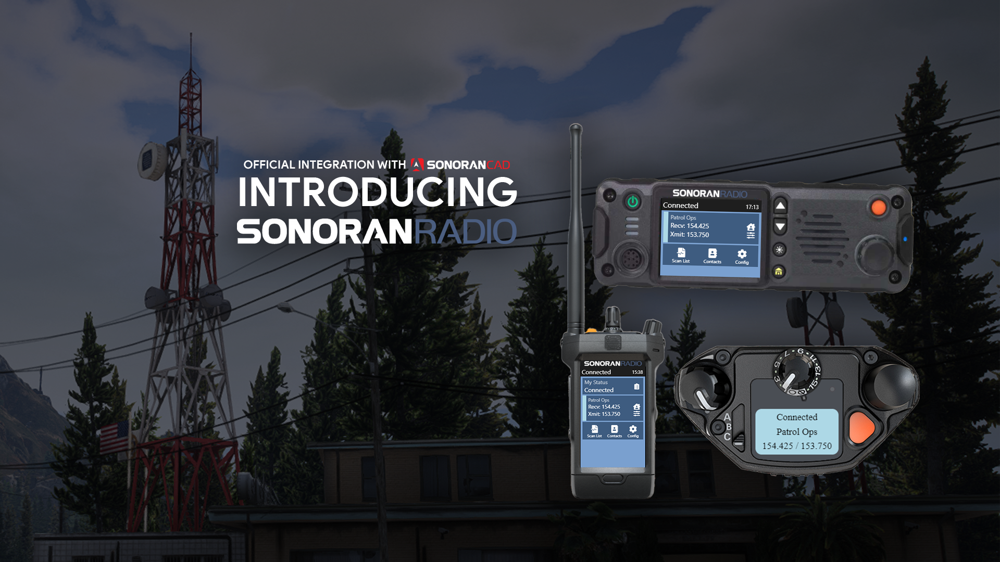

# Sonoran Radio

Learn more about our advanced communication system, find tutorials, access API documentation, and more!


Looking for VPS, web, or dedicated hosting? Check out our official [server hosting](other-products/sonoran-servers.md)!


<figure><figcaption>
Sonoran Radio - Promotional Image
</figcaption></figure>

### What is Sonoran Radio?

Sonoran Radio is the all-in-one package for realistic radio simulation. It strives to bring real-life radio habits into the digital world. Provided with a TeamSpeak 3 plugin and FiveM resource out of the box, community owners and managers are able to customize the radio to their liking through our online dashboard!

<table data-view="cards"><thead><tr><th></th><th></th><th></th><th data-hidden data-card-target data-type="content-ref"></th></tr></thead><tbody><tr><td><h3>Why Choose Sonoran Radio?</h3></td><td>Sonoran Radio's first priority for any community is customizability, reliability, and realism all at a fair price</td><td></td><td><a href="why-choose-sonoran-radio/why-choose-sonoran-radio.md">why-choose-sonoran-radio.md</a></td></tr><tr><td><h3>Where to get Sonoran Radio?</h3></td><td>Try it for free, purchase or manage subscriptions from the main website linked here</td><td></td><td><a href="https://sonoranradio.com">https://sonoranradio.com</a></td></tr><tr><td><h3>How do I get started?</h3></td><td>Using Sonoran Radio with your community is free, fast, and easy! We've compiled a list of tutorials to help you get started and get the most out of our advanced system</td><td></td><td><a href="tutorials/getting-started/">getting-started</a></td></tr></tbody></table>
