# 🏆 Why Sonoran Radio?

## What is Sonoran Radio?

Sonoran Radio is the most advanced push-to-talk system for gaming communities.

With customizable voice effects, live emergency calls, and deep FiveM integrations like nearby radio audio, background noise injection, and destructible towers—Sonoran Radio keeps your team connected and in control.


[getting-started](tutorials/getting-started/)


## 💸 Free!

Sonoran Radio offers a fully-featured free version accessible to anyone!

With instant setup, you can chat with community members in just minutes!

## 💣 [In-Game Tower Destruction](tutorials/usage/in-game-radio/in-game-repeaters.md)

The physical in-game towers are able to be destroyed by criminals, which will devastate quality of radios around it.

With three different in-game model types, Sonoran Radio takes immersion to the next level!

See our [tower destruction and repairing](broken-reference) info!

<figure>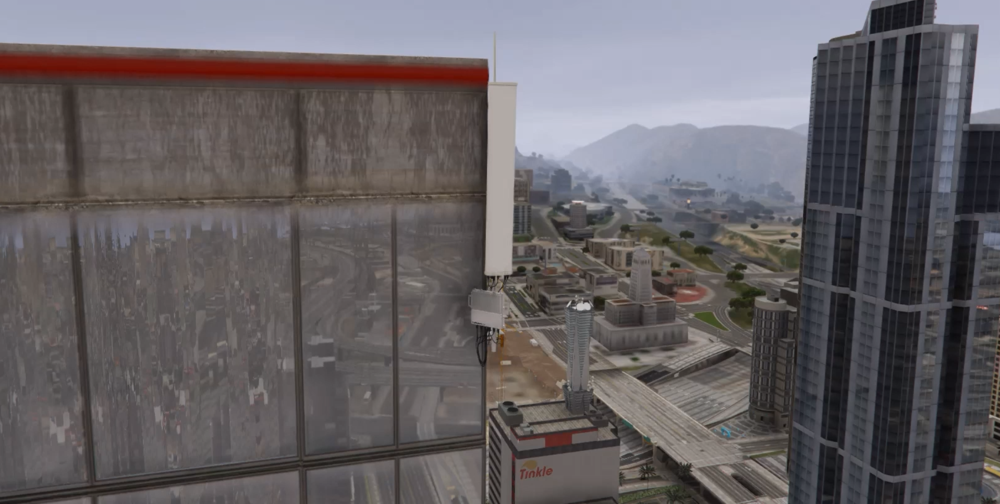<figcaption>
Cellular Antenna
</figcaption></figure> <figure>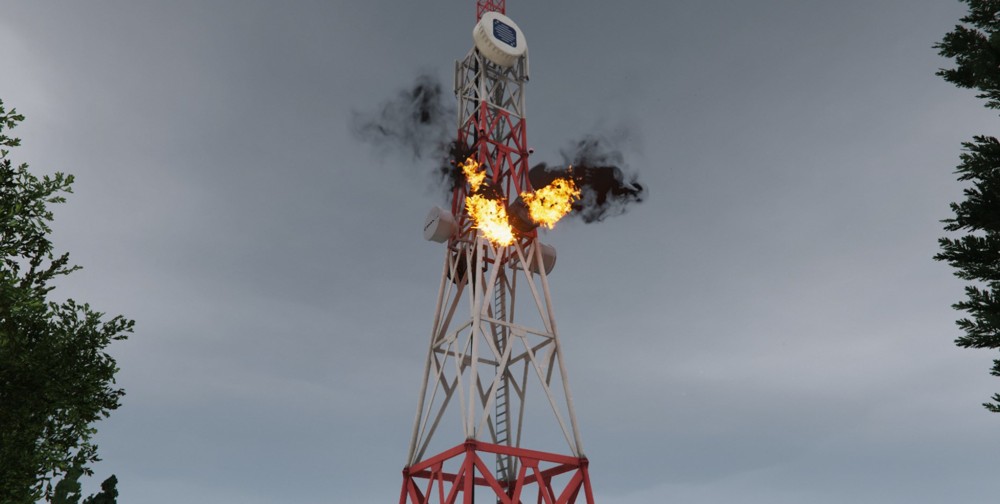<figcaption>
Radio Tower
</figcaption></figure> <figure><figcaption>
Server Rack
</figcaption></figure>

<figure>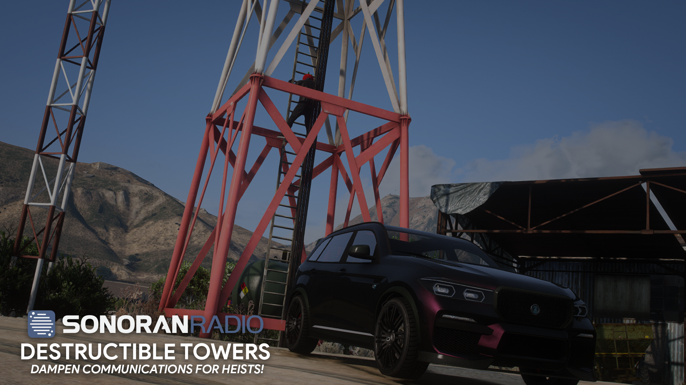<figcaption>
Sonoran Radio - Destructible Towers - Promotional Image
</figcaption></figure>

## 💻[3D Vehicle Display](tutorials/integrations/vehicle-radio-display.md)

Our [3D vehicle radio display](tutorials/integrations/vehicle-radio-display.md) reflects your channel information, transmitting user, and panic status in real time bringing new levels of immersion!

<figure><figcaption>
Sonoran Radio - Vehicle Display
</figcaption></figure>

## 📶 [Tunnel Signal Loss](tutorials/usage/in-game-radio/tunnels-and-degrade-zones.md)

Configure signal loss in tunnels, underground locations, and more!

<figure><figcaption>
Sonoran Radio - Tunnel Detection
</figcaption></figure>

## 📶 [Signal Jammers](tutorials/usage/in-game-radio/radio-jammers.md)

Configure custom in-game items to jam nearby radio signals.

<figure>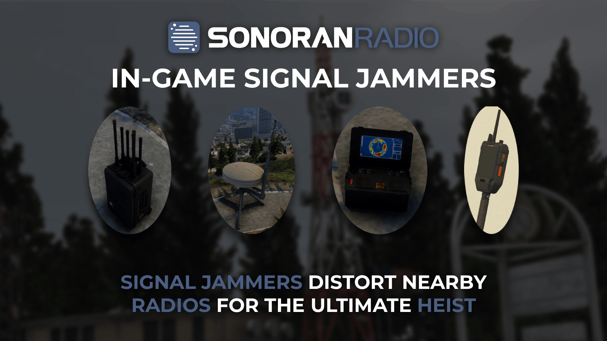<figcaption></figcaption></figure>

## 📢 [Custom Tone Board](tutorials/usage/dispatch-panel/custom-tone-board.md)

Upload and customize dispatch tones for your community!

Sonoran Radio's dispatch UI allows you to specify specific channels and groups, repeat tones, and more! You can even [play tones on in-game speakers](tutorials/usage/in-game-radio/in-game-speakers.md)!

<figure><figcaption>
Sonoran Radio - Tone Board
</figcaption></figure>

<figure><figcaption>
Sonoran Radio - In-Game Speakers
</figcaption></figure>

## 🎙️[Custom Voice Effects](tutorials/usage/dispatch-panel/custom-voice-effects.md)

Customize digital and analog style voice effects for your community!

<figure><figcaption>
Sonoran Radio - Custom Voice Effects
</figcaption></figure>

## 🔊 [Custom SFX](tutorials/usage/dispatch-panel/custom-sfx.md)

Easily customize mic clicks, talkover protection tones, and more!

<figure>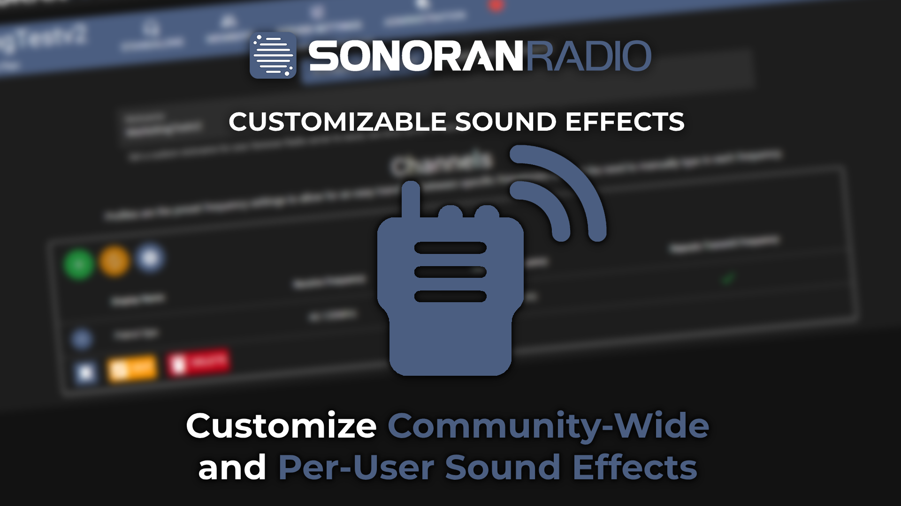<figcaption>
Sonoran Radio: Custom Sound Effects
</figcaption></figure>

## 🚨[In-Game Emergency Calls](tutorials/usage/dispatch-panel/emergency-calls.md)

Players in-game can call and speak directly with dispatchers for live emergencies!

<figure><figcaption>
Sonoran Radio: In-Game Emergency Calls
</figcaption></figure>

## ☁️ [Cloud Configurations](tutorials/usage/dispatch-panel/configure-channels.md)

Customizing your radio has never been easier, with live updates from our easy-to-use configuration panel.

<figure><figcaption>
Sonoran Radio - Customization Panel
</figcaption></figure>

## 🎧 [Dispatch Panel](tutorials/usage/dispatch-panel/using-the-dispatch-panel.md)

Easily visualize, manage users, play tones, and more!

Sonoran Radio's dispatch UI is available everywhere on the [web](sonoran-radio/download-the-app.md) and [desktop](sonoran-radio/download-the-app.md) for Windows and OSX.

<figure><figcaption>
Sonoran Radio - Dispatch Panel
</figcaption></figure>

## 📡 [Multiple Radio Options](tutorials/usage/in-game-radio/using-the-in-game-radio/)

Sonoran Radio offers multiple in-game user interfaces, allowing you to stay connected on-foot, in-vehicle, and more!

Choose from one of our radio style options, or even add your own!

<figure>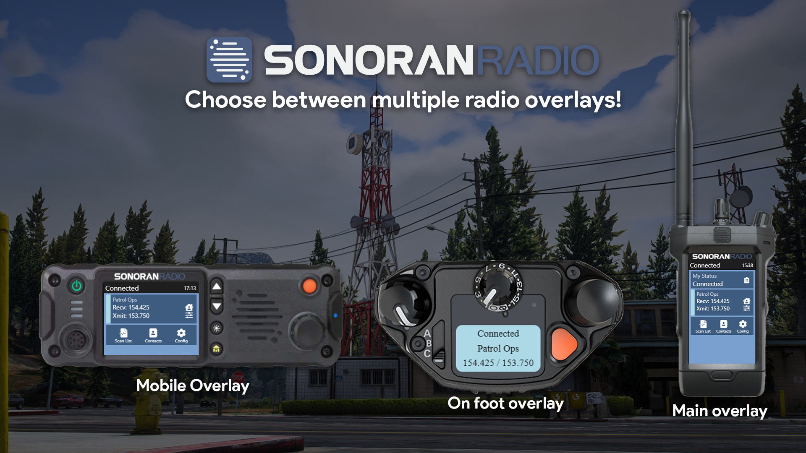<figcaption>
Sonoran Radio - Multiple Overlays - Promotional Image
</figcaption></figure>

<figure><figcaption>
Sonoran Radio - Custom Frames
</figcaption></figure>

## 🗣 [Hear Nearby Radio Chatter In-Game](tutorials/usage/in-game-radio/hear-nearby-radio-chatter.md)

Pulled over in a traffic stop? You'll hear the real radio chatter when an officer has an active radio nearby!

<figure><figcaption>
Sonoran Radio - Nearby Radio Chatter
</figcaption></figure>

## 📻[In-Game Scanners](tutorials/usage/in-game-radio/radio-scanners.md)

In-game scanners allow you and others nearby to listen in on radio traffic!

<figure><figcaption>
Sonoran Radio - In-Game Scanner
</figcaption></figure>

## 🎤️ [Background Noise Injection](tutorials/usage/in-game-radio/background-audio-injection.md)

Responding to a call? Sonoran Radio injects real-time sirens, gunshots, and more directly into your microphone feed for the ultimate immersion.

<figure>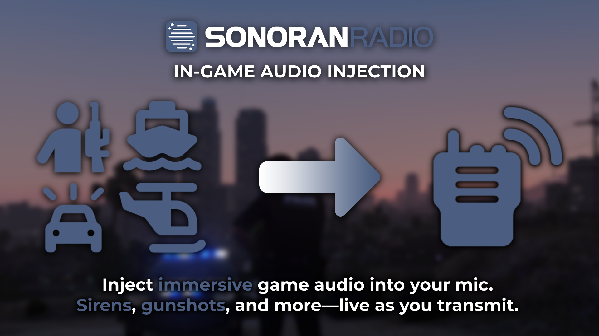<figcaption>
Sonoran Radio - Background Noise Injection
</figcaption></figure>

## 📡 [AI Pursuit Callouts](tutorials/usage/in-game-radio/pursuit-callouts.md)

Transmit live AI updates of your location and speed for seamless pursuit coordination.

<figure>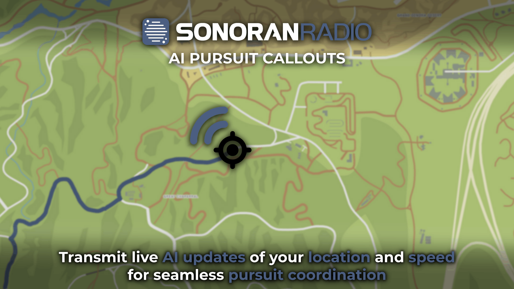<figcaption>
Sonoran Radio - AI Pursuit Callouts
</figcaption></figure>

## 🌐 [Custom Domain and Vanity URL](tutorials/usage/dispatch-panel/custom-domain-vanity-url.md)

Maintain your exclusive community branding by configuring a custom domain and vanity url!

<figure><figcaption></figcaption></figure>

## 🏃 [Free Animations Script](tutorials/integrations/big-daddy-radio-animations.md)

Get the most popular in-game radio animation script for [FREE](tutorials/integrations/big-daddy-radio-animations.md)!

<figure><figcaption>
Sonoran Radio x Big Daddy Scripts
</figcaption></figure>

## 🔌 [Power Grid Support](https://www.sonoran.store/package/5120025)

Hack into the integrated power grid to disable Sonoran Radio towers in your area! [Learn more about this script](https://www.sonoran.store/package/5120025)!

<figure>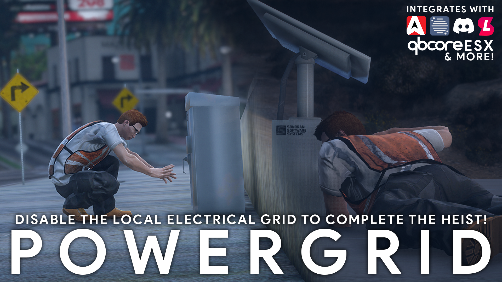<figcaption>
Sonoran Radio x Sonoran Power Grid - Promotional Image
</figcaption></figure>

## 🏆 [Sonoran CAD Integration](tutorials/integrations/sonoran-cad-integration.md)

Sonoran Radio provides an optional integration to SonoranCAD through the FiveM resource. Turning this on takes the system to a whole new level.

View dispatch call information on your in-game Sonoran Radio. CAD users can also see in-game towers, health, and signal range on the CAD live map!

<figure><figcaption>
Sonoran CAD x Sonoran Radio
</figcaption></figure>

## 📁[Sonoran CMS Integration](tutorials/integrations/sonoran-cms.md)

Sonoran CMS allows you to automatically manage your community's Sonoran Radio permissions based on their CMS ranks and Discord roles!

<figure><figcaption>
Sonoran CMS x Sonoran Radio
</figcaption></figure>

## [🚐](https://emojiterra.com/minibus/) [Mobile Command Center Integration](https://www.sonoran.store/package/5287071)

<figure>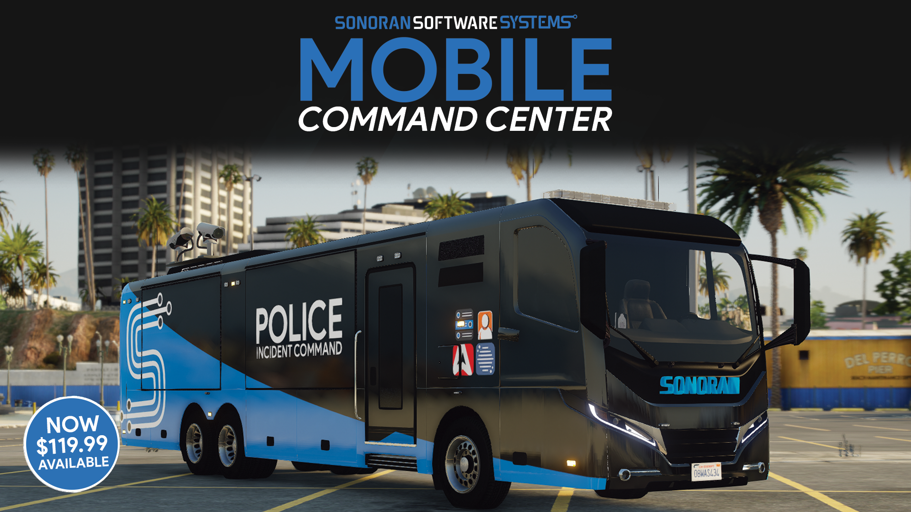<figcaption>
Sonoran Radio x Sonoran MCC - Promotional Image
</figcaption></figure>

<figure>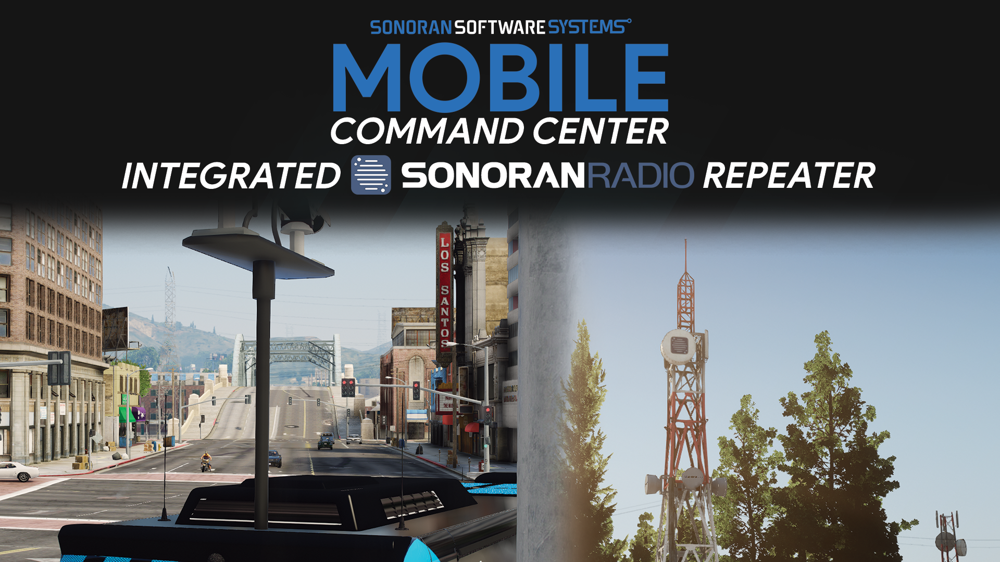<figcaption>
Sonoran Radio x Sonoran MCC - Integrated Repeater - Promotional Image
</figcaption></figure>

[Sonoran's mobile command center](https://www.sonoran.store/package/5287071) enables you to take command like never before. This one-of-a-kind utility vehicle brings endless possibilities!

Expand the pop-out sides for a walkable command center interior. Or, **raise the radio antenna** and scan the scene with 360 degree surveillance cameras!

Paired with a standalone script, the mobile command center offers an **integrated Sonoran Radio repeater** and Sonoran CAD ALPR functionality!

## 📋 [Frequent Updates](roadmap/roadmap-and-changelog/changelog.md)

Sonoran Radio is always providing updates to help improve the experience, customizability, and realism of the product. We're always looking for new ideas and suggestions!
