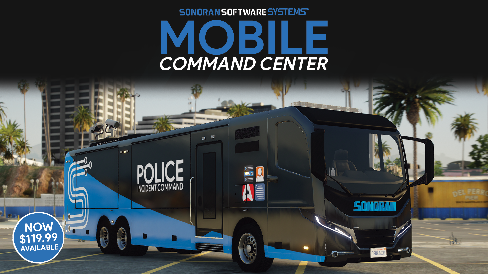

# 🏆 Why Choose Sonoran Radio

## 💸 Free!

Sonoran Radio offers a fully-featured free version accessible to anyone!

With instant setup, you can chat with community members in just minutes!

## 💣 [In-Game Tower Destruction](tutorials/usage/in-game-radio/in-game-repeaters.md)

The physical in-game towers are able to be destroyed by criminals, which will devastate quality of radios around it.

With three different in-game model types, Sonoran Radio takes immersion to the next level!

See our [tower destruction and repairing](ts3-legacy/tutorials/script-usage.md#in-game-towers) info!

<figure><figcaption>
Cellular Antenna
</figcaption></figure>

 

<figure><figcaption>
Radio Tower
</figcaption></figure>

 

<figure><figcaption>
Server Rack
</figcaption></figure>

<figure><figcaption>
Sonoran Radio - Destructible Towers - Promotional Image
</figcaption></figure>

## 📶 [Tunnel Signal Loss](tutorials/usage/in-game-radio/tunnels-and-degrade-zones.md)

Configure signal loss in tunnels, underground locations, and more!

<figure><figcaption>
Sonoran Radio - Tunnel Detection
</figcaption></figure>

## 📢 [Custom Tone Board](tutorials/usage/dispatch-panel/custom-tone-board.md)

Upload and customize dispatch tones for your community!

Sonoran Radio's dispatch UI allows you to specify specific channels and groups, repeat tones, and more! You can even [play tones on in-game speakers](tutorials/usage/in-game-radio/in-game-speakers.md)!

<figure><figcaption>
Sonoran Radio - Tone Board
</figcaption></figure>

<figure><figcaption>
Sonoran Radio - In-Game Speakers
</figcaption></figure>

## 🎙️[Custom Voice Effects](tutorials/usage/dispatch-panel/custom-voice-effects.md)

Customize digital and analog style voice effects for your community!

<figure><figcaption>
Sonoran Radio - Custom Voice Effects
</figcaption></figure>

## 🔊 [Custom SFX](tutorials/usage/dispatch-panel/custom-sfx.md)

Easily customize mic clicks, talkover protection tones, and more!

<figure><figcaption></figcaption></figure>

## ☁️ [Cloud Configurations](tutorials/usage/dispatch-panel/configure-channels.md)

Customizing your radio has never been easier, with live updates from our easy-to-use configuration panel.

<figure><figcaption>
Sonoran Radio - Customize Panel
</figcaption></figure>

## 🎧 [Dispatch Panel](tutorials/usage/dispatch-panel/using-the-dispatch-panel.md)

Easily visualize, manage users, play tones, and more!

Sonoran Radio's dispatch UI is available everywhere on the [web](sonoran-radio/download-the-app.md) and [desktop](sonoran-radio/download-the-app.md) for Windows and OSX.

<figure><figcaption>
Sonoran Radio - Dispatch Portal
</figcaption></figure>

## 📡 [Multiple Radio Options](tutorials/usage/in-game-radio/using-the-in-game-radio.md)

Sonoran Radio offers multiple in-game user interfaces, allowing you to stay connected on-foot, in-vehicle, and more!

Choose from one of our radio style options, or even add your own!

<figure><figcaption>
Sonoran Radio - Multiple Overlays - Promotional Image
</figcaption></figure>

<figure><figcaption>
Sonoran Radio - Custom Frames
</figcaption></figure>

## 🗣 [Hear Nearby Radio Chatter In-Game](tutorials/usage/in-game-radio/hear-nearby-radio-chatter.md)

Pulled over in a traffic stop? You'll hear the real radio chatter when an officer has an active radio nearby!

<figure><figcaption>
Sonoran Radio - Nearby Radio Chatter
</figcaption></figure>

## 🏃 [Free Animations Script](tutorials/integrations/big-daddy-radio-animations.md)

Get the most popular in-game radio animation script for [FREE](tutorials/integrations/big-daddy-radio-animations.md)!

<figure><figcaption>
Sonoran Radio x Big Daddy Scripts
</figcaption></figure>

## 🔌 [Power Grid Support](https://www.sonoran.store/package/5120025)

Hack into the integrated power grid to disable Sonoran Radio towers in your area! [Learn more about this script](https://www.sonoran.store/package/5120025)!

<figure><figcaption>
Sonoran Radio x Sonoran Power Grid - Promotional Image
</figcaption></figure>

## 🏆 [Sonoran CAD Integration](tutorials/integrations/sonoran-cad-integration.md)

Sonoran Radio provides an optional integration to SonoranCAD through the FiveM resource. Turning this on takes the system to a whole new level.

Visually see in-game towers, health, and signal range on the CAD live map!


_CAD status, call information, and more will be released in a coming update._


## 📁[Sonoran CMS Integration](tutorials/integrations/sonoran-cms.md)

Sonoran CMS allows you to automatically manage your community's Sonoran Radio permissions based on their CMS ranks and Discord roles!

<figure><figcaption>
Sonoran CMS x Sonoran Radio
</figcaption></figure>

## [🚐](https://emojiterra.com/minibus/) [Mobile Command Center Integration](https://www.sonoran.store/package/5287071)

<figure><figcaption>
Sonoran Radio x Sonoran MCC - Promotional Image
</figcaption></figure>

<figure><figcaption>
Sonoran Radio x Sonoran MCC - Integrated Repeater - Promotional Image
</figcaption></figure>

[Sonoran's mobile command center](https://www.sonoran.store/package/5287071) enables you to take command like never before. This one-of-a-kind utility vehicle brings endless possibilities!

Expand the pop-out sides for a walkable command center interior. Or, **raise the radio antenna** and scan the scene with 360 degree surveillance cameras!

Paired with a standalone script, the mobile command center offers an **integrated Sonoran Radio repeater** and Sonoran CAD ALPR functionality!

## 📋 [Frequent Updates](roadmap/changelog.md)

Sonoran Radio is always providing updates to help improve the experience, customizability, and realism of the product. We're always looking for new ideas and suggestions!
