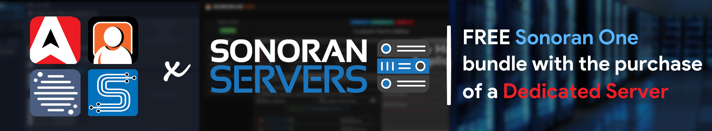
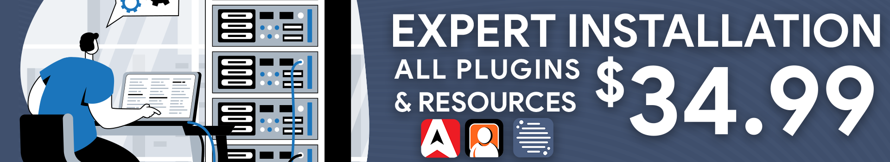

# Free in-game Radio Installation and Discount - Sonoran Servers

## CAD: 30%-100% off Discount

[Learn more about this offer!](https://info.sonoranservers.com/pricing/promotions-and-discounts/30-off-software)

## Free Plugin Installation

### 1. Purchase a Windows Server Product from Sonoran Servers

If you haven't already, [purchase any server plan with Windows as the operating system from Sonoran Servers](https://info.sonoranservers.com/tutorials/windows-server/purchasing-and-getting-started).

### 2. Contact Support

Reach out on our [customer support site](https://support.sonoransoftware.com) and a team member will help install and configure your Sonoran Radio in-game integration for free!

### The support agent has installed my in-game Radio, what's next?

[View the next steps guide](free-install-next-steps.md)

## Free TeamSpeak 3 Server

[ Get started today!](free-teamspeak-promo.md)

<figure><figcaption>
Sonoran Radio x Sonoran Servers - Promotional Image
</figcaption></figure>

## Purchase Expert Installation

Get Sonoran Radio's in-game radio as well as Sonoran CMS and Sonoran CAD's FiveM in-game integrations installed by our experts!&#x20;

<figure><figcaption>
Expert Installation - Promotional Image
</figcaption></figure>

### What is expert installation?

Our [support agents](https://support.sonoransoftware.com) are available 7 days/week to help install and configure all of your Sonoran CAD, CMS, and Radio plugins on your Windows VPS or dedicated server!

Expert installation is a one-time payment of $34.99 and covers THREE (3) non-transferable installation credits. These credits can be used for:

* Sonoran CAD - Framework and Plugin Installation
* Sonoran CMS - Addon Installation
* Sonoran Radio - In-Game Radio and Addon Installation

### Requirements for Installation

1. Windows VPS or Dedicated Server
2. Windows RDP Access (shared with support agent)
3. Sonoran CAD, CMS, or Radio subscription

### FAQ

#### How do I purchase expert installation?

Expert installation can be added to your order at the time of checkout. Or, by accessing the Sonoran Radio billing portal.

#### How do I contact support for the installation?

Our [support agents](https://support.sonoransoftware.com) are available 7 days/week to help install and configure all of your Sonoran CAD, CMS, and Radio plugins on your Windows VPS or dedicated server!

#### Can I redeem another product installation at a later date?

Yes! Your purchase is valid for three installation credits. You could have the agent install and configure CAD plugins and install CMS plugins at a later date. The support agent has installed my plugins, what's next?
