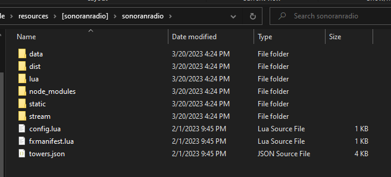
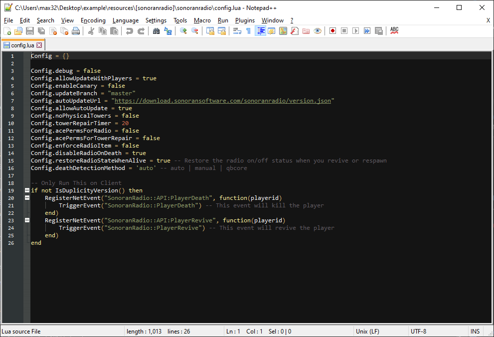

# Free in-game Radio Installation - Next Steps

If you haven't already,[ check out our page for more information on this promotion](discounts-and-offers.md).

## 1. Locate your Installed in-game Radio files

Open the `\resources\[sonoranradio]\sonoranradio` directory.

## 2. View and Change Configuration File

For Sonoran Radio's in-game resource, there will be a `config.lua` file present.

You can open this configuration file with a text editor and change values.

For more information on the configuration options, you can view the [in-game resource's guide](../../ts3-legacy/tutorials/getting-started/in-game-radio.md) page and scroll down to the configuration section.

If you modify a configuration file, be sure to save it and restart the server.
