# Free TeamSpeak Server Promo

## Sonoran Servers Promo

Purchase either:

1. Sonoran Radio Pro
2. Sonoran ONE

Receive a coupon for a Sonoran Servers TeamSpeak 20-slot server for the life of your Sonoran Radio or Sonoran ONE subscription. You may purchase additional slots at the regular rate but your first 20 slots are free. This will show on your Sonoran Servers invoice as a credit up to $7.

**NOTE: Cancelling your Sonoran Radio or Sonoran ONE subscription, even accidentally, will terminate your Sonoran Servers TeamSpeak 3 server and all data/configuration will be lost.**&#x20;

<figure>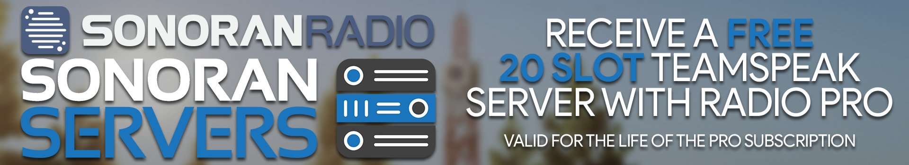<figcaption>
Sonoran Radio x Sonoran Servers - Promotional Image
</figcaption></figure>

## How to get the discount

## 1. Purchase Sonoran Radio Pro or Sonoran ONE Subscription

### a. Select Sonoran Radio Community to Upgrade

Click `Subscriptions & Billing` on the Sonoran Radio Portal or [follow this link](https://sonoranradio.com/billing).&#x20;

<figure>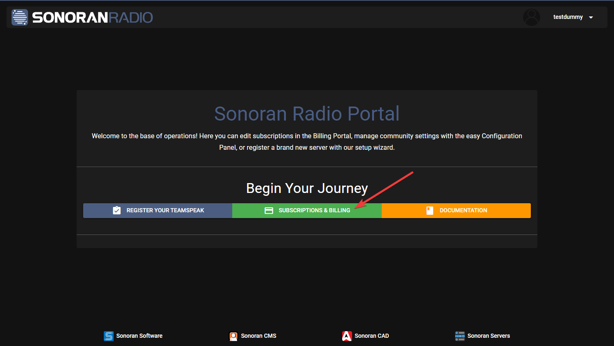<figcaption>
Sonoran Radio - Navigate to Billing Panel
</figcaption></figure>


If you have already purchased `Sonoran Radio Pro` or `Sonoran ONE` then you can [skip to step 2](free-teamspeak-promo.md#generate-promo).


### b. Click "New Subscription"

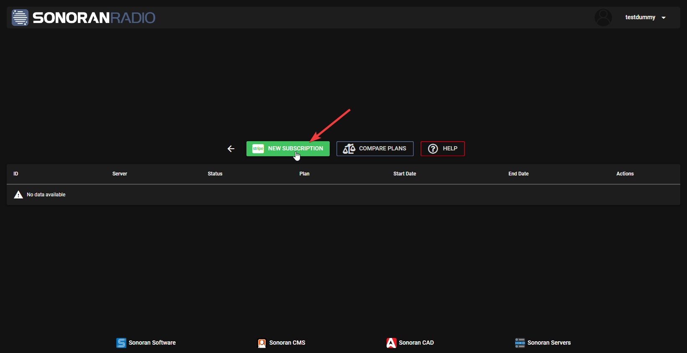

### c. Choose the Subscription Tier


NOTE: Sonoran Servers Promo **requires** `Pro Plan` or `Sonoran ONE`


Select the subscription tier you would like:&#x20;

<figure>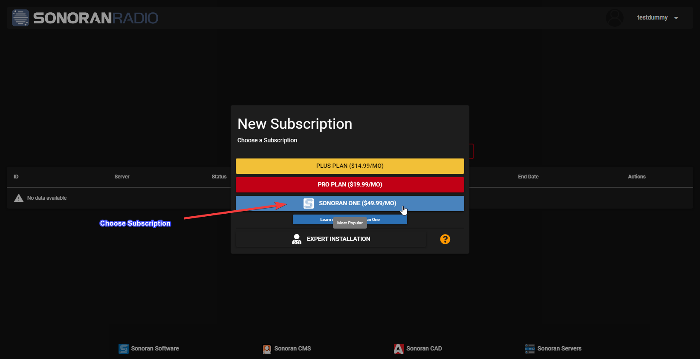<figcaption>
Sonoran Radio - Choose Subscription
</figcaption></figure>

### d. Confirm the Sonoran Radio Community

Select the Sonoran Radio community you would like the new subscription to apply to

**or**

Select `No Server` if you have not registered a Sonoran Radio Community yet (we will go over these steps later):

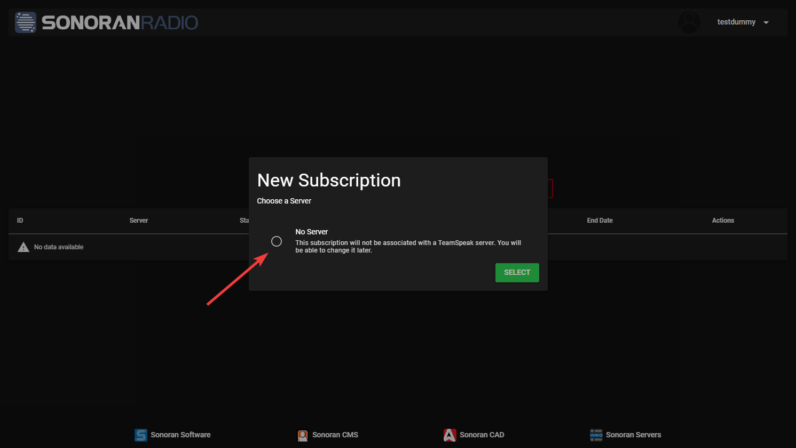

### e. Complete Purchase

Fill in the requested billing information and complete your purchase. You will be redirected on successful payment to the Sonoran Radio web panel and should see your new subscription applied to your Sonoran Radio community.

> Did you know we offer [expert installation](discounts-and-offers.md#what-is-expert-installation)?
>
> Add expert installation to your order to have our representatives install the Sonoran Radio in-game integration as well as other in-game integrations on your GTA:V RP server. [See more info here](discounts-and-offers.md#what-is-expert-installation).

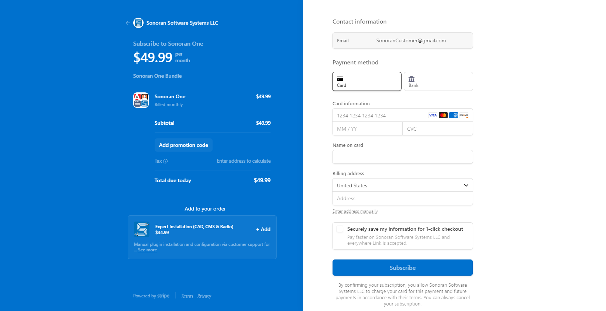

## 2. Generate Promo Code 

Click on `FREE 20 SLOT TEAMSPEAK` on your new subscription and then click `Generate Code` on the pop-up modal.&#x20;

<figure>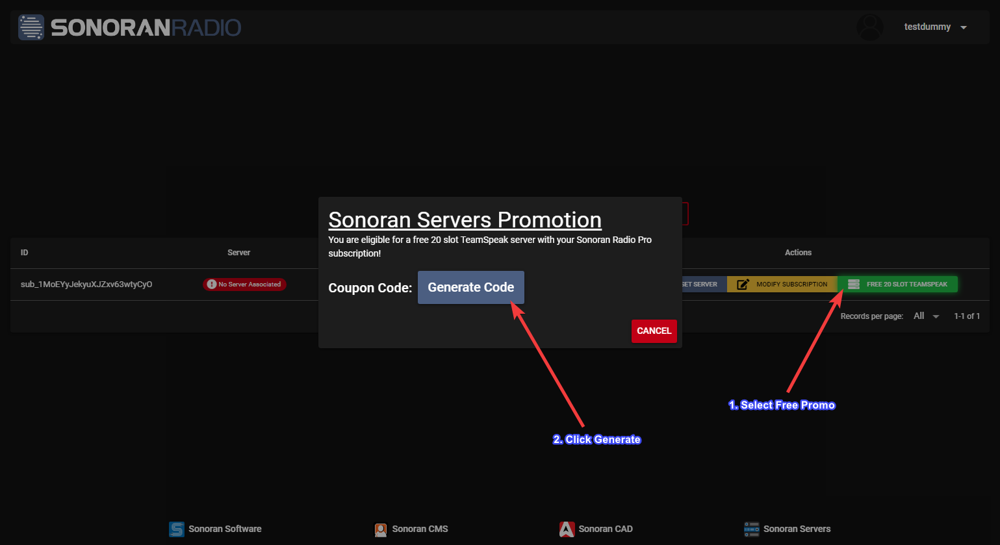<figcaption>
Sonoran Radio x Sonoran Servers - Generate Code
</figcaption></figure>

## 3. Copy Code and Open Link

Click the Copy icon next to the promo code as shown, then click the Sonoran Servers TeamSpeak 3 Server purchase link as shown on the image below:&#x20;

<figure>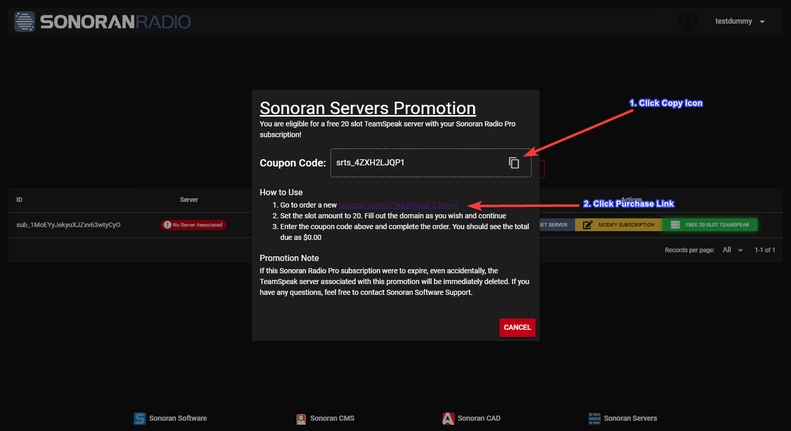<figcaption>
Sonoran Radio x Sonoran Servers - Copy Code
</figcaption></figure>

## 4. Configure TeamSpeak 3 Server Purchase

Set the `Slots` to 20 or more if you would like to pay for additional slots above the free 20 you get with this promotion. Then type in a `TeamSpeak Subdomain` to have a subdomain to make it easier to connect to your new TeamSpeak 3 Server.&#x20;

<figure>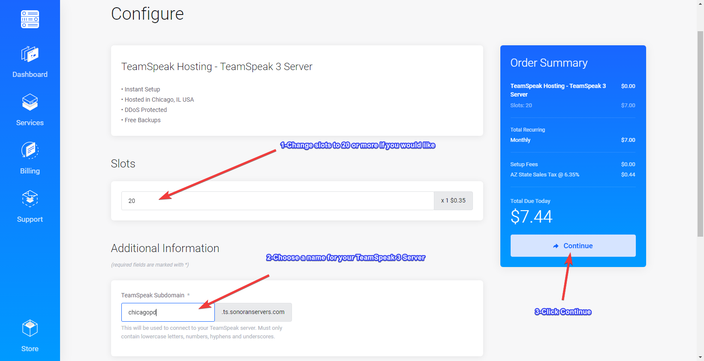<figcaption>
Sonoran Radio x Sonoran Servers - Checkout Page
</figcaption></figure>

## 5. Apply your Promo Code

Paste the promo code you copied in Step 4 in the `Promotion` code box, then click `Validate Code` as shown:&#x20;

<figure>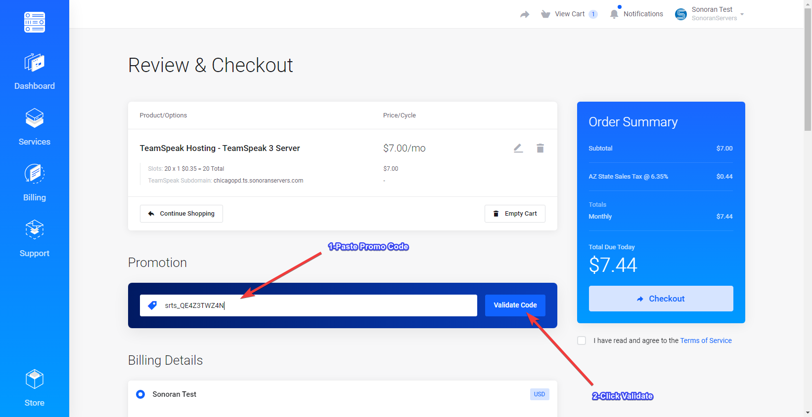<figcaption>
Sonoran Radio x Sonoran Servers - Enter Code
</figcaption></figure>

## 6. Complete Checkout

Fill in the required billing and account information, then follow the prompts to checkout. You should receive an email confirming your purchase.&#x20;

<figure>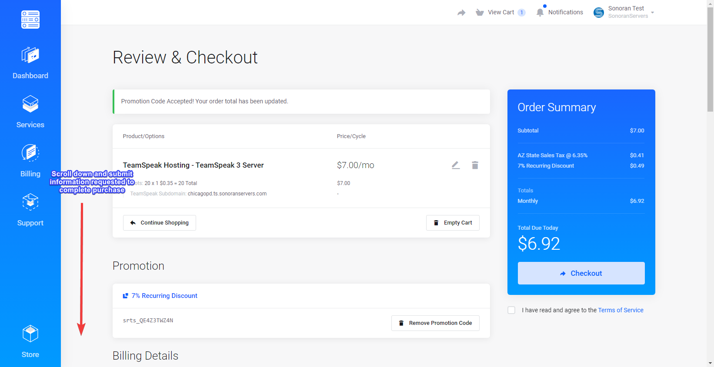<figcaption>
Sonoran Radio x Sonoran Servers - Complete Checkout
</figcaption></figure>

## 7. Check Email

One of the emails sent after checking out will be similar to the following. Use the information in this email to access your TeamSpeak 3 server, claim TeamSpeak admin permissions and continuing registering your new TeamSpeak 3 server with Sonoran Radio.&#x20;

<figure>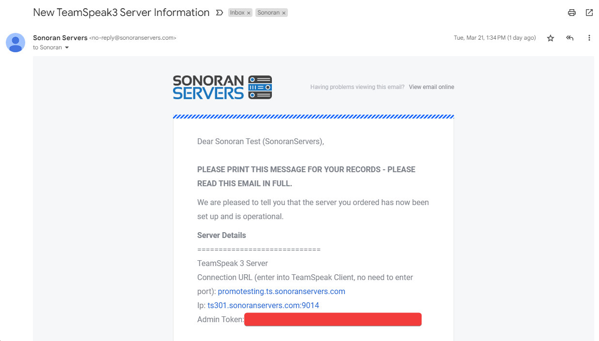<figcaption>
Sonoran Radio x Sonoran Servers - Check Email
</figcaption></figure>

## 8. Register your TeamSpeak

a. Navigate back to the [Sonoran Radio Portal](https://sonoranradio.com/portal).

b. Click on the `REGISTER YOUR TEAMSPEAK` button to begin linking your TeamSpeak server.

c. (Optional) Enter a nickname for your server

d. Connect to your TeamSpeak server and retrieve the Unique ID of your TeamSpeak server using the Sonoran Radio Plugin. \* Click on the TeamSpeak Virtual Server \* Copy the Unique ID field.

<figure>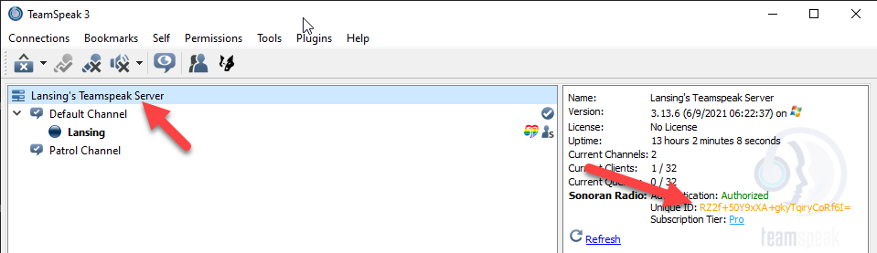<figcaption>
Sonoran Radio - Copy Unique ID
</figcaption></figure>


You must have the [TS3 Plugin installed](../../ts3-legacy/tutorials/getting-started/install-plugin.md) on your TeamSpeak client before this information will appear


e. Paste the Server UID into the new server form and press `Register Server`&#x20;

<figure><figcaption>
Sonoran Radio - Paste UID
</figcaption></figure>

f. Copy the Authorization Code given (example below), re-connect to your TeamSpeak Server and paste the code in the pop-up shown below


If you are receiving an error/don't see the pop-up, it can be one of three common issues: 1 - You do have the required permissions (You must be able to modify the server password) 2 - You do not have version 0.2.0 or greater of the plugin 3 - You did not set your Server UID properly in the panel.


 

## 9. Apply Subscription to your Community

a. Navigate back to the [Billing Panel](https://sonoranradio.com/billing) and select `SET SERVER` under your new subscription.&#x20;

<figure>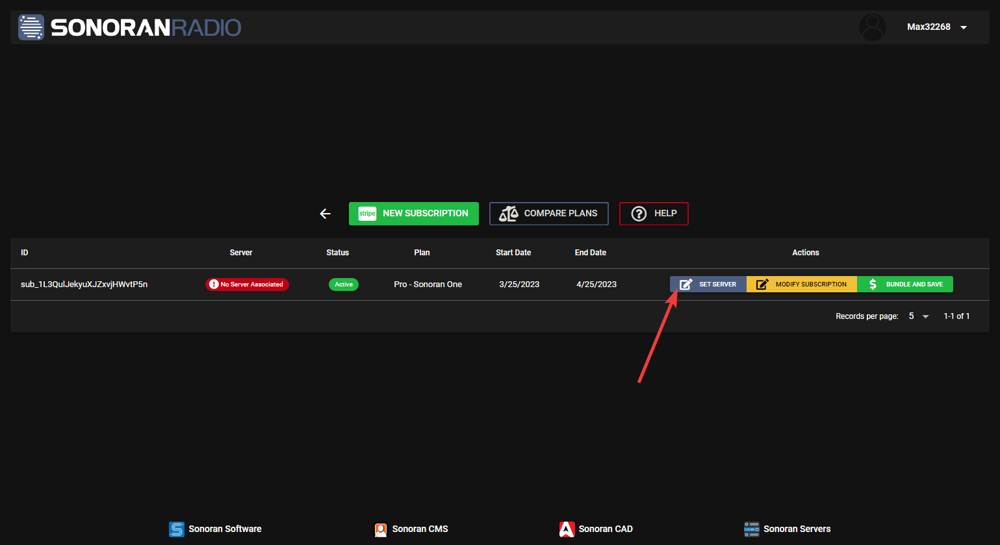<figcaption>
Sonoran Radio x Sonoran Servers - Set Server
</figcaption></figure>

b. Select the community you just registered then click `SELECT`&#x20;

<figure>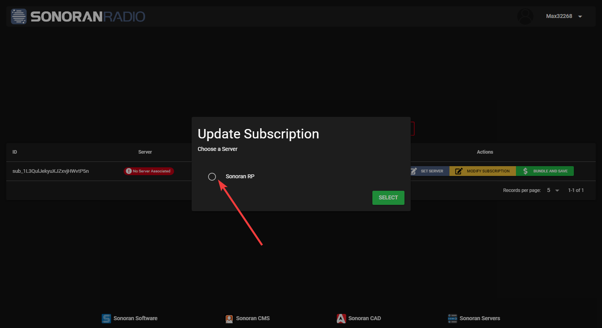<figcaption>
Sonoran Radio x Sonoran Servers - Select Community
</figcaption></figure>

## 10. Set Patrol Channel

a. Create a new voice channel to set as your radio communications channel. Note the Channel ID of your patrol channel by clicking the channel name then looking for the `Channel ID` in the details sidebar.&#x20;

<figure><figcaption>
Sonoran Radio x Sonoran Servers - Patrol Channel ID
</figcaption></figure>

b. Click on the Plus button under the **Patrol Channels** section of the radio management portal. Insert that channels Unique ID and press `SAVE`&#x20;

<figure><figcaption>
Sonoran Radio x Sonoran Servers - Add Patrol Channel
</figcaption></figure>


Note: Checking Allow Talkover disables preventing units from talking over one another.



Note: Customizable Talk-Around Ranges vary from Short Range (600m) to Extra Long Range (1400m) with a 400m difference between each range option. The Customizable Talk-Around Range only applies to talk-around frequencies, transmitted frequencies that don't get repeated over the radio tower network.


## 11. Add Radio Frequency Profiles

a. To create a new profile, click on the Plus button on the radio management portal under the **Profiles** section.

**Basic Profile Creation**

Basic Profile Creation is meant for a quick and easy way to create profiles without the hassle of organizing frequencies. Receiver Frequency & Transmit Frequency with automatically be generated on creation.&#x20;

<figure><figcaption>
Sonoran Radio x Sonoran Servers - Add Profile
</figcaption></figure>

Set the display name of the profile. This will display in both TeamSpeak and the in-game radio.

#### **Advanced Profile Creation**

Advanced Profile Creation is meant for a more customizable and in-depth way to create profiles if you have the knowledge of how our Simplex & Duplex radio system works.&#x20;

<figure><figcaption>
Sonoran Radio x Sonoran Servers - Add Profile (Advanced)
</figcaption></figure>

* Set the Receive Frequency. In Simplex, this should be set to the same as the Transmit Frequency. In Duplex, this is the frequency of the transmissions from the repeater.
* Set the Transmit Frequency. In Simplex, this should be set to the same as the Receive Frequency. In Duplex, this is the frequency that the repeater is listening for transmissions on.
* Check the Repeats Transmit Frequency to enable the duplex repeater functionality.
* [Learn More About Simplex & Duplex Mode](../../ts3-legacy/tutorials/getting-started/core-concepts.md)

b. To reorder the position of profiles, click on the `Reorder Profiles` button on the radio management portal.

* Drag and drop the rows in the order that you'd like them to be.
* Click the `Save Reordered Profiles` button above the profiles table to save.
* Click the `Cancel Reordered Profiles` button above the profiles table to cancel, it will reset any reordering changes you made.

c. The setup process is complete. You will need to disconnect and reconnect to your TeamSpeak server. If the setup process was successful, you should see the following:

`Server Authenticated` message in teamspeak when you join the server.

<figure>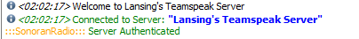<figcaption>
Sonoran Radio x Sonoran Servers - Server Authenticated
</figcaption></figure>

Clicking your server name should say `Authorized` in the sidebar&#x20;

<figure>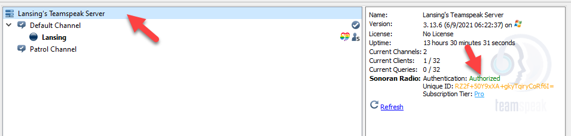<figcaption>
Sonoran Radio x Sonoran Servers - Server Authorized
</figcaption></figure>

Your Patrol Channel should be marked as a Patrol Channel in the sidebar

<figure>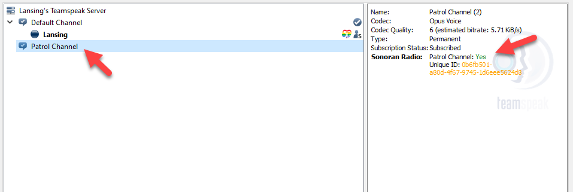<figcaption>
Sonoran Radio x Sonoran Servers - Patrol Channel Success
</figcaption></figure>
