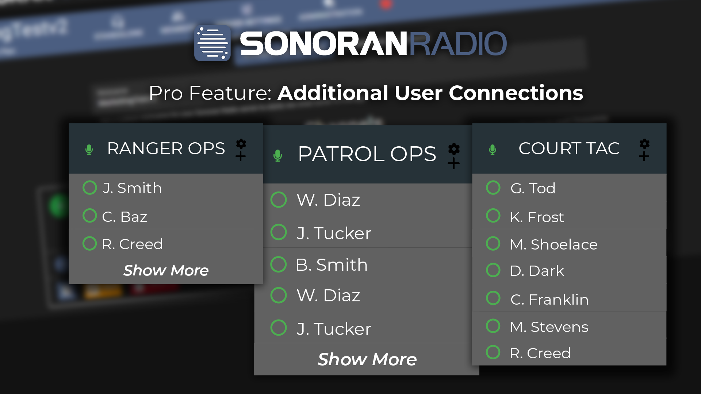
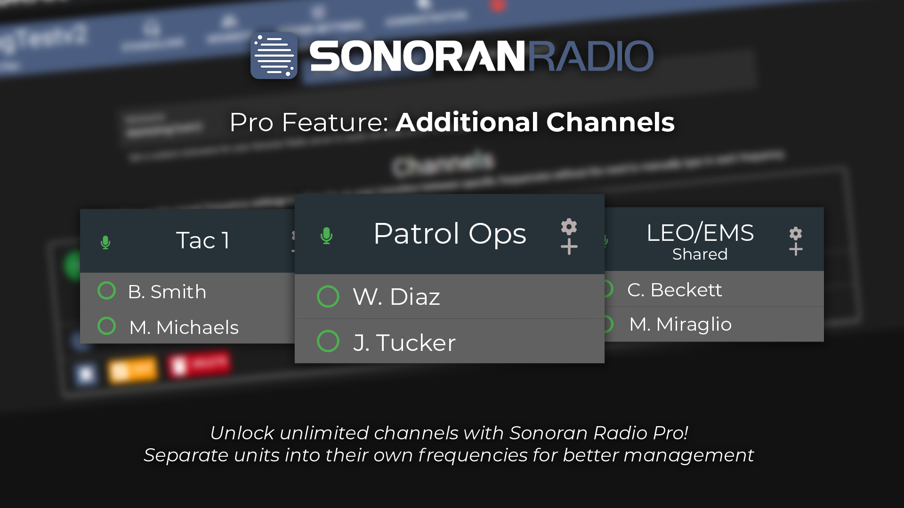
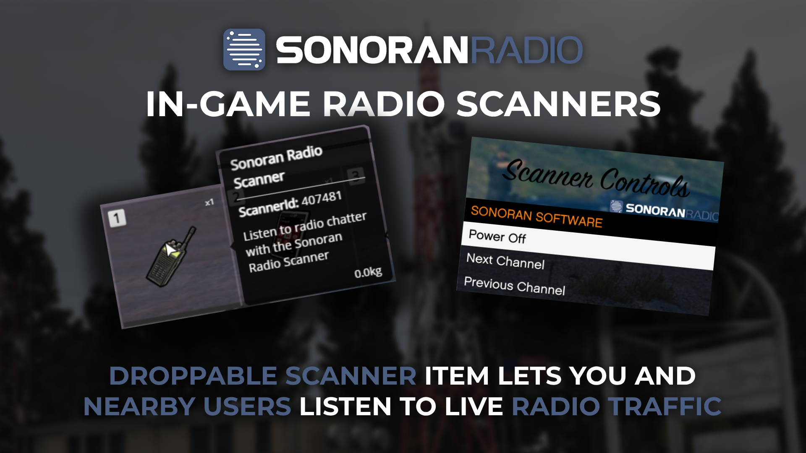

# Standalone Pricing

Subscription Options

All payment options are monthly or quarterly (3 month) subscriptions.

Quarterly subscriptions offer a 25% discount.

| Subscription | Monthly   | Quarterly |
| ------------ | --------- | --------- |
| Free         | $0/mo     | $0/qr     |
| Plus         | $14.99/mo | $33.75/qr |
| Pro          | $19.99/mo | $45/qr    |

## Subscription Limits

Specific features are limited based on the subscription version. View the details below:

### Connected Users

Depending upon your subscription level, your community is limited to the maximum amount of users connected at one time.

<figure><figcaption></figcaption></figure>

| Subscription | Limit                     |
| ------------ | ------------------------- |
| Free         | 10 Connected Users        |
| Plus         | 30 Connected Users        |
| Pro          | Unlimited Connected Users |

### [Radio Channels](../../tutorials/usage/dispatch-panel/configure-channels.md)

Depending upon your subscription level, your community is limited to the maximum amount of radio channels.

<figure><figcaption></figcaption></figure>

| Subscription | Limit                    |
| ------------ | ------------------------ |
| Free         | 1 Radio Channel          |
| Plus         | 5 Radio Channels         |
| Pro          | Unlimited Radio Channels |

### [Hear Nearby Radio Chatter](../../tutorials/usage/in-game-radio/hear-nearby-radio-chatter.md) and [Scanners](../../tutorials/usage/in-game-radio/radio-scanners.md)

<figure><figcaption>
Sonoran Radio - Hear Nearby Chatter
</figcaption></figure> <figure><figcaption>
Sonoran Radio - Scanners
</figcaption></figure>

Pulled over in a traffic stop? You'll hear the real radio chatter when an officer has an active radio nearby!

| Subscription | Limit |
| ------------ | ----- |
| Free         | 🚫    |
| Plus         | 🚫    |
| Pro          | ✅     |

<figure><figcaption></figcaption></figure>

### [Community-Wide Sound Effect Customization](../../tutorials/usage/dispatch-panel/custom-sfx.md#community-wide-sfx)

* Key Up/Down SFX
* Talkover Deny/Override SFX
* Incoming Emergency Call SFX

| Subscription | Limit |
| ------------ | ----- |
| Free         | 🚫    |
| Plus         | ✅     |
| Pro          | ✅     |

### [Per-User Sound Effect Customization](../../tutorials/usage/dispatch-panel/custom-sfx.md#per-user-sfx)

* Key Up/Down SFX

| Subscription | Limit |
| ------------ | ----- |
| Free         | 🚫    |
| Plus         | 🚫    |
| Pro          | ✅     |

### [Tone Board Customization](../../tutorials/usage/dispatch-panel/custom-tone-board.md)

<figure><figcaption></figcaption></figure>

| Subscription | Limit     |
| ------------ | --------- |
| Free         | 1         |
| Standard     | 3         |
| Pro          | Unlimited |

### [Voice Effect Customization](../../tutorials/usage/dispatch-panel/custom-voice-effects.md)

<figure><figcaption></figcaption></figure>

| Subscription | Effect Styles Limit |
| ------------ | ------------------- |
| Free         | 1                   |
| Standard     | 1                   |
| Pro          | Unlimited           |

### [Transmission Logs](../../tutorials/usage/dispatch-panel/transmission-logs.md)

<figure><figcaption></figcaption></figure>

| Subscription | Limit |
| ------------ | ----- |
| Free         | 🚫    |
| Standard     | 🚫    |
| Pro          | ✅     |

