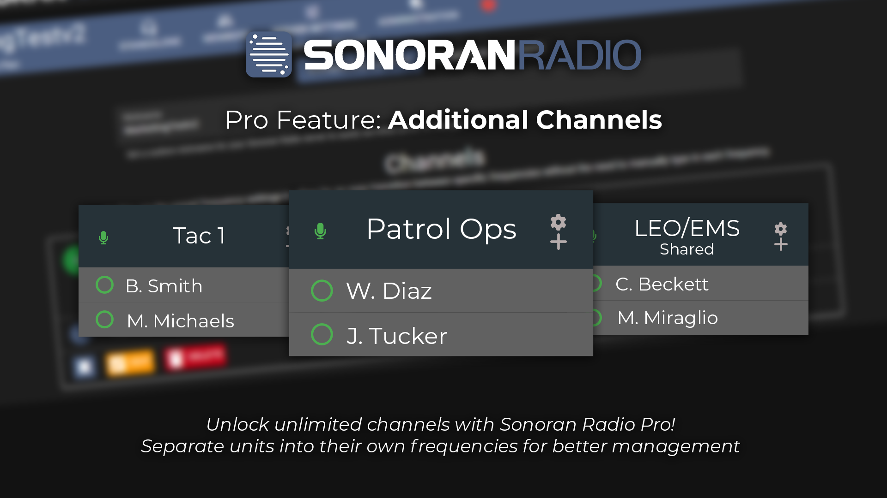
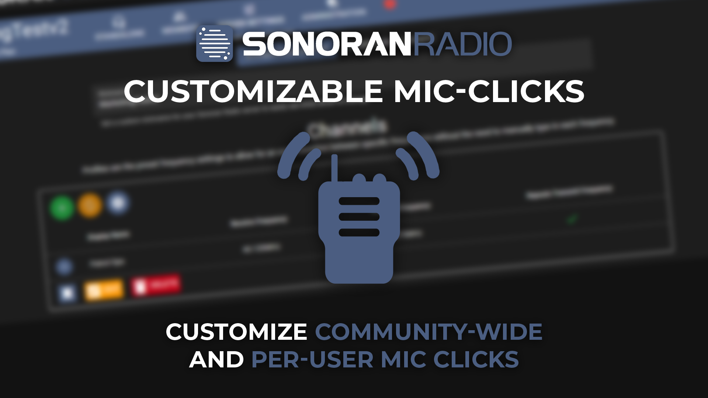

# Standalone Pricing

## Connected Users

Depending upon your subscription level, your community is limited to the maximum amount of users connected at one time.

<figure><figcaption></figcaption></figure>

| Subscription | Limit                     |
| ------------ | ------------------------- |
| Free         | 10 Connected Users        |
| Plus         | 30 Connected Users        |
| Pro          | Unlimited Connected Users |

## Radio Channels

Depending upon your subscription level, your community is limited to the maximum amount of radio channels.

<figure><figcaption></figcaption></figure>

| Subscription | Limit                    |
| ------------ | ------------------------ |
| Free         | 1 Radio Channel          |
| Plus         | 5 Radio Channels         |
| Pro          | Unlimited Radio Channels |

## Mic Click Sound Customization

<figure><figcaption></figcaption></figure>

| Subscription | Limit                             |
| ------------ | --------------------------------- |
| Free         | No Customization                  |
| Plus         | Community-Wide Customization Only |
| Pro          | Community-Wide and Per-User       |

## Talkover Prevent/Error Sound Customization

| Subscription | Limit            |
| ------------ | ---------------- |
| Free         | No Customization |
| Plus         | No Customization |
| Pro          | Community-Wide   |
