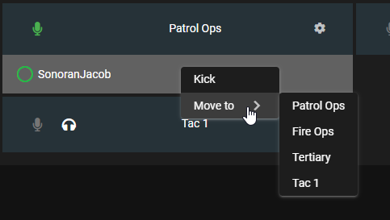

# Getting Started

## Creating a New Community

1. In your Sonoran Radio Portal, click the green plus button
2. Click `Begin Your Journey!` to create a new community
3. Click `Standalone (Alpha)` mode at the top
4. Enter a good nickname, and click `Register Server`

<figure><figcaption>
Sonoran Radio - Create a New Community
</figcaption></figure>

### Inviting Members

You can find an invite code in the administration. With the invite code, people from your community can join your Sonoran Radio server in the Sonoran Radio Portal

<figure><figcaption></figcaption></figure>

 

<figure><figcaption></figcaption></figure>

## In the Browser

When you first open a Sonoran Radio community with standalone enabled, you will see this page:

<figure><figcaption>
Sonoran Radio - Connect to Radio
</figcaption></figure>

To join the radio, press **Connect.** After connecting, you will be greeted with a row of channels, and a list of connected users underneath them

<figure><figcaption>
Sonoran Radio - Radio Hub
</figcaption></figure>

### Transmitting (Push to Talk)

To transmit over Sonoran Radio, you can press the microphone button on the top-left

<figure><figcaption>
Sonoran Radio - Transmit Button
</figcaption></figure>

#### PTT Keybind

In the browser, you can set a push-to-talk keybind in your radio settings

<figure><figcaption></figcaption></figure>

 

<figure><figcaption></figcaption></figure>


Note that the push-to-talk is not global, and only works when the browser window is focused (i.e. you must click on Sonoran Radio before the keybind works)


### Switching Channels

To switch to another channel, click the microphone button on the channel card

<figure><figcaption>
Sonoran Radio - Switch Channel
</figcaption></figure>

#### Scanning (Listening) multiple channels

With Sonoran Radio, you are able to listen to multiple channels at the same time. To enable this for another channel, press the headphones button on the channel card next

<figure><figcaption>
Sonoran Radio - Scan Channel
</figcaption></figure>

### User Actions

You are able to perform actions on users in the radio, like move their channel or kick them. To perform an action, right click on a user

<figure><figcaption>
Sonoran Radio - Radio User Actions
</figcaption></figure>

## In FiveM

The preferred method of using the radio is with the FiveM resource, as you can use your push-to-talk in-game

### Logging In

When using the in-game resource for the first time, you have to login. To login, you must copy your Secret Key from your account settings

<figure><figcaption></figcaption></figure>

 

<figure><figcaption></figcaption></figure>

Then, once you have your Secret Key, you can paste it into the FiveM resource to login

<figure><figcaption></figcaption></figure>
