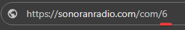

# Installing the In-Game Resource

## Resource Installation

### 1. Download the ZIP

Download the [latest release](https://download.sonoransoftware.com/sonoranradio/fivem/latest.zip) of the FiveM resource

### 2. Extract the ZIP File

Extract the .zip file into your resources directory. Place the `sonoranradio` and `sonoranradio_updatehelper` into a folder labeled `[sonoranradio]`

<figure><figcaption><p>Sonoran Radio Folder Structure</p></figcaption></figure>

### 3. Configure Sonoran Radio

Rename `config.CHANGEME.lua` to `config.lua`, and open it to edit your standalone ID

Set `Config.standaloneId` to your community's ID. This can be found in the URL of your community: `https://sonoranradio/com/YOUR_COMMUNITY_ID`

<div align="left">

<figure><figcaption></figcaption></figure>

</div>


Incorrectly setting the `Config.standaloneId` will cause problems!


### 4. Update Your Server Config

In your `server.cfg` file, add the following:

```
ensure sonoranradio

# permissions for auto-updater (REQUIRED)
add_ace resource.sonoranradio command allow
add_ace resource.sonoranradio_updatehelper command allow

# permissions for sonrad tower commands
add_principal group.admin sonoranradio.towers
add_ace sonoranradio.towers command.spawntower allow
add_ace sonoranradio.towers command.savetowers allow
```


It is very important that the `sonoranradio_updatehelper` resource is not started manually. Doing so may cause a server crash if updates are available due to a race condition.

**DO NOT** start the whole \[sonoranradio] folder as that will also start the sonoranradio\_updatehelper which might cause crashing if started manually.

Example of what NOT to do: `ensure [sonoranradio]`


## Updates <a href="#updates" id="updates"></a>

The Sonoran Radio in-game resource will automatically update with the latest features, fixes, and changes upon server restart!

## Next Steps

Learn how to use the in-game radio:


[using-the-in-game-radio.md](using-the-in-game-radio.md)

