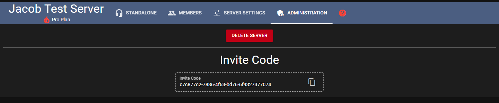
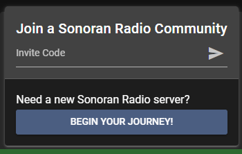

# Invite and Manage Users

## Automatic Invite, Kick, Ban, and Permission Sync

Sonoran CMS allows you to automatically add and manage user permissions with user applications, sync them with Discord roles, and more!

COMING SOON

## Manual User Management

### Inviting Members

You can find an invite code in the administration. With the invite code, people from your community can join your Sonoran Radio server in the Sonoran Radio Portal

<figure><figcaption></figcaption></figure>

 

<figure><figcaption></figcaption></figure>

### Manage User Permissions

TODO

## Next Steps

Learn how to configure and use the dispatch panel!


[using-the-dispatch-panel.md](using-the-dispatch-panel.md)

