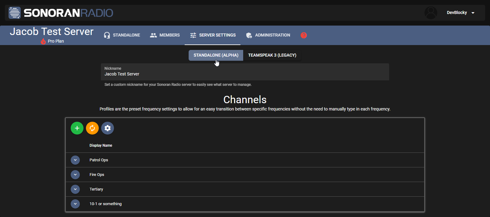

# Migrate from TeamSpeak

## Your Community

To switch your community from using TeamSpeak Sonoran Radio to the standalone version, all you need to do is switch to standalone mode in your portal.

1. Open your [Sonoran Radio Portal](https://sonoranradio.com)
2. Navigate to your community
3. Click "Standalone" to swap to standalone mode

<figure><figcaption>
Sonoran Radio Portal - Standalone Mode Toggle
</figcaption></figure>

You're now able to use the standalone radio in your browser!

## In-Game FiveM Resource

To update to FiveM resource to standalone, you'll need to replace the old `sonoranradio` resource with the new standalone version (It **WILL NOT** automatically update)

Delete your old resource `[sonoranradio]` folder and then follow this tutorial:


[installing-the-in-game-resource.md](installing-the-in-game-resource.md)


