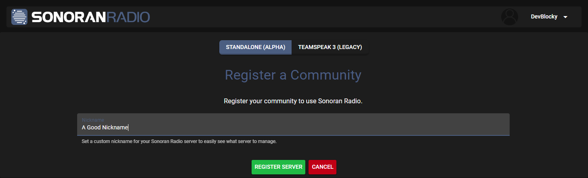

# Register a Community

## Creating a Community

1. Navigate to [SonoranRadio.com](https://sonoranradio.com) and login
2. In your Sonoran Radio Portal, click the green plus button
3. Click `Begin Your Journey!` to create a new community
4. Click `Standalone (Alpha)` mode at the top
5. Enter a good nickname, and click `Register Server`

<figure><figcaption>
Sonoran Radio - Create a New Community
</figcaption></figure>

***

## Next Steps

Now it's time to invite your community members!


[invite-and-manage-users.md](invite-and-manage-users.md)

