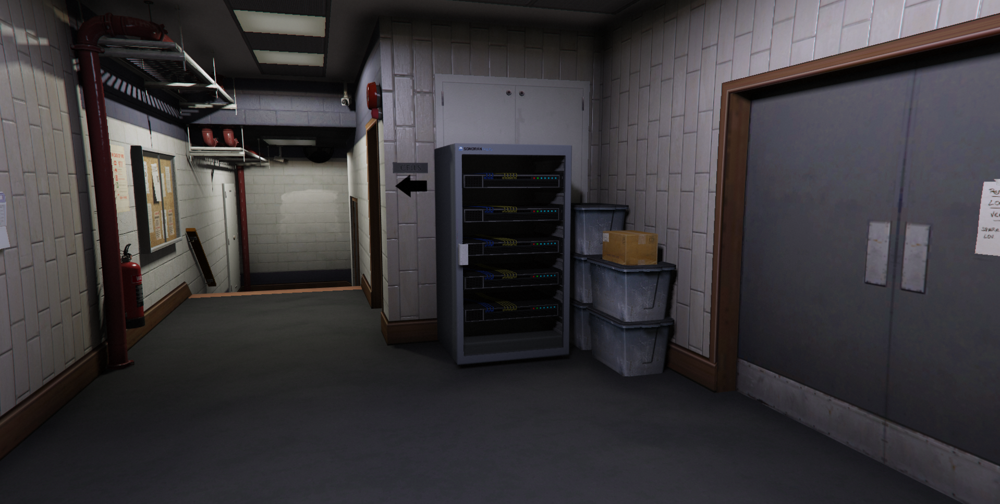
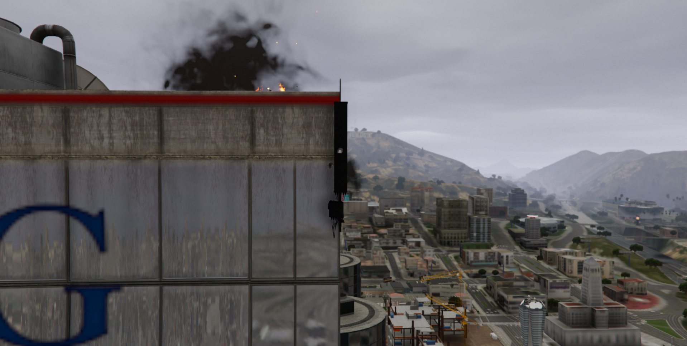
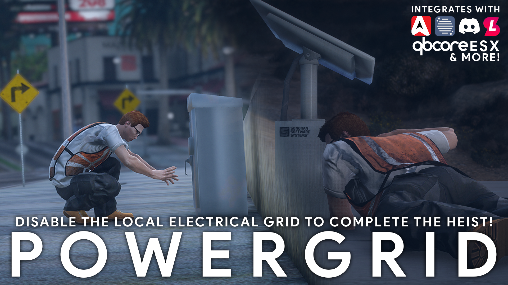

# Using In-Game Repeaters



## Available Repeater Types

### Server Rack

Server rack style repeaters are found by default inside of police stations and hospitals. These repeaters offer the most interactive destruction experience.

Press `E` on the door to open it.

Each server inside can be individually destroyed and will fall separately out of the rack. These can be configured with 1-5 servers in each. As more of these servers are destroyed, the repeater signal will diminish.

<div>

<figure><figcaption><p>Server Rack</p></figcaption></figure>

 

<figure><figcaption><p>Server Rack - Opened</p></figcaption></figure>

 

<figure><figcaption><p>Server Rack - Destroyed</p></figcaption></figure>

</div>

### Radio Tower

Tower style repeaters are found by default on hills, mountains, and large rooftops.

Players can climb the ladder to reach the top.

There are four dishes inside that each account for 25% of the health. As more of these dishes are destroyed, the repeater signal will diminish.

<div>

<figure><figcaption><p>Radio Tower</p></figcaption></figure>

 

<figure><figcaption><p>Radio Tower - Destroyed</p></figcaption></figure>

</div>

### Cellular Antenna

Cellular antenna style repeaters are found by default on the side of high-rises and other buildings.

Destroying this antenna will disable it's repeater range.

<div>

<figure><figcaption><p>Cellular Antenna</p></figcaption></figure>

 

<figure><figcaption><p>Cellular Antenna - Destroyed</p></figcaption></figure>

</div>

### Custom Repeaters

Additional integrations like the [mobile command center](using-in-game-repeaters.md#mobile-command-center-repeater), [power grid hacking](using-in-game-repeaters.md#hacking-repeaters-power-grid-integration), and [custom vehicle repeaters](using-in-game-repeaters.md#mobile-vehicle-repeaters) offer further customization.

***

## Configuration

### Tower Placement

#### Default Positions

<figure><figcaption><p>Sonoran Radio - Default Tower Positions</p></figcaption></figure>

#### Game Menu Configuration

To add, edit, or remove a repeater, open the configuration menu by typing `/radioMenu`

Access to this command requires the `sonoranradio.towers` [ACE permission](configuring-ace-permissions.md).

<div>

<figure><figcaption><p>Spawn Repeater</p></figcaption></figure>

 

<figure><figcaption><p>Move/Edit Repeater</p></figcaption></figure>

 

<figure><figcaption><p>Delete Repeater</p></figcaption></figure>

</div>

#### Manual Configuration

Alternatively, you can edit the individual `towers.json` file in the `sonoranradio` resource.

<details>

<summary>towers.json</summary>

```json
[
  // Radio Tower
  {
    // Unique Identifier
    "Id": "74d910e5-5705-4b58-baaf-88a8ca82734c",
    // Type of repeater (tower)
    "type": "radioTower",
    // XYZ Coordinates
    "PropPosition": {
      "x": -577.4769287109375,
      "y": -138.4747314453125,
      "z": 51.9765625
    },
    // Signal range in units
    "Range": 1500,
    // Allow destruction
    "Destruction": true
  },
  // Server Rack
  {
    // Unique Identifier
    "Id": "50a9c40a-e5bb-46b2-9a83-c5164599c64c",
    // Type of repeater (Server Rack)
    "type": "serverRack",
    // XYZ Coordinates
    "PropPosition": {
      "x": 443.3538513183594,
      "y": -983.1824340820312,
      "z": 30.6783447265625
    },
    // 360 degree compass heading for angles
    "heading": 90,
    // Signal range in units
    "Range": 1500,
    // Status of each server in rack: "alive" or "dead"
    "serverStatus": [
      "alive",
      "alive",
      "alive",
      "alive",
      "alive"
    ],
    // Is the repeater on or not
    "Powered": true,
    // Make the repeater invisible by setting to true
    "NotPhysical": false,
    // Temporary repeater
    "DontSaveMe": false,
    // Allow destruction
    "Destruction": true
  },
  // Cell Repeater
  {
    // Unique Identifier
    "Id": "1f68f034-500b-4b29-9356-8c8bf63fda04",
    // Type of repeater (cell repeater)
    "type": "cellRepeater",
    // XYZ Coordinates
    "PropPosition": {
      "x": 152.5,
      "y": -775.9000244140625,
      "z": 264.29998779296877
    },
    // 360 degree compass heading for angles
    "heading": 340.0,
    // Signal range in units
    "Range": 1500.0,
    // Is the repeater on or not
    "Powered": true,
    // Make the repeater invisible by setting to true
    "NotPhysical": false,
    // Temporary repeater
    "DontSaveMe": false,
    // Status of the antenna: "alive" or "dead"
    "AntennaStatus": "alive",
    // Allow destruction
    "Destruction": true
  }
]

```

</details>

***

## Using the In-Game Towers

### Destroying a Tower

When tower destruction is enabled, users can use any form of weapon to damage the repeaters.

Once damaged and destroyed, the tower no longer provides radio coverage within that range.

### Repairing a Tower

Players can walk up to a destroyed repeater and press `G` to being the repair process.

The repair time can be configured in the `config.lua`'s `towerRepairTimer`.

You can also restrict permissions to repairing a tower with [ACE permissions](configuring-ace-permissions.md) by setting `acePermsForTowerRepair` to `true` in the `config.lua`.

### Viewing Tower Coverage

#### Via In-Game Map

Enabling`Config.debug` in the `config.lua` file will display a radius around each tower, where the edge represents 50% radio quality.

#### Via Sonoran CAD Live Map

View Sonoran Radio repeater signal strength and health on the integrated CAD live map.\
Or, view dispatch call information on the in-game radio!


[sonoran-cad-integration.md](../integrations/sonoran-cad-integration.md)


### Viewing Signal Strength

Coming Soon!

***

## Additional Integrations

### Mobile Command Center Repeater

The [Sonoran Mobile Command Center](https://www.sonoran.store/package/5287071) also offers a built-in radio repeater to improve reception on a scene.

Raise the radio antenna by running the `/mccradio` command.

<div>

<figure><figcaption><p>Sonoran Mobile Command Center</p></figcaption></figure>

 

<figure><figcaption><p>Sonoran Mobile Command Center</p></figcaption></figure>

</div>

### Hacking Repeaters - Power Grid Integration

Communities can add additional [Sonoran Power Grid](https://www.sonoran.store/package/5120025) integration support, enabling users to hack a radio repeater's power source instead of destroying it.

<figure><figcaption><p>Sonoran Power Grid</p></figcaption></figure>

### Mobile (Vehicle) Repeaters

To extend coverage range, communities can also customize what vehicles contain a radio repeater.

In the `config.lua`, you can configure vehucle types and the range of a given vehicle's repeater.

**Example Config Structure:**

```lua
-- Enable mobile repeaters
Config.enableVehicleRepeaters = true
-- Mobile repeater spawncodes
Config.repeaterVehicleSpawncodes = {
    {model = "police", label = "Police Vehicle", range = 200},
    {model = "police2", label = "Police Vehicle", range = 200},
}
```

In-game, you can press `G` to toggle the mobile repeater on a configured vehicle.

If a vehicle is destroyed, it will no longer function as a radio repeater.
