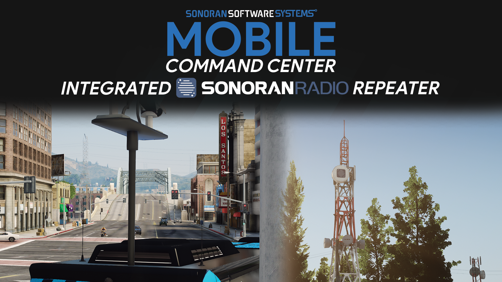
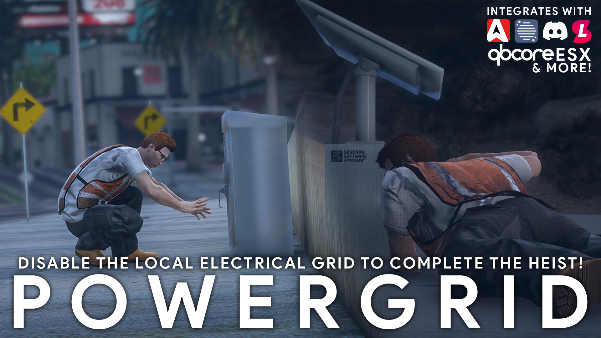

# Using In-Game Towers


This feature is not yet accessible in the early-access Alpha.

Stay tuned to our [Discord ](https://discord.sonoransoftware.com)for news and announcements!


## Available Repeater Types

### Server Rack

Server rack style repeaters are found by default inside of police stations and hospitals. These repeaters offer the most interactive destruction experience.

Press `E` on the door to open it.

Each server inside can be individually destroyed and will fall separately out of the rack. There are five servers inside that each account for 20% of the health. As more of these servers are destroyed, the repeater signal will diminish.

### Tower

Tower style repeaters are found by default on hills, mountains, and large rooftops.

Players can climb the ladder to reach the top.

Each dish on the top accounts for a percentage of the tower's health. As more of these dishes are destroyed, the repeater signal will diminish.

### Cellular Antenna

Cellular antenna style repeaters are found by default on the side of high-rises and other buildings.

Destroying this antenna will disable it's repeater range.

### Custom Repeaters

Additional integrations like the [mobile command center](using-in-game-towers.md#mobile-command-center-repeater), [power grid hacking](using-in-game-towers.md#hacking-repeaters-power-grid-integration), and [custom vehicle repeaters](using-in-game-towers.md#mobile-vehicle-repeaters) offer further customization.

## Configuration

### Tower Placement

To modify the list of towers, you can either add-on to the existing list by using `/spawntower` and then `/savetowers` while in-game

#### **Command ACE Permissions**

```
add_principal group.admin sonoranradio.towers
add_ace sonoranradio.towers command.spawntower allow
add_ace sonoranradio.towers command.savetowers allow
```

Users will need the `group.admin` permission to access these commands.\
The example below grants a permission to a specific user's identifier:

```
add_principal identifier.license:{GTA License} group.admin
```

#### Manual Configuration

Alternatively, you can edit the file `towers.json` in the `sonoranradio` resource.

The config example below shows two radio tower placements.

```json
[
  {
    "Id": "74d910e5-5705-4b58-baaf-88a8ca82734c",
    "PropPosition": {
      "x": 0.0,
      "y": 0.0,
      "z": 0.0
    },
    "Destruction": false,
    "Range": 1500.0
  },
  {
    "Id": "7a4cb19d-e158-4afa-9e56-6de0c5446626",
    "PropPosition": {
      "x": 100.0,
      "y": 0.0,
      "z": 0.0
    },
    "Destruction": false,
    "Range": 1500.0
  },
]
```

**Config Object Properties**

`PropPosition` - X, Y, Z coordinate positioning object

`Destruction` - Toggles whether this specific tower can be destroyed

`Range` - Tower's range with in-game radios

### Viewing Tower Coverage

#### Via In-Game Map

Enabling`Config.debug` in the `config.lua` file will display a radius around each tower, where the edge represents 50% radio quality

#### Via Sonoran CAD Live Map

View Sonoran Radio repeater signal strength and health on the integrated CAD live map.\
Or, view dispatch call information on the in-game radio!


[sonoran-cad-integration.md](../integrations/sonoran-cad-integration.md)


### Viewing Signal Strength

Coming Soon!

## Additional Integrations

### Mobile Command Center Repeater

The [Sonoran Mobile Command Center](https://www.sonoran.store/package/5287071) also offers a built-in radio repeater to improve reception on a scene.

Raise the radio antenna by running the `/mccradio` command.

<div>

<figure><figcaption><p>Sonoran Mobile Command Center</p></figcaption></figure>

 

<figure><figcaption><p>Sonoran Mobile Command Center</p></figcaption></figure>

</div>

### Hacking Repeaters - Power Grid Integration

Communities can add additional [Sonoran Power Grid](https://www.sonoran.store/package/5120025) integration support, enabling users to hack a radio repeater's power source instead of destroying it.

<figure><figcaption><p>Sonoran Power Grid</p></figcaption></figure>

### Mobile (Vehicle) Repeaters

To extend coverage range, communities can also customize what vehicles contain a radio repeater.

In the `config.lua`, you can configure vehucle types and the range of a given vehicle's repeater.

**Example Config Structure:**

```lua
-- Enable mobile repeaters
Config.enableVehicleRepeaters = true
-- Mobile repeater spawncodes
Config.repeaterVehicleSpawncodes = {
    {model = "police", label = "Police Vehicle", range = 200},
    {model = "police2", label = "Police Vehicle", range = 200},
}
```

In-game, you can press `G` to toggle the mobile repeater on a configured vehicle.

If a vehicle is destroyed, it will no longer function as a radio repeater.
