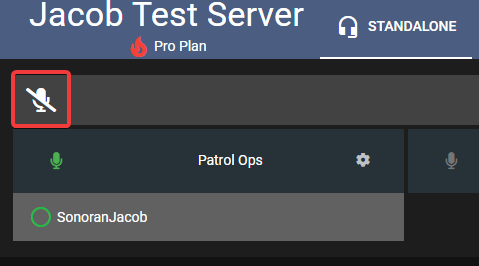
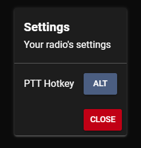
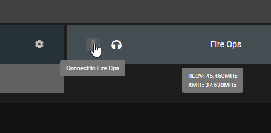

# Using the Dispatch Panel

## In the Browser

When you first open a Sonoran Radio community with standalone enabled, you will see this page:

<figure><figcaption>
Sonoran Radio - Connect to Radio
</figcaption></figure>

To join the radio, press **Connect.** After connecting, you will be greeted with a row of channels, and a list of connected users underneath them

<figure><figcaption>
Sonoran Radio - Radio Hub
</figcaption></figure>

### Transmitting (Push to Talk)

To transmit over Sonoran Radio, you can press the microphone button on the top-left

<figure><figcaption>
Sonoran Radio - Transmit Button
</figcaption></figure>

### PTT Keybind

In the browser, you can set a push-to-talk keybind in your radio settings

<figure><figcaption></figcaption></figure>

 

<figure><figcaption></figcaption></figure>


Note that the push-to-talk is not global, and only works when the browser window is focused (i.e. you must click on Sonoran Radio before the keybind works)


### Switching Channels

To switch to another channel, click the microphone button on the channel card

<figure><figcaption>
Sonoran Radio - Switch Channel
</figcaption></figure>

### Scanning (Listening) multiple channels

With Sonoran Radio, you are able to listen to multiple channels at the same time. To enable this for another channel, press the headphones button on the channel card next

<figure><figcaption>
Sonoran Radio - Scan Channel
</figcaption></figure>

### User Actions

You are able to perform actions on users in the radio, like move their channel or kick them. To perform an action, right click on a user

<figure><figcaption>
Sonoran Radio - Radio User Actions
</figcaption></figure>

## Next Steps

Learn how to install the in-game resource:


[installing-the-in-game-resource.md](installing-the-in-game-resource.md)

