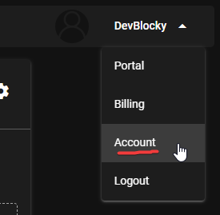
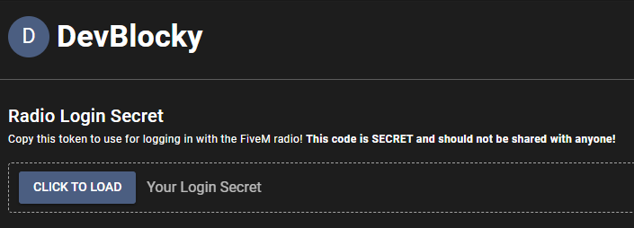
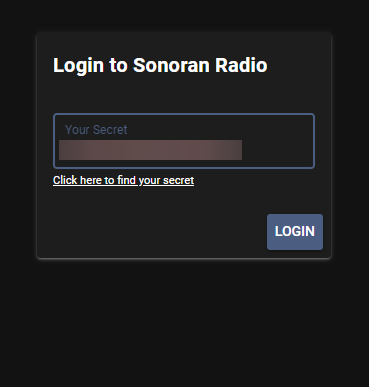

# Using the In-Game Radio

## Initial Setup

### Accessing the In-Game Radio

TODO

### Logging In

When using the in-game resource for the first time, you have to login. To login, you must copy your Secret Key from your account settings

<figure><figcaption></figcaption></figure>

 

<figure><figcaption></figcaption></figure>

Then, once you have your Secret Key, you can paste it into the FiveM resource to login

<figure><figcaption></figcaption></figure>

## Using the In-Game Radio

### Setting your Push-To-Talk (PTT) Keybind

TODO

### Connecting and Switching Channels

TODO

