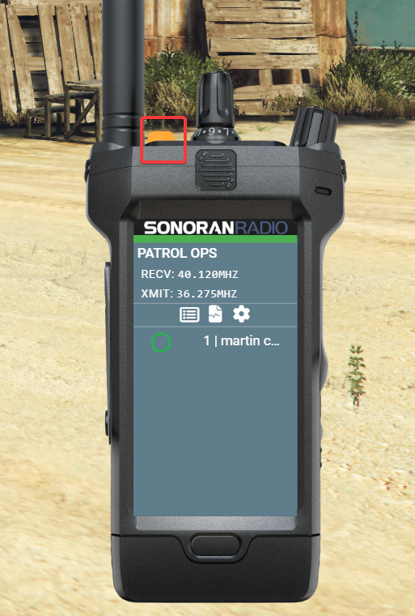
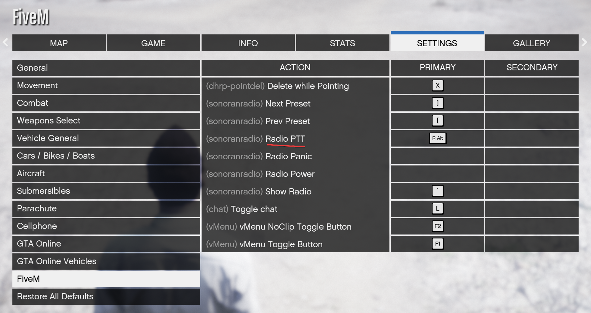

# Using the In-Game Radio

## Initial Setup

### Accessing the In-Game Radio

#### Keybind

* The default keybind to open Sonoran Radio is `~` (right above Tab)
  * You can also [customize this keybind](using-the-in-game-radio.md#setting-your-push-to-talk-ptt-keybind)

#### Command

* Use the `/radio` command

### Logging In

When you first use the in-game resource, you'll need to log in.\
A 4-digit code will appear for you to sign in from your browser.

<figure><figcaption>
Sonoran Radio - Login with Link Prompt
</figcaption></figure>

Open [sonoranradio.com/link](https://sonoranradio.com/link) in a web browser, log in if needed, enter your code, and click "Activate" to log in to the game.

<figure><figcaption>
Sonoran Radio - Activate Link
</figcaption></figure>

## Using the In-Game Radio

### Setting your Push-To-Talk (PTT) Keybind

By default, there is no PTT keybind set. You can set one in your GTA `Settings` -> `Key Bindings` -> `FiveM` -> `Radio PTT`

<figure><figcaption></figcaption></figure>

### Connecting and Switching Channels

The radio will connect when you turn it on with the power button ([unless you need to login first](using-the-in-game-radio.md#logging-in))

<figure><figcaption></figcaption></figure>

You can scroll through the radio channels with the channel select dial on top, or choose a channel using the UI

<figure><figcaption></figcaption></figure>
