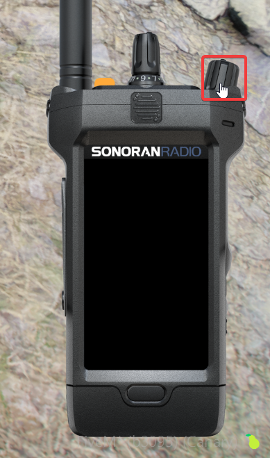

# Using the In-Game Radio

## Initial Setup

### Accessing the In-Game Radio

#### Keybind

* The default keybind to open Sonoran Radio is `~` (right above Tab)
  * You can also [customize this keybind](using-the-in-game-radio.md#setting-your-push-to-talk-ptt-keybind)

#### Command

* Use the `/radio` command

### Logging In

When using the in-game resource for the first time, you have to login. To login, you must copy your Secret Key from your account settings

<figure><figcaption></figcaption></figure>

 

<figure><figcaption></figcaption></figure>

Then, once you have your Secret Key, you can paste it into the FiveM resource to login

<figure><figcaption></figcaption></figure>

## Using the In-Game Radio

### Setting your Push-To-Talk (PTT) Keybind

By default, there is no PTT keybind set. You can set one in your GTA `Settings` -> `Key Bindings` -> `FiveM` -> `Radio PTT`

<figure><figcaption></figcaption></figure>

### Connecting and Switching Channels

The radio will connect when you turn it on with the power button ([unless you need to login first](using-the-in-game-radio.md#logging-in))

<figure><figcaption></figcaption></figure>

You can scroll through the radio channels with the channel select dial on top, or choose a channel using the UI

<figure><figcaption></figcaption></figure>
