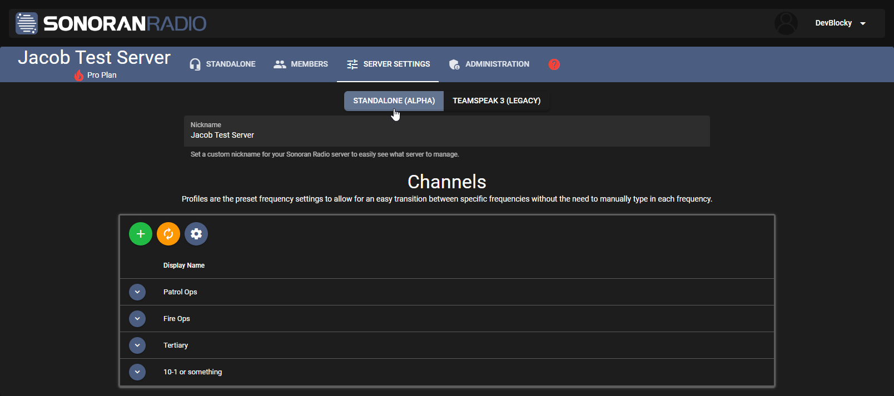

# TeamSpeak -> Standalone Migration

## Your Community

To switch your community from using TeamSpeak Sonoran Radio to the standalone version, all you need to do is switch to standalone mode in your portal.

1. Open your [Sonoran Radio Portal](https://sonoranradio.com)
2. Navigate to your community
3. Click "Standalone" to swap to standalone mode

<figure><figcaption>
Sonoran Radio Portal - Standalone Mode Toggle
</figcaption></figure>

And boom, you're now able to use the standalone radio in your browser!

## In-Game FiveM Resource

If you also wish to have the in-game resource work with standalone radio, you will need to update it manually

1. Download this [unreleased beta resource](https://drive.google.com/file/d/1S5rkL-A\_cjJa7HVpXEmqlOU4o71lhU8Q/view?usp=drive\_link)
2. Replace your old `sonoranradio` resource with this one
3. In your config, change the `standaloneId` to your community ID
   * Your standalone ID can be found in the URL of your Sonoran Radio community (only the number portion)\
     
4. In your config, make sure `allowAutoUpdate` is set to `false`&#x20;
   * Forgetting this step will cause your beta resource to be replaced by the regular version

