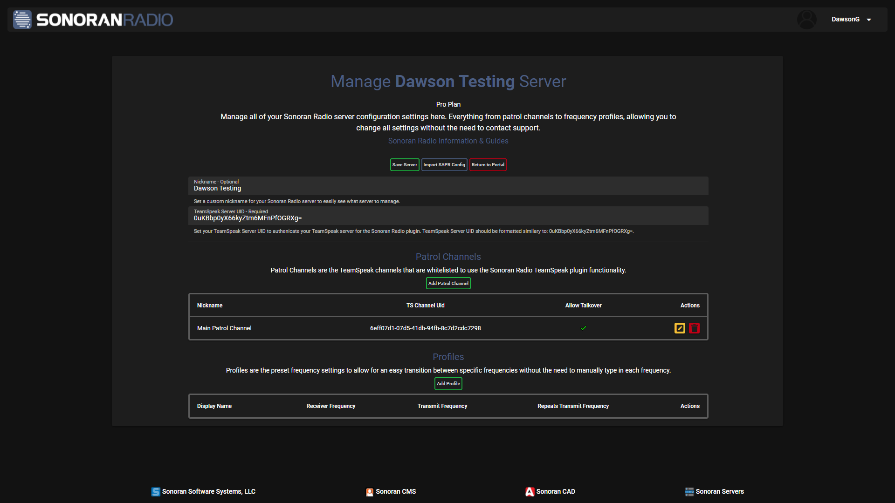
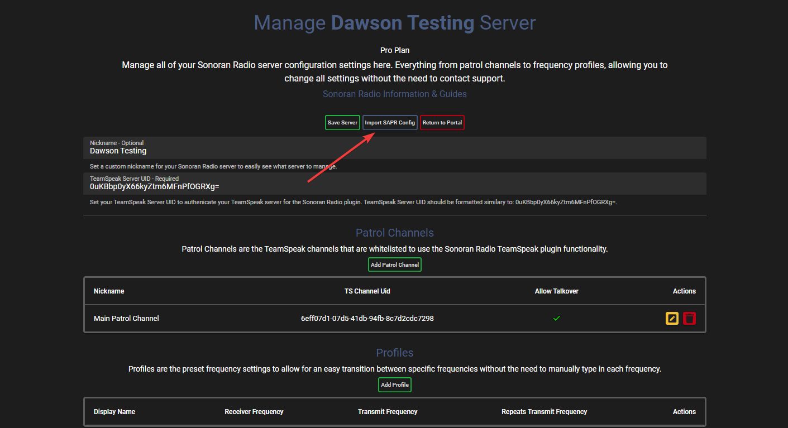
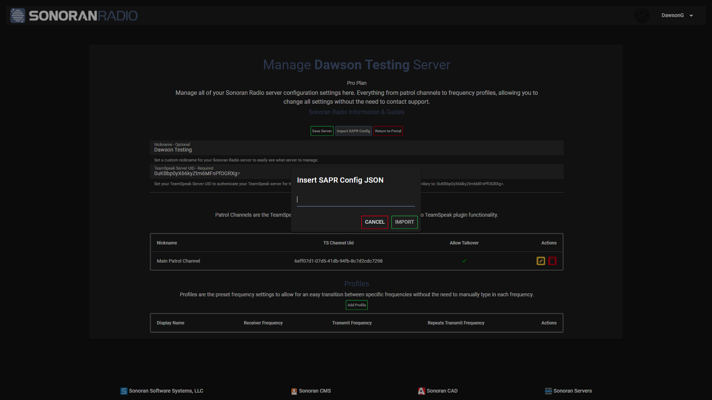
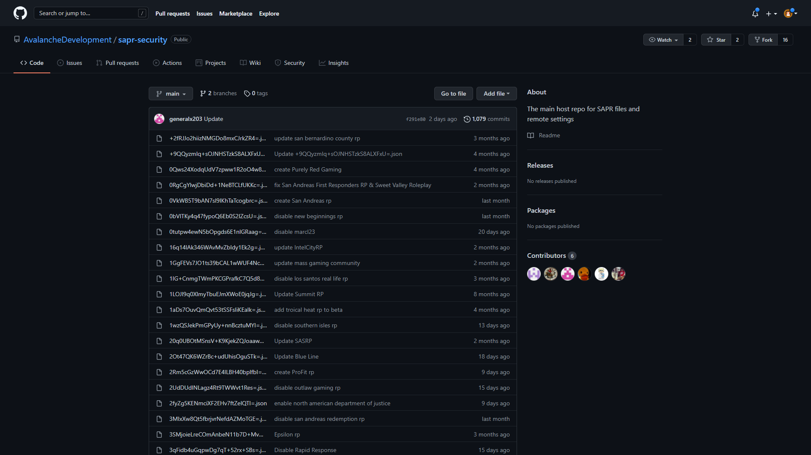
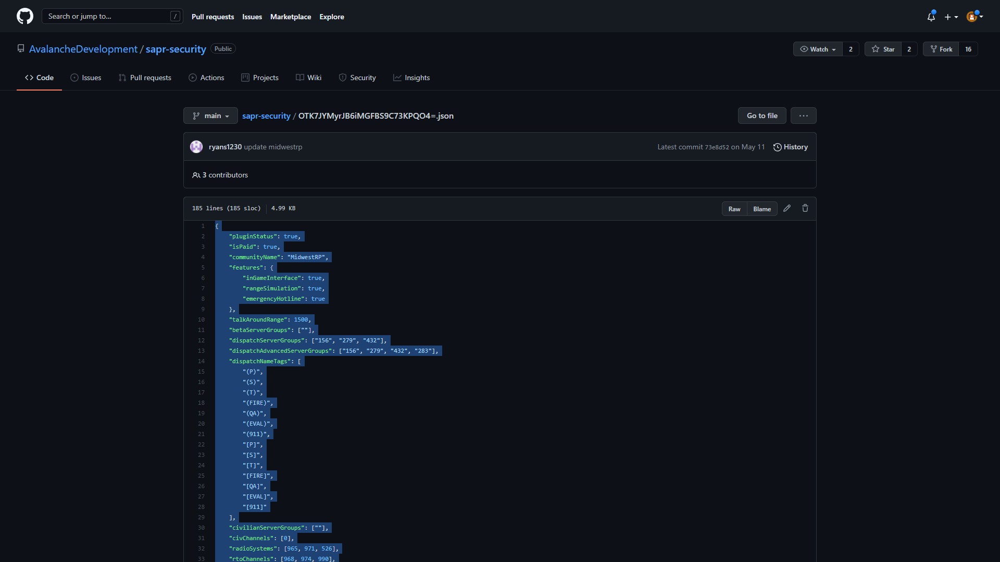
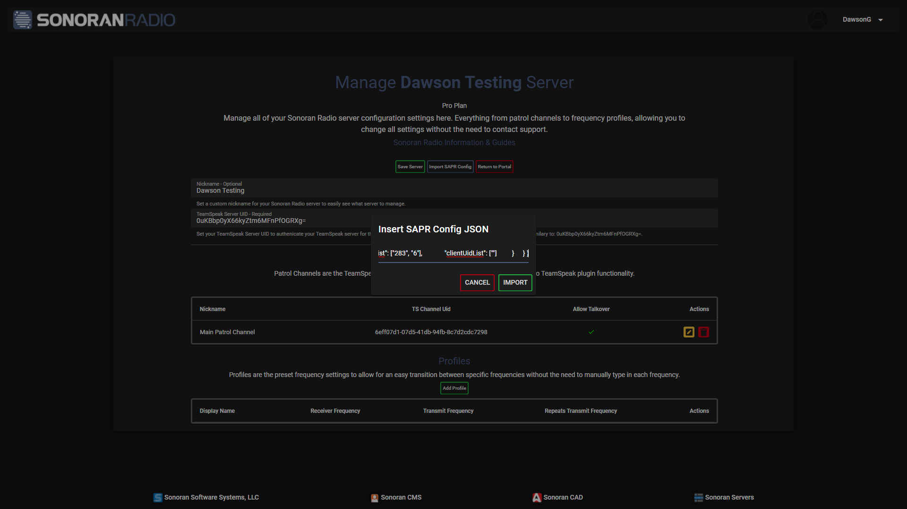
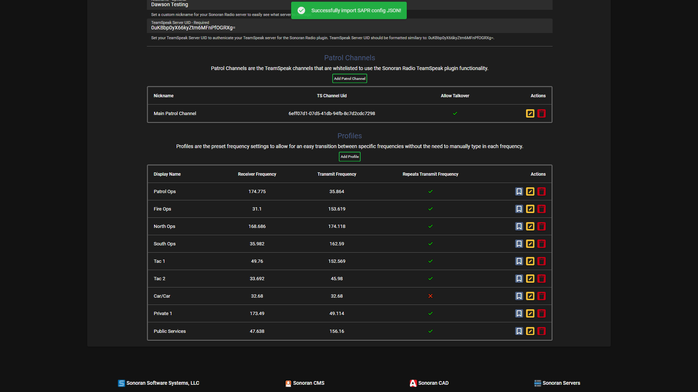

# Switching from SAPR

## Why Make the Switch?

By switching to Sonoran Radio, your community's experience is upgraded to the best technology, support, and development available.

* Instant setup with no additional fees
* Instant configuration changes through our [web panel](https://sonoranradio.com/#/)
* Directly migrate your configuration from SAPR
* Modern "Smart Radio" UI
* [In-Game Destructible Towers](../script-usage.md#in-game-towers)
* Frequent Updates - No more crashing!
* Dedicated live chat [support](https://support.sonoransoftware.com/) hours 7 days a week
* [Sonoran CAD Integration](https://info.sonorancad.com/integration-plugins/integration-plugins/available-plugins/sonoran-radio-sonrad)
* And so much more!

## Start Today and Save!

You can [sign up](./) for Sonoran Radio for free, or save 25% off your first month with code `BYESAPR` at checkout!

## Download our FREE SAPR Removal Tool!

Having trouble removing SAPR? Our [free removal tool](https://download.sonoransoftware.com/sonoranradio/BYESAPR.exe) for Windows automatically finds and uninstalls your SAPR TeamSpeak plugin!

## Importing your SAPR Config to Sonoran Radio

Importing your SAPR Config is fast and easy! _Note: If you haven't already, you will need to register your server and completed the server authorization._

1.  Navigate to the server management portal of your desired server.&#x20;

    <figure><figcaption></figcaption></figure>
2.  Click the `Import SAPR Config` button located next to the `Save Server` button.&#x20;

    <figure><figcaption></figcaption></figure>

You should now have a popup prompting for your SAPR Config JSON.&#x20;

<figure><figcaption></figcaption></figure>

3.  Head over to the [SAPR Security GitHub repository](https://github.com/AvalancheDevelopment/sapr-security).&#x20;

    <figure><figcaption></figcaption></figure>
4.  Locate your config JSON file for your community and copy the contents of the `.json` file. _Note: Your community config JSON file will be named such as `0uKBbp0yX66kyZtm6MFnPfOGRXg=.json`._&#x20;

    <figure><figcaption></figcaption></figure>
5.  Paste your copied config JSON into the `Insert SAPR Config JSON` popup.&#x20;

    <figure><figcaption></figcaption></figure>
6.  Click the `Import` button and all your "SAPR Radio Channels" will be imported and converted into Sonoran Radio Profiles.

    <figure><figcaption></figcaption></figure>
