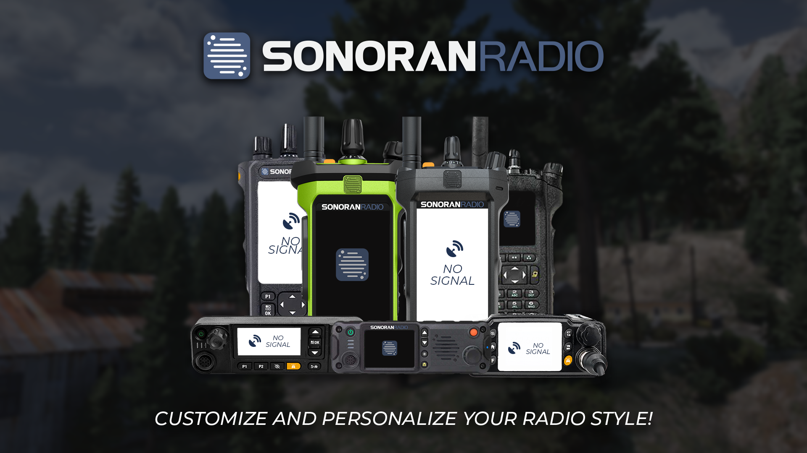
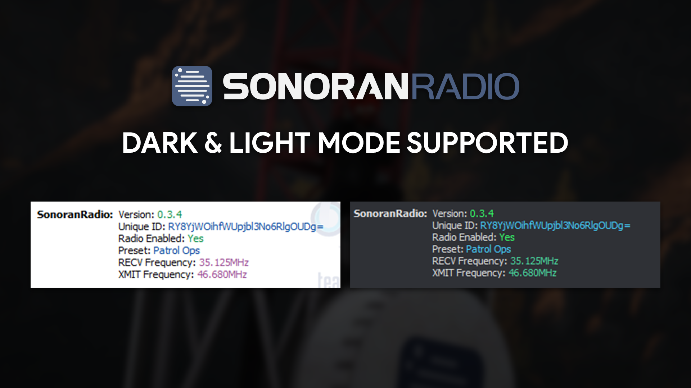
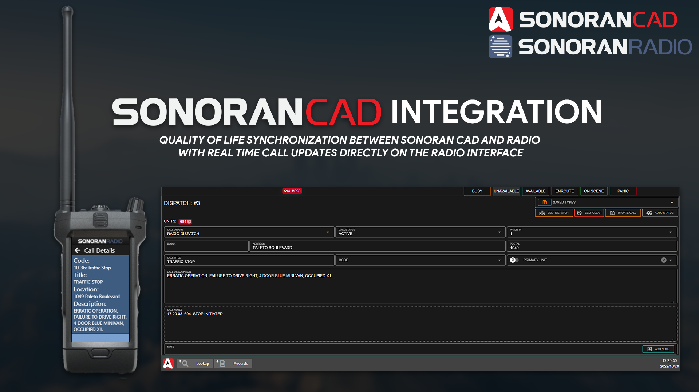
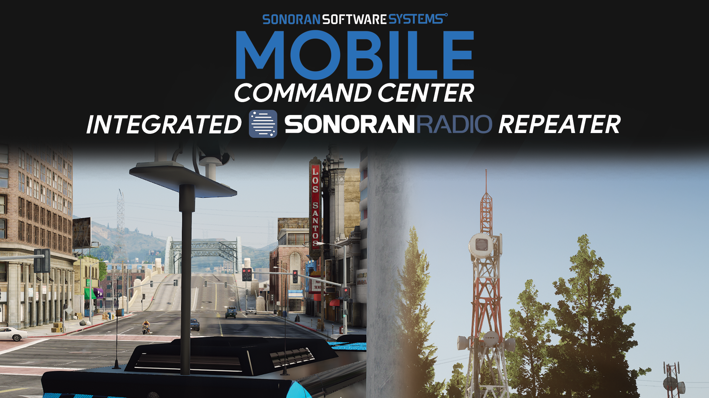
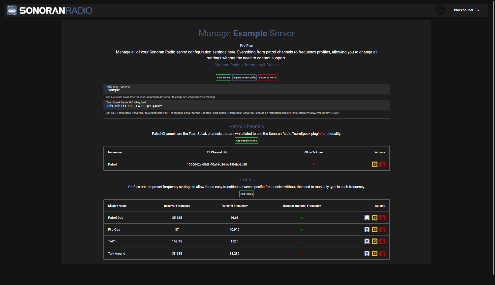
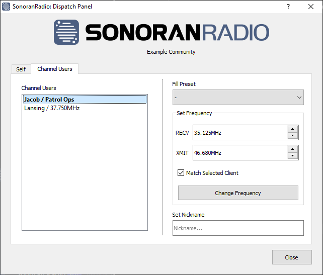

# 🏆 Why Choose Sonoran Radio

<figure><figcaption></figcaption></figure>

### 💸 Free!

Sonoran Radio offers a free version accessible to anybody who [signs up on our webpanel](https://sonoranradio.com).

Setup is instant! There's no wait times for installation or configuration.

### 📡 Multiple Radio Options

Sonoran Radio offers multiple in-game user interfaces, allowing you to stay connected on-foot, in-vehicle, and more!

Choose from one of our radio style options, or even add your own!

<figure><figcaption>
Sonoran Radio - Multiple Overlays - Promotional Image
</figcaption></figure>

<figure><figcaption>
Sonoran Radio - Customizable Frames - Promotional Image
</figcaption></figure>

### 💣 GTA RP In-Game Tower Destruction

The physical in-game towers are able to be destroyed by criminals, which will devastate quality of radios around it.

See our [tower destruction and repairing](tutorials/script-usage.md#in-game-towers) info!

<figure><figcaption>
Sonoran Radio - Destructible Towers - Promotional Image
</figcaption></figure>

### 🔌 Power Grid Support

Hack into the integrated power grid to disable Sonoran Radio towers in your area! [Learn more about this script](https://www.sonoran.store/package/5120025)!

<figure><figcaption>
Sonoran Radio x Sonoran Power Grid - Promotional Image
</figcaption></figure>

### 💵 Free TeamSpeak 3 Server

&#x20;[Get started today!](../pricing/faq/free-teamspeak-promo.md)

<figure><figcaption>
Sonoran Radio x Sonoran Servers - Promotional Image
</figcaption></figure>

### 🔦 TeamSpeak Theme Support

Sonoran Radio will automatically adjust its color scheme based on if you are using a light or dark theme

<figure><figcaption>
Sonoran Radio - Dark &#x26; Light Modes - Promotional Image
</figcaption></figure>

### 🏆 Sonoran CAD Integration

Sonoran Radio provides an optional integration to SonoranCAD through the FiveM resource. Turning this on takes the system to a whole new level.

Check out the [Sonoran CAD integration plugin for Sonoran Radio](https://info.sonorancad.com/integration-plugins/integration-plugins/available-plugins/sonoran-radio-sonrad)!

<figure><figcaption>
Sonoran Radio x Sonoran CAD - Promotional Image
</figcaption></figure>

#### CAD: Unit Status and Panic

Users can view their unit status and activate their panic toggle right through the radio!

#### CAD: Dispatch Call Information

Users can also view dispatch call information right from their radio!

### [🚐](https://emojiterra.com/minibus/) [Mobile Command Center Integration](https://www.sonoran.store/package/5287071)

<figure><figcaption>
Sonoran Radio x Sonoran MCC - Promotional Image
</figcaption></figure>

<figure><figcaption>
Sonoran Radio x Sonoran MCC - Integrated Repeater - Promotional Image
</figcaption></figure>

[Sonoran's mobile command center](https://www.sonoran.store/package/5287071) enables you to take command like never before. This one-of-a-kind utility vehicle brings endless possibilities!

Expand the pop-out sides for a walkable command center interior. Or, **raise the radio antenna** and scan the scene with 360 degree surveillance cameras!

Paired with a standalone script, the mobile command center offers an **integrated Sonoran Radio repeater** and Sonoran CAD ALPR functionality!

### ☁️ Cloud Configurations

Our webpanel offers many ways to configure Sonoran Radio to your roleplay needs. In addition, these changes are automatically synced by the users using the plugin!

<figure><figcaption>
Sonoran Radio - Cloud Configurations
</figcaption></figure>

### 💯 Most Realistic Roleplay Radio Available

Sonoran Radio simulates the limitations and functionality of radio systems used by emergency services personnel all over the world.

Design the system to your liking with simplex or duplex frequency communications and determine the effective range of your radio system with configurable repeater towers. Our rapid development enables your community to design a system tailored to fit your needs.

### 📻 TeamSpeak 3 Based

Our product is drag-and-drop! Once users install the plugin, it does all the magic for you. Integration into you TeamSpeak server is fast and easy!

### 🎧 Dispatch Panel

The plugin offers a dispatch panel to easily change the state of your radio or the radio of other units!

<figure><figcaption>
Sonoran Radio - Dispatch Panel
</figcaption></figure>

### 📋 Frequent Updates

Sonoran Radio is always providing updates to help improve the experience, customizability, and realism of the product. We're always looking for new ideas and suggestions!

### ✈️ Migrating from SAPR?

We've built an easy migration tool to automatically import your existing SAPR config right to Sonoran Radio!

[Learn more about migrating, and our special offer!](tutorials/getting-started/import-sapr-config.md)
