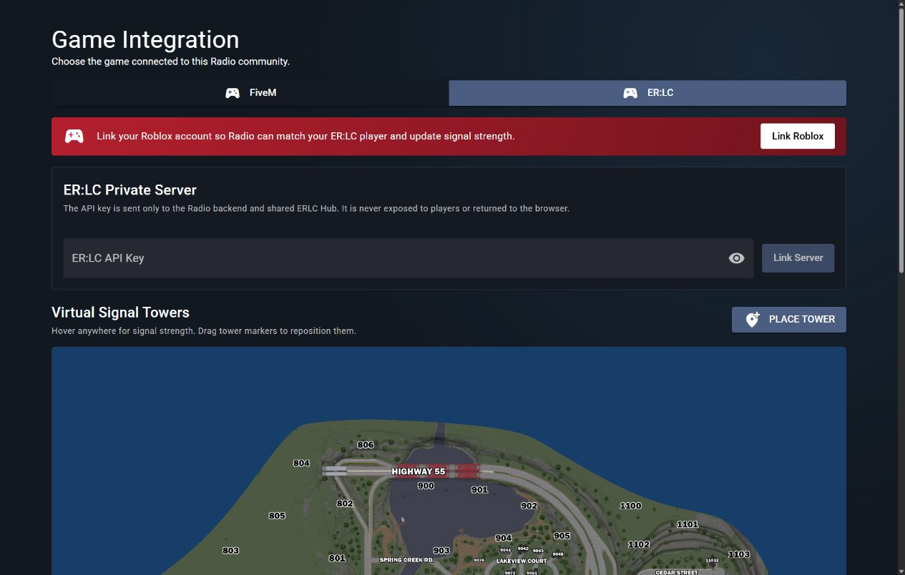
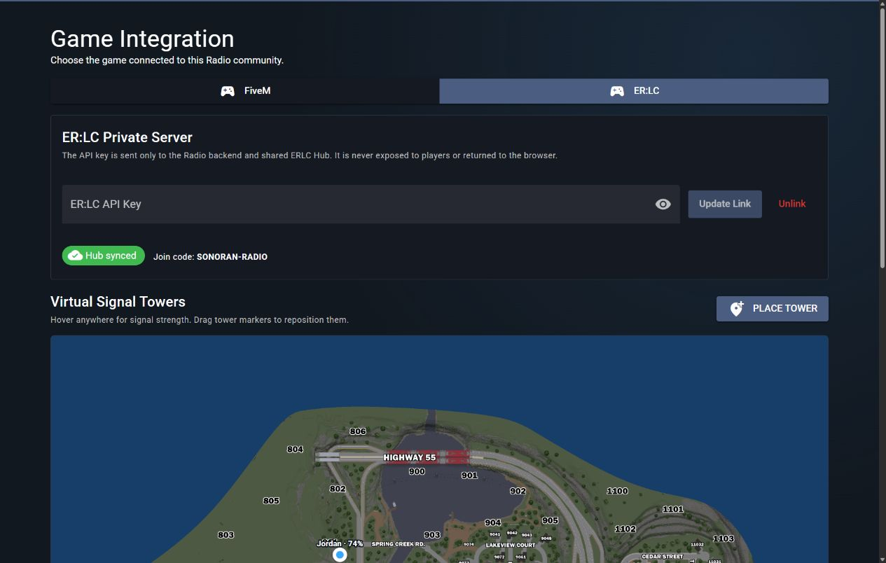

# Configure a Game Integration

Each Sonoran Radio community server can be configured for **FiveM** or **Emergency Response: Liberty County (ER:LC)**. Your selection controls the setup tools shown under **Game Integration** and the map used for emergency zones under **Zones**.

Open your Radio community, then navigate to **Customize** > **Game Integration**.

## FiveM

Select **FiveM** to display the existing FiveM resource setup and download tools.

Continue with [Installing the In-Game Resource](installing-the-in-game-resource.md) to download and configure the resource.

## ER:LC

Select **ER:LC** to connect an ER:LC private server and enable location-based radio signal.

<figure><figcaption>
Select ER:LC to display Roblox account linking, private-server linking, and the virtual tower editor.
</figcaption></figure>

### 1. Link Your Roblox Account

Radio matches your Sonoran account to your player in ER:LC through your linked Roblox account. If your account is not linked, a red banner appears at the top of the Game Integration panel.

1. Select **Link Roblox**.
2. Sign in to Roblox in the new window and authorize the account link.
3. Return to Sonoran Radio. The banner will disappear once the link is detected.


Every Radio user who wants ER:LC location-based signal must link the Roblox account they use to play ER:LC.


A Roblox account link already completed through another Sonoran product is reused by Radio.

### 2. Create an ER:LC API Key

ER:LC API access requires the private server's paid **API Pack** upgrade.

1. In ER:LC, open **Menu** > **Servers** > **Owned Servers**.
2. Select your private server, then open **Upgrade Packs** > **API Pack** if it is not already enabled.
3. Join the private server and open **Server Info**.
4. Select **Edit Server Settings**.
5. Navigate to **ER:LC API**, select **Edit**, and copy the API key.


Treat the ER:LC API key like a password. Do not post it in Discord, screenshots, source code, or other public locations.


### 3. Link the Private Server

1. Paste the key into **ER:LC API Key**.
2. Select **Link Server**.
3. Confirm that the panel displays **Hub synced** and the private server's join code.

<figure><figcaption>
Hub synced confirms that Sonoran Radio is connected to the ER:LC private server.
</figcaption></figure>

The API key is stored securely by Sonoran Radio and is not returned to players or displayed again. To replace it, enter a new key and select **Update Link**.

To disconnect the private server, select **Unlink** and confirm the prompt. Live player positions and ER:LC signal updates stop until another server is linked.

### 4. Configure Signal Coverage

The **Virtual Signal Towers** editor appears directly below the ER:LC private-server settings. You can lay out towers before linking the server, but the server must be synced before Radio can display live players or update their signal.


[erlc-signal-towers.md](../usage/in-game-radio/erlc-signal-towers.md)

