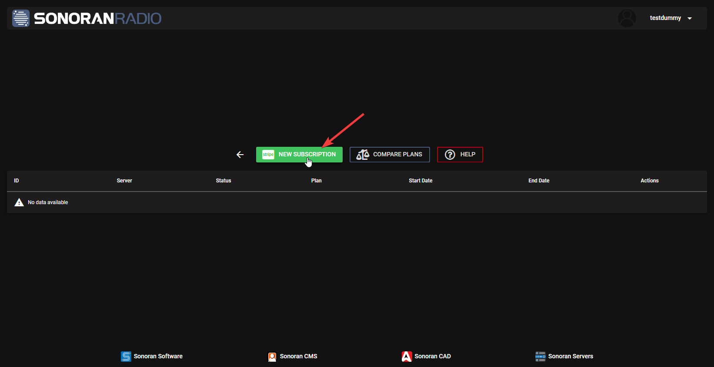
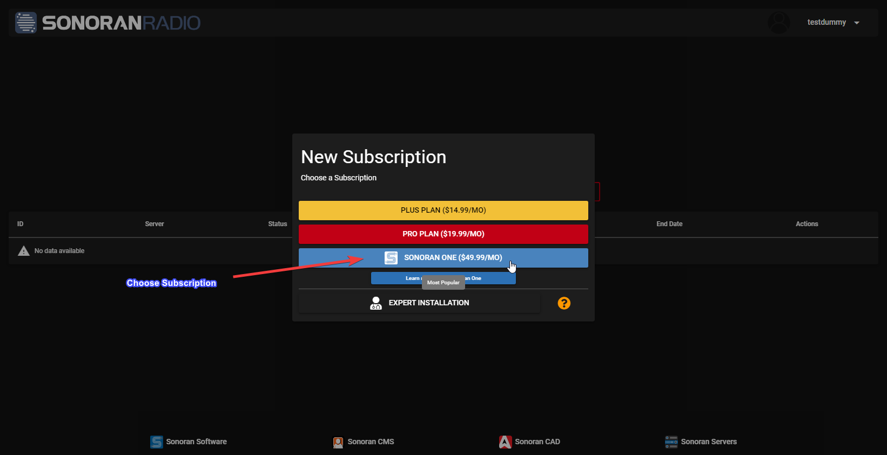
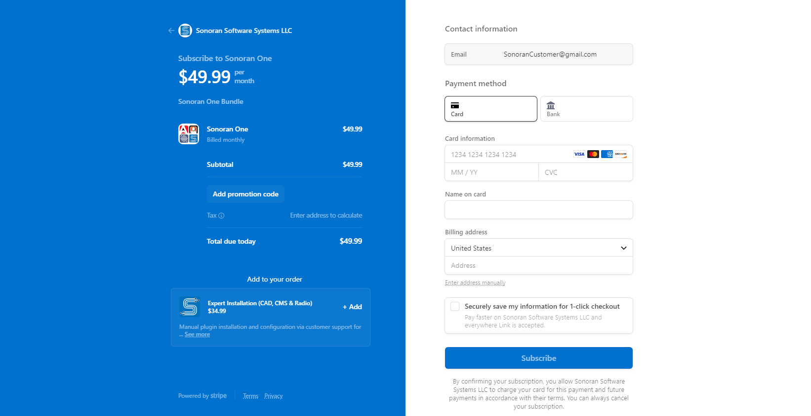

# Purchase a Subscription

## Prerequistes

* Registered TeamSpeak 3 Server on Sonoran Radio web panel
* or the intention to claim our [Sonoran Servers Promo](../../pricing/faq/discounts-and-offers.md)

## 1. Select Sonoran Radio Community to Upgrade

Click `UPGRADE` on the Sonoran Radio Community you would like to purchase a subscription on:&#x20;

<figure><figcaption>
Sonoran Radio - Navigate to Billing Portal
</figcaption></figure>

## 2. Click "New Subscription"

## 3. Choose the Subscription Tier


You can find the [subscription tier comparison here](https://sonoranradio.com/pricing) NOTE: Sonoran Servers Promo **requires** `Pro Plan` or `Sonoran ONE`


Select the subscription tier you would like:&#x20;

<figure><figcaption>
Sonoran Radio - Choose Subscription
</figcaption></figure>

## 4. Confirm the Sonoran Radio Community

Select the Sonoran Radio community you would like the new subscription to apply to:&#x20;

<figure><figcaption>
Sonoran Radio - Select Community
</figcaption></figure>


If claiming our Sonoran Servers Promo, please select `No Server` as shown below. You will need to apply your subscription to your Sonoran Radio community after registering your new Sonoran Servers TeamSpeak server with Sonoran Radio.


<figure><figcaption>
Sonoran Radio - No Server
</figcaption></figure>

## 5. Complete Purchase

Fill in the requested billing information and complete your purchase. You will be redirected on successful payment to the Sonoran Radio web panel and should see your new subscription applied to your Sonoran Radio community.


Did you know we offer [expert installation](../../pricing/faq/discounts-and-offers.md#what-is-expert-installation)?

Add expert installation to your order to have our reprensentatives install the Sonoran Radio in-game integration as well as other in-game integrations on your GTA:V RP server. [See more info here](../../pricing/faq/discounts-and-offers.md#what-is-expert-installation).


