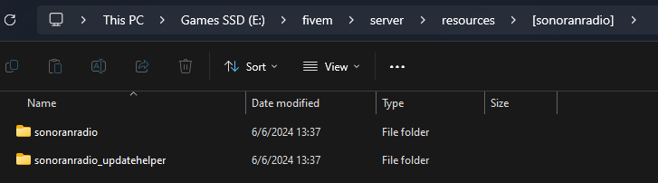

# Installing the In-Game Resource

## A. One-Click Installation (RocketNode)

We've partnered with Rocket Node to bring you one-click Sonoran Radio installation for FiveM — making it easier than ever to host your community and connect with Sonoran Radio.

* [Purchase your FiveM Game Server!](https://sonoran.link/p62G7ncv)
* Use code `SONORAN` to save big!



## B. Pre-Configured Resource Installation



### 1. Download the ZIP

Download a pre-configured version of the in-game resource from the panel. This download will already have your community ID and API key in the `config.lua` file.

Navigate to `Customization` > `FiveM Integration` > `Download Resource`

### 2. Extract the ZIP File

Extract the .zip file into your resources directory. Place the `sonoranradio` and `sonoranradio_updatehelper` into a folder labeled `[sonoranradio]`

<figure><figcaption><p>Sonoran Radio - Folder Structure</p></figcaption></figure>

### 3. Update Your Server Config

In your `server.cfg` file, add the following:

```
exec @sonoranradio/sonoranradio.cfg
```


It is very important that the `sonoranradio_updatehelper` resource is not started manually. Doing so may cause a server crash if updates are available due to a race condition.

**DO NOT** start the whole \[sonoranradio] folder as that will also start the sonoranradio\_updatehelper which might cause crashing if started manually.

Example of what NOT to do: `ensure [sonoranradio]`



Start this resource **AFTER** your preferred framework and any additional framework core resources such as inventory resources


***


### C. Resource Installation (Manual)

#### 1. Download the ZIP

Download the [latest release](https://download.sonoransoftware.com/sonoranradio/fivem/latest.zip) of the FiveM resource

#### 2. Extract the ZIP File

Extract the .zip file into your resources directory. Place the `sonoranradio` and `sonoranradio_updatehelper` into a folder labeled `[sonoranradio]`

<figure><figcaption><p>Sonoran Radio Folder Structure</p></figcaption></figure>

#### 3. Configure Community Information

1. Rename the `config.CHANGEME.lua` file to `config.lua`
2. In the `config.lua` file set `comId` to your community's ID
3. in the `config.lua` file set `apiKey` to your community's API key

The community ID and API key can be found in the `Administration` tab.

<figure><figcaption><p>Sonoran Radio - Community ID &#x26; API Key</p></figcaption></figure>

#### 4. Update Your Server Config

In your `server.cfg` file, add the following:

```
# Start the sonoranradio resource
ensure sonoranradio

# Permissions for auto-updater (REQUIRED)
add_ace resource.sonoranradio command allow
add_ace resource.sonoranradio_updatehelper command allow
```


It is very important that the `sonoranradio_updatehelper` resource is not started manually. Doing so may cause a server crash if updates are available due to a race condition.

**DO NOT** start the whole \[sonoranradio] folder as that will also start the sonoranradio\_updatehelper which might cause crashing if started manually.

Example of what NOT to do: `ensure [sonoranradio]`


***


## Configuration Values <a href="#updates" id="updates"></a>

<details>

<summary>Configuration Options</summary>

<table><thead><tr><th>Parameter</th><th>Default</th><th>Description</th></tr></thead><tbody><tr><td><code>comId</code></td><td>EMPTY</td><td>The Sonoran Radio Community ID</td></tr><tr><td><code>apiKey</code></td><td>EMPTY</td><td>The Sonoran Radio Community API Key</td></tr><tr><td><code>debug</code></td><td><code>false</code></td><td>Display tower ranges on the map and other console prints.<br>This can be toggled live with the <a href="../usage/in-game-radio/using-the-in-game-radio/fivem-keybinds-and-commands.md#debug-mode">debug mode command</a>.</td></tr><tr><td><code>allowUpdateWithPlayers</code></td><td><code>true</code></td><td>Allow the auto-updater to run while players are still in the server.</td></tr><tr><td><code>enableCanary</code></td><td><code>false</code></td><td>Allow the auto-updater to pull development branches for early testing.</td></tr><tr><td><code>allowAutoUpdate</code></td><td><code>true</code></td><td>Allow the auto-updater to run.</td></tr><tr><td><code>chatter</code></td><td><code>true</code></td><td>Allow civilians to hear radio chatter when one is nearby</td></tr><tr><td><code>talkSync</code></td><td><code>true</code></td><td>Talk in-game whenever you talk on the radio<br><br>If using <a href="../integrations/big-daddy-radio-animations.md">BD Animations</a>, you will also need to disable their <code>TalkSync</code> feature in the <code>settings.ini</code> file.</td></tr><tr><td><code>emergencyCallCommand</code></td><td><code>911</code></td><td>Command suffix to start or stop an emergency call (i.e. '911' == /radio 911)</td></tr><tr><td><code>luxartResourceName</code></td><td><code>lvc</code></td><td>Resource name for Luxart Vehicle Control, <a href="../usage/in-game-radio/using-the-in-game-radio/#automatic-volume-increase-w-sirens">used for the siren volume integration</a>.</td></tr><tr><td><code>keybinds</code></td><td><pre class="language-lua"><code class="lang-lua">Config.keybinds = {
	['toggle'] = '',
	['ptt'] = 'BACKSLASH',
['power'] = '',['panic'] = '',['nextChannel'] = '',['prevChannel'] = '',['talkAnim'] = '',['nextGroup'] = '',['prevGroup'] = '',['volUp'] = '',['volDown'] = '',['toggleAutoCallouts'] = '',['toggleGeoSwitch'] = '',['toggleAi'] = '',
}
</code></pre></td><td>Default radio keybinds (these can be changed in GTA settings).<br><br>Use the <code>Input Parameter</code> from the <a href="https://app.gitbook.com/o/-M7AnMftAZpL5ZULbraX/s/gJnyZgUQPWpA5p9njAAR/">CFX Documentation</a>.</td></tr><tr><td><code>towerRepairTimer</code></td><td><code>20</code></td><td>Time (in seconds) that it takes a player to repair a destructed tower.</td></tr><tr><td><code>rackRepairTimer</code></td><td><code>15</code></td><td>Time (in seconds) that it takes a player to repair a destructed server rack.</td></tr><tr><td><code>antennaRepairTimer</code></td><td><code>15</code></td><td>Time (in seconds) that it takes a player to repair a destructed cellular antenna.</td></tr><tr><td><code>acePermSync</code></td><td><code>false</code></td><td><a href="../usage/in-game-radio/configuring-ace-permissions.md#ace-permission-sync">Sync ACE permissions to auto-approve and grant radio permissions from in-game</a>.</td></tr><tr><td><code>acePermsForRadioGuests</code></td><td><code>false</code></td><td>Restricts the <a href="../usage/in-game-radio/using-the-in-game-radio/#login-as-guest"><strong>Login as Guest</strong> button</a> to users with an ACE permission.</td></tr><tr><td><code>acePermsForServerRepair</code></td><td><code>false</code></td><td><p>Restrict the ability to repair damaged radio repeaters with ACE permissions.</p><p>ACE Command: <code>sonoranradio.repair</code></p></td></tr><tr><td><code>acePermsForTowerRepair</code></td><td><code>false</code></td><td><p>Restrict the ability to repair damaged radio repeaters with ACE permissions.</p><p>ACE Command: <code>sonoranradio.repair</code></p></td></tr><tr><td><code>acePermsForAntennaRepair</code></td><td><code>false</code></td><td><p>Restrict the ability to repair damaged radio repeaters with ACE permissions.</p><p>ACE Command: <code>sonoranradio.repair</code></p></td></tr><tr><td><code>acePermsForRadio</code></td><td><code>false</code></td><td>Restrict the usage of the radio (<code>/radio</code>) with ACE permissions.<br><br>ACE Command: <code>sonoranradio.use</code></td></tr><tr><td><code>enforceRadioItem</code></td><td><code>false</code></td><td>Require the user to have a item in their inventory to be able to use the radio or radio scanner.<br><a href="../integrations/fivem-inventories.md">View supported frameworks and inventories.</a></td></tr><tr><td><code>acePermsForRadioUsers</code></td><td><code>false</code></td><td>Restrict the usage of the radio (<code>/radiousers</code>) with ACE permissions.<br><br>ACE Command: <code>sonoranradio.radiousers</code></td></tr><tr><td><code>syncPlayerNameToRadio</code></td><td><code>false</code></td><td>Set the radio user's display name to match their in-game name.</td></tr><tr><td><code>disableRadioOnDeath</code></td><td><code>true</code></td><td>Disables radio when dead.</td></tr><tr><td><code>restoreRadioStateWhenAlive</code></td><td><code>true</code></td><td>Restore the radio's power state (on/off) when you are revived or respawn.</td></tr><tr><td><code>deathDetectionMethod</code></td><td><code>auto</code></td><td>What method to use for death detection.<br><br><code>auto</code>, <code>manual</code>, or <code>qbcore</code></td></tr><tr><td><code>heavySignalDegradeInWater</code></td><td><pre><code>Config.heavySignalDegradeInWater = { -- Heavily degrade radio signal while the player is in water to mimic an IP67-rated handheld
enabled = true, -- Set to true to enable heavy signal degrade in water
pedInWaterDegredation = 0.6, -- Signal strength multiplier when the player is simply in water (e.g. 0.6 would reduce signal strength to 60% of normal)
pedUnderWaterDegredation = 0.3 -- Signal strength multiplier when the player is underwater (e.g. 0.3 would reduce signal strength to 30% of normal)
}
</code></pre></td><td>Heavily degrade radio signal while the player is in water to mimic an IP67-rated handheld</td></tr><tr><td><code>disableAnimation</code></td><td><code>false</code></td><td>Disable the radio talking animation for custom animation scripts.</td></tr><tr><td><code>noPhysicalCellRepeaters</code></td><td><code>false</code></td><td>Hide the in-game cellular antenna repeaters</td></tr><tr><td><code>noPhysicalRacks</code></td><td><code>false</code></td><td>Hide the in-game server rack repeaters</td></tr><tr><td><code>noPhysicalTowers</code></td><td><code>false</code></td><td>Hide the in-game tower repeaters</td></tr><tr><td><code>defaultEscapeMode</code></td><td><code>keep</code></td><td>The default <a href="../usage/in-game-radio/using-the-in-game-radio/#c.-esc-options">escape behavior for the in-game radio</a>.<br><br>Options: <code>keep</code>, <code>hide</code>, <code>transmit_only</code>.</td></tr><tr><td><code>autoCallouts</code></td><td><pre class="language-lua"><code class="lang-lua">{
enabled = true, -- Whether or not this feature is enabled
speedUnit = 'mph', -- mph | kmh | none -- The unit of speed provided with the callout
withPostals = false, -- Whether to include postals with the automatic callouts
postalResource = 'nearest-postal',
<strong>}
</strong></code></pre></td><td>When enabled, user radios will <a href="/broken/pages/8K95enlvAv1TRZPhQrlS">automatically transmit their heading, road, and speeds</a> during a pursuit.</td></tr><tr><td><code>geoChannels</code></td><td><pre class="language-lua"><code class="lang-lua">Config.geoChannels = {
enabled = true,
command = 'sonradgeoswitch', -- command to toggle geo-channel switching | e.g. /sonradgeoswitch
friendlyCommand = 'geoswitch', -- friendly subcommand of the /radio command to toggle geo-channel switching | e.g. / radio geoswitch
acePermission = '', -- ACE permission required to use disable geo-channel switching | Leave blank to allow all users
showNotifications = true -- Show notifications when geo-channel switching is enabled/disabled
}
</code></pre></td><td>When enabled, configure specific channels to transmit and scan when inside a <a href="../usage/in-game-radio/geo-channels.md">geographical zone</a>.</td></tr><tr><td><code>autoOnSceneStatus</code></td><td><pre class="language-lua"><code class="lang-lua">Config.autoOnSceneStatus = {
enabled = true, -- Enable automatic ON_SCENE status when arriving at a waypoint created by SonoranRadio AI
distance = 30.0, -- Distance in meters from the waypoint to trigger ON_SCENE status
statusEnum = 4, -- Status enum for "ON_SCENE" -- See https://docs.sonoransoftware.com/cad/api-integration/api-endpoints/emergency/identifiers/unit-status for more information
timeout = 300000 -- Time in milliseconds to timeout the auto ON_SCENE status after arriving at the waypoint
}
</code></pre></td><td>When the <a href="../integrations/dispatch-ai.md#fivem-gps-route-to-postal">AI dispatcher GPS routes a user</a>, <a href="../integrations/dispatch-ai.md#fivem-automatic-status-on-postal">automatically update their CAD status</a> to en-route. Upon arrival, update their CAD status to on-scene.</td></tr><tr><td><code>radioJammers</code></td><td><pre><code>Config.radioJammers = {
enabled = true, -- Enable or disable radio jammers
menuCommand = 'jammers', -- Subcommand to open the jammers menu | e.g. /sonoranradio jammers
toggleRange = 3.0, -- Distance in meters required to toggle a jammer on/off
permissionMode = 'none', -- ace, qbcore, esx or none
acePermission = 'sonoranradio.jammers', -- ACE permission required to use jammers
allowedJobs = { -- Jobs that can use jammers | Requires permission mode to be set to 'qbcore' or 'esx'
['hacker'] = {
grades = { -- Job grades that can use jammers
1,
2,
3
}
}
},
jammers = {
-- See file for full example
}
}
</code></pre></td><td>Configuration for in-game signal jammers.</td></tr></tbody></table>

</details>

***

## ACE Permissions (Command Restrictions) <a href="#updates" id="updates"></a>

ACE permissions allow communities to restrict access to actions like using the radio, adding and removing towers, repairing towers, and more.


[configuring-ace-permissions.md](../usage/in-game-radio/configuring-ace-permissions.md)


***

## Updates <a href="#updates" id="updates"></a>

The Sonoran Radio in-game resource will automatically update with the latest features, fixes, and changes upon server restart!

***

## Next Steps

Learn how to customize and use the dispatch and in-game portals:


[usage](../usage/)

