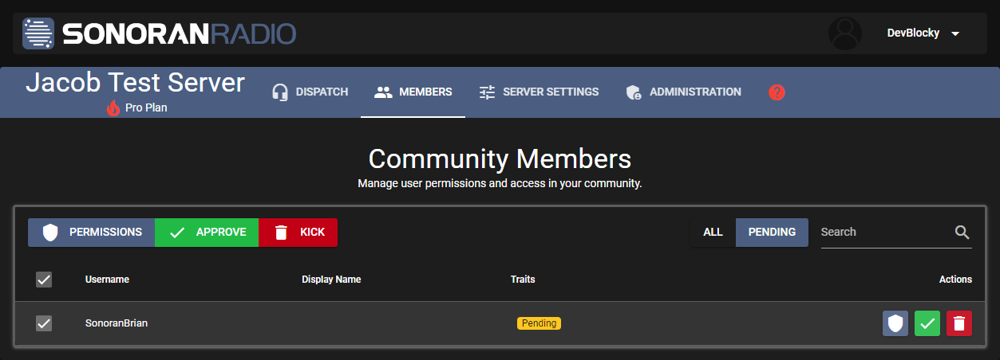

# Invite and Manage Users



## Automatic Join, Kick, Ban, and Permission Sync

Sonoran CMS allows you to automatically add and manage user permissions with user applications, sync them with Discord roles, and more!


[sonoran-cms.md](../integrations/sonoran-cms.md)


If you are building your own integration, Sonoran Radio also exposes API endpoints to approve members, kick members, ban members, update member display names, and set member permissions.


[README.md](../../developer-documentation/developer-documentation/api-endpoints/users/README.md)


***

## FiveM Management

All user permission management, including inviting and approving members, can be automated with FiveM ACE permissions.


[configuring-ace-permissions.md](../usage/in-game-radio/configuring-ace-permissions.md)


## Manual User Management

### Inviting Members

Users will need the `Community ID` located in the `Administrator` panel.\
Communities can also [customize this community ID](../usage/dispatch-panel/custom-domain-vanity-url.md#vanity-urls).

<figure><figcaption>
Sonoran Radio: Community ID
</figcaption></figure>

When logged into Sonoran Radio, they can select the `+` button in the portal to paste in the `Community ID`.

<figure><figcaption>
Sonoran Radio: Join Community
</figcaption></figure>

### Approving Members

When a member joins your community with an invite code, they will be pending until approved.

Users with the `Approve Pending Members`  permission can approve in the `Members` tab

<figure><figcaption>
Sonoran Radio - Approve Members
</figcaption></figure>

### Manage User Permissions

User permissions can be manually set by clicking the shield icon on a user in the `Members` tab

<figure><figcaption></figcaption></figure>

***

## Next Steps

Installing the In-Game Resource


[installing-the-in-game-resource.md](installing-the-in-game-resource.md)

