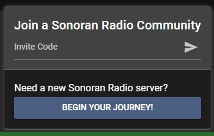

# Invite and Manage Users



## Automatic Join, Kick, Ban, and Permission Sync

Sonoran CMS allows you to automatically add and manage user permissions with user applications, sync them with Discord roles, and more!


[sonoran-cms.md](../integrations/sonoran-cms.md)


***

## Manual User Management

### Inviting Members

You can find your Community API ID in the administration. With this code, people from your community can join your Sonoran Radio server in the Sonoran Radio Portal

<figure><figcaption></figcaption></figure>

 

<figure><figcaption></figcaption></figure>

### Approving Members

When a member joins your community with an invite code, they will be pending until approved. The owner or members with the `Approve Pending Members`  permission can approve in the "Members" tab

<figure><figcaption>
Sonoran Radio - Approve Members
</figcaption></figure>

### Manage User Permissions

User permissions can be managed in the "Members" tab

<figure><figcaption>
Sonoran Radio - Edit Memeber Permissions
</figcaption></figure>

***

## Next Steps

Installing the In-Game Resource


[installing-the-in-game-resource.md](installing-the-in-game-resource.md)

