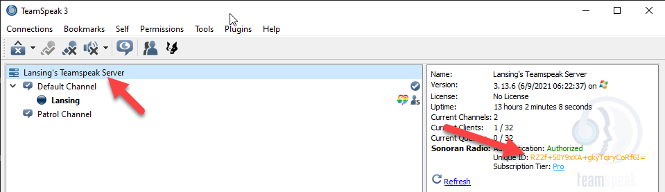

# Registering Your Community

Registering your community and setting up Sonoran Radio is fast, easy, and free!

_Note: If you have not already, you will need to create a user account with Sonoran Software, and have the TeamSpeak Plugin Installed_

1. Navigate to SonoranRadio.com and click on the Login Button and enter your Sonoran Software credentials.&#x20;
2. Click on the `Register a Teamspeak Server for Sonoran Radio` button to begin linking your TeamSpeak server.
3. (Optional) Enter a nickname for your server
4. Retrieve the Unique ID of your TeamSpeak server using the Sonoran Radio Plugin.
   * Click on the TeamSpeak Virtual Server
   * Copy the Unique ID field (shown below)

<figure><figcaption>
TeamSpeak - Copy Unique ID
</figcaption></figure>


You must have the [TS3 Plugin installed](install-plugin.md) on your TeamSpeak client before this information will appear


5. Paste the Server UID into the new server form and press `Register Server`

6. Copy the Authorization Code given, re-connect to your TeamSpeak Server and paste the code in the popup


If you are receiving an error, it can be one of three common issues:&#x20;

1\. You do have the required permissions (You must be able to modify the server password)

2\. You do not have version 0.2.0 or greater of the plugin

3\. You did not set your Server UID properly in the panel


 

7. Note the Channel ID of your patrol channel by following the same method as Step 4, however ensure you select the patrol channel.

8. Click on the Plus button under the **Patrol Channels** section of the radio management portal. Insert that channels Unique ID and press `Add Patrol Channel`

&#x20;Note: Checking Allow Talkover disables preventing units from talking over one another. Note: Customizable Talk-Around Ranges vary from Short Range (600m) to Extra Long Range (1400m) with a 400m difference between each range option. The Customizable Talk-Around Range only applies to talk-around frequencies, transmitted frequencies that don't get repeated over the radio tower network.

<figure><figcaption>
Sonoran Radio - Add Patrol Channel
</figcaption></figure>

9. To create a new profile, click on the Plus button on the radio management portal under the **Profiles** section.

#### Basic Profile Creation&#x20;

Basic Profile Creation is meant for a quick and easy way to create profiles without the hassle of organizing frequencies. Receiver Frequency & Transmit Frequency with automatically be generated on creation.&#x20;

<figure><figcaption>
Sonoran Radio - Add Profile
</figcaption></figure>

* Set the display name of the profile. This will display in both TeamSpeak and the in-game radio.

#### Advanced Profile Creation

Advanced Profile Creation is meant for a more customizable and in-depth way to create profiles if you have the knowledge of how our Simplex & Duplex radio system works.&#x20;

<figure><figcaption>
Sonoran Radio - Add Profile (Advanced)
</figcaption></figure>

* Set the Receive Frequency. In Simplex, this should be set to the same as the Transmit Frequency. In Duplex, this is the frequency of the transmissions from the repeater.
* Set the Transmit Frequency. In Simplex, this should be set to the same as the Receive Frequency. In Duplex, this is the frequency that the repeater is listening for transmissions on.
* Check the Repeats Transmit Frequency to enable the duplex repeater functionality.
* [Learn More About Simplex & Duplex Mode](core-concepts.md#simplex-and-duplex)

10. To reorder the position of profiles, click on the `Reorder Profiles` button on the radio management portal.

* Drag and drop the rows in the order that you'd like them to be.
* Click the `Save Reordered Profiles` button above the profiles table to save.
* Click the `Cancel Reordered Profiles` button above the profiles table to cancel, it will reset any reordering changes you made.

11. The setup process is complete. You will need to disconnect and reconnect to your TeamSpeak server. If the setup process was successful, you should see the following:

`Server Authenticated` message in TeamSpeak when you join the server.

<figure><figcaption>
Sonoran Radio - Server Authenticated
</figcaption></figure>

Your Virtual Server should say `Authorized`

<figure><figcaption>
Sonoran Radio - Server Authorized
</figcaption></figure>

Your Patrol Channel should be marked as a Patrol Channel

<figure><figcaption>
Sonoran Radio - Patrol Channel Success
</figcaption></figure>
