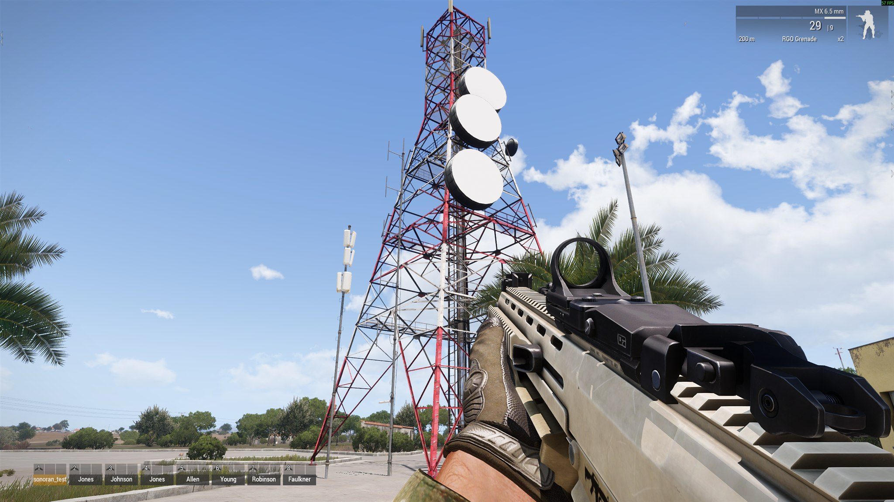

# Signal Towers and Repeaters

Signal towers are owned by the server and synchronized to every player, including players who join after the mission starts. Each client uses the strongest available tower.

## Place a tower in Eden

1. Open the mission in Eden Editor.
2. Select **Systems (F5)** > **Modules** > **Sonoran Radio**.
3. Place **Signal Tower / Repeater** at the desired location.
4. Configure its settings in the module attributes.
5. Optionally synchronize the module to an existing map or editor object.

When synchronized to a physical object, that object becomes the tower. Its antenna position is calculated from the top of its model, and destroying it disables the signal.

Use a unique **Tower ID** when mission scripts need to update the tower later. A blank ID is safe for editor-only towers because the mod generates one.

## Place a tower in Zeus

1. Open Zeus during the mission.
2. Select **Modules** > **Sonoran Radio** > **Signal Tower / Repeater**.
3. Click the desired location on the map or in the world.
4. Complete the **Sonoran Radio Tower** dialog and select **OK**.

<figure><figcaption><p>Configure the repeater model, signal range, dishes, power, damage, and visibility before placing the tower.</p></figcaption></figure>

The physical object is created by the server and added to active curators. Double-click the Sonoran Radio module logic to change its range, power, dish state, or other settings during the mission.

Deleting the module unregisters its signal and removes any physical object that the module spawned.

## Tower settings

| Setting | Default | Behavior |
| --- | ---: | --- |
| Repeater model | Small Repeater | Selects the physical Arma object to spawn. Ignored for invisible or synchronized towers. |
| Signal range | 5,000 m | Maximum coverage radius. Valid values are 1 to 100,000 meters. |
| Dish count | 4 | Total tower capacity. Valid values are 1 to 16. |
| Active dishes | 4 | Working capacity. May be 0 and cannot exceed the dish count. |
| Powered | On | An unpowered tower provides no signal. |
| Indestructible | Off | Prevents the physical tower object from taking damage. |
| Invisible (signal only) | Off | Uses the module position without spawning or using a physical object. |

### Physical tower models

| Zeus label | Arma class name |
| --- | --- |
| Small Repeater | `Land_TTowerSmall_1_F` |
| Tall Repeater | `Land_TTowerSmall_2_F` |
| Large Radio Tower | `Land_TTowerBig_1_F` |

<figure><figcaption><p>The Large Radio Tower physical preset in-game.</p></figcaption></figure>

## Invisible towers

Enable **Invisible (signal only)** before confirming the module. Coverage originates from the module position, but no physical tower is spawned.

An invisible tower cannot be damaged because there is no physical object. Disable it by editing the module and clearing **Powered**, or remove it by deleting the module.

## Destructible towers

Leave **Indestructible** disabled and place a physical model. Normal Arma damage can then destroy the object. When the object is killed or deleted, the server turns the tower off and sets its active dishes to zero, removing its coverage.

To restore a destroyed physical tower, replace or recreate the module/object. Mission scripts can also register a replacement object and restore its state through the [Mission Maker API](mission-maker-api.md).

## Signal calculation

Tower quality falls linearly with distance and is reduced by damaged or inactive dishes:

```text
tower capacity = active dishes / total dishes
tower quality  = (1 - distance / range) × tower capacity
player quality = strongest tower quality
```

Quality is clamped from `0` to `1`. A tower supplies no signal when it is unpowered, has no active dishes, or the player is outside its range.

Terrain attenuation is enabled by default. If Arma terrain blocks the direct path from the player's eye position to the antenna, tower quality is multiplied by `0.35`.

## Signal CBA settings

Open **Options** > **Addon Options** and select **Sonoran Radio**. Mission-wide signal settings should be changed by the server or mission administrator.

| Setting | Default | Description |
| --- | ---: | --- |
| Update interval | 1 second | Time between local signal calculations. Requires a restart after changing it. |
| Minimum quality change | 0.02 | Suppresses insignificant quality updates. |
| Terrain attenuation | On | Reduces signal when terrain blocks the tower. |
| Blocked terrain multiplier | 0.35 | Signal remaining through blocked terrain. |
| Sonoran audio bridge | On | Sends signal and inventory-radio state to the local desktop overlay. This is a client setting. |
| Signal logging | Off | Writes signal changes to the client's Arma RPT log. |
