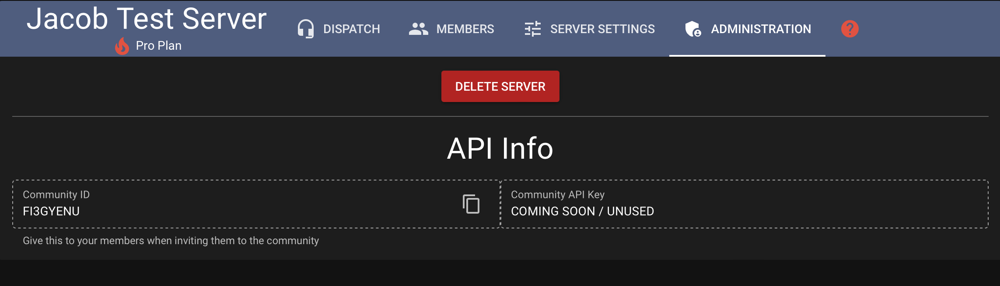
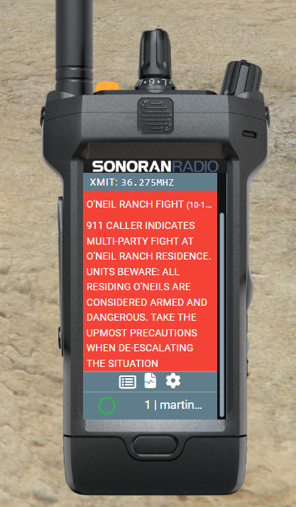

# Sonoran CAD Integration

## Sonoran Radio CAD Plugin

You need to install `sonrad` CAD integration plugin to use the CAD Panic and CAD Call Information features. Follow [this guide ](https://info.sonorancad.com/integration-plugins/integration-plugins/available-plugins/sonoran-radio-sonrad)for more details.

## Integration Features

### CAD Panic

To activate your panic toggle in Sonoran CAD, press the yellow button at the top of the radio.

<figure><figcaption>
Sonoran Radio Handheld - Panic Button
</figcaption></figure>

### CAD Call Information

When attached to a Sonoran CAD dispatch call, the radio will display a red call info box and set the top status bar to red. Click the call title to expand and collapse the information.

<figure><figcaption>
Sonoran Radio x CAD Call Information
</figcaption></figure>

 

<figure><figcaption>
Call Information - Expanded
</figcaption></figure>

### CAD Live Map Blips

Sonoran Radio towers will be displayed on the CAD live map.

Select one of the blips to view it's repeater type and health.

<figure><figcaption>
Sonoran CAD - Radio Repeater Blip
</figcaption></figure>
