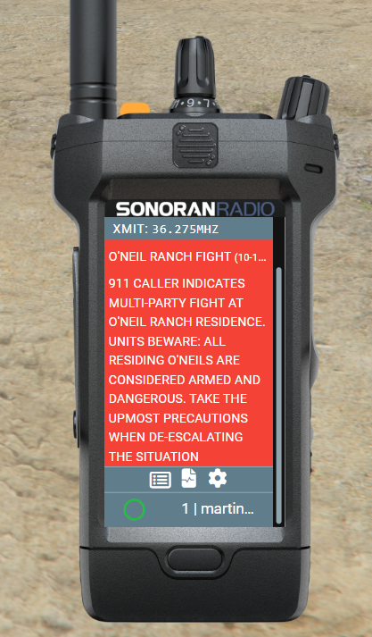

# Sonoran CAD Integration

## Sonoran Radio CAD Plugin

To enable integrations between Sonoran CAD and Radio, simply [enable the `sonrad` (Sonoran Radio) submodule in your CAD resource](https://info.sonorancad.com/integration-plugins/in-game-integration/fivem-installation/available-plugins/sonoran-radio-sonrad).

## Integration Features

### Panic Toggle

CAD Panic Toggle

Triggering your Sonoran Radio panic (by pressing the yellow button at the top of the radio) will also toggle your panic status in Sonoran CAD.

### Dispatch Call Information

Dispatch Call Information

When attached to a Sonoran CAD dispatch call, the radio will display a red call info box and set the top status bar to red. Click the call title to expand and collapse the information.

### Live Map Blips

Live Map Radio Tower Information

Sonoran Radio towers will be displayed on the CAD live map.

Select one of the blips to view it's repeater type and health.

## Display Name Sync

CAD To Radio Display Name

Automatically set your radio's display name based on your CAD unit information.

In the `sonorad` submodule's configuration file, set `config.syncRadioName.enabled` to true and customize the formatting in `config.syncRadioName.nameFormat`.

.png>)

