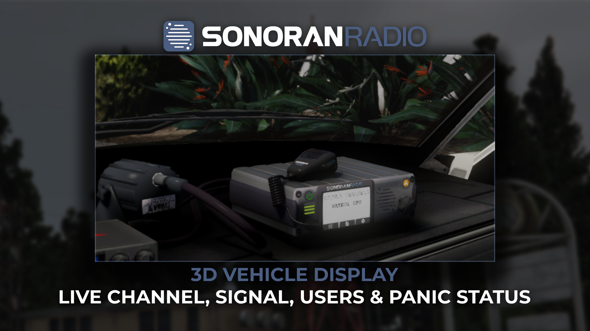

# Vehicle Radio Display

## Vehicle Radio Display (Video Tutorial)


Sonoran Radio: Vehicle Display Script



The vehicle radio display is a **free** Tebex script fully compatible with the **free** version of Sonoran Radio.


<figure><figcaption><p>Sonoran Radio - Vehicle Display</p></figcaption></figure>

## Installation (Written) <a href="#acquire-the-script" id="acquire-the-script"></a>

## 1. Download the Script <a href="#acquire-the-script" id="acquire-the-script"></a>

"Purchase" the **free** [vehicle radio display from the Sonoran Store](https://www.sonoran.store/package/6668073).

Once purchased, see: [How to download the script from your Keymaster account.](https://docs.sonoran.store/general/tebex-assets)

## 2. Install the script

#### A. Extract Folders

Extract the script's two folders (`sonoran-radiodisplay` and `sonoran-radiodisplay_helper`) to a folder in your server's resources folder called `[sonoranradio]`.

<figure><figcaption><p>Radio Display - Folders</p></figcaption></figure>

#### B. Rename Config Files

Inside of the `sonoran-radiodisplay` folder:

* Rename `config.changeme.lua` to `config.lua`&#x20;
  * See more about the [configuration options](vehicle-radio-display.md#configuration) here.
* Rename `radios.changeme.json` to `radios.json`&#x20;

#### C. Start the Resource

To start the display resource and give the auto-updater permissions to run, paste the following into your `server.cfg`&#x20;

```
# Start the Radio Display Resource
ensure sonoran-radiodisplay

# Grant permissions to the auto-updater
add_ace resource.sonoran-radiodisplay command allow
add_ace resource.sonoran-radiodisplay_helper command allow
```

## Configuration

The `config.lua` file allows you to customize the labels, ACE permissions, and more!

<details>

<summary>Default <code>config.lua</code></summary>

```lua
Config = {}

Config.debug_mode = false -- Enable debug mode
Config.configuration_version = 1.0
Config.auto_update = true -- Enable auto updates

Config.lang = {
    addNewRadioHelp = 'Open the menu to begin spawning a new in-car model model',
    vehNotCompatible = 'This vehicle is not compatible with the in-car model placement system!',
    vehAlrRadio = 'This vehicle already has a valid in-car radio!',
    radioMenuHeader = 'Sonoran In-Car Radio',
    creditsPanel = 'Made by',
    spawningSubMenu = 'In-Car Radio Spawning',
    attachingSubMenu = 'Attaching',
    deletionSubMenu = 'Are you sure?',
    radioAttachMenuButton = 'Attach In-Car Radio',
    deleteMenuButton = 'Delete Current In-Car Radio',
    spawnMenuButton = 'Spawn In-Car Radio',
    deletionConfirmationButton = 'Yes, remove from all of these vehicles',
    deletionCancelButton = 'Cancel',
    deletionCancelled = 'In-Car Radio deletion cancelled',
    noRadioFound = 'No In-Car Radio is in this vehicle!',
    modelComboBox = 'Model:',
    vehAlrRadioNoti = '~r~This vehicle already has an In-Car Radio of this type',
    notInVeh = '~r~You must be in a vehicle!',
    vehicleBone = 'Radio - Vehicle Bone',
    object = "Object:",
    vehicleBoneComboBox = 'Vehicle Bone',
    objectName = 'Sonoran In-Car Radio',
    attachButton = 'Attach',
    detachButton = 'Detach',
    confirmPlacementButton = 'Apply to all of this vehicle model',
    cannotGoFaster = '~r~You cannot go any faster!',
    cannotGoSlower = '~r~You cannot go any slower!',
}

Config.commands = {
    carRadioMenu = 'radiodisplay',
    restricted = false -- should the radio display menu be restricted?
}

Config.permissionMode = "ace" -- Available Options: ace, framework, custom

-- Ace Permissions Section --
Config.acePerms = {
    aceObjectUseMenu = "sonoran.incarradio", -- Select the ace for placing new In-Car radios
    aceObjectAdminUseMenu = "sonoran.incarradio.admin", -- Select the ace for placing new In-Car radios into all vehicles of the same model
}

-- Framework Related Settings --
Config.framework = {
    frameworkType = "qb-core", -- This setting controls which framework is in use options are esx or qb-core
    civilianJobNames = {"unemployed"}, -- An array of job names that should be allowed to use the radio menu
    adminJobNames = {"admin"}, -- An array of job names that should be allowed to use the radio menu as an admin
    useCivilianJobListAsBlacklist = false, -- This will treat the civilian job list as a blacklist rather than a whitelist
}

-- Configuration For Custom Permissions Handling --
Config.custom = {
    checkPermsServerSide = true, -- If true the permission event will be sent out to the server side resource, this is recommended
    permissionCheck = function(_, type) -- This function will always be called server side.
        if type == 0 then -- Check permission to use the menu
            return true or false -- Return true if they have admin, return false if they don't
        end
    end
}

Config.general = {
    notificationType = "native", -- Available options: native, pNotify, okokNotify
    useAllowlistAsBlacklist = false, -- If true, the Config.allowlistedCars will be treated as an blacklist
}

Config.allowlistedCars = {
    "POLICE",
    "POLICE2",
    "POLICE3",
    "POLICE4",
    "FBI",
    "FBI2",
    "SHERIFF",
    "SHERIFF2",
}

```

</details>

## Spawning the Radio Display

Use the `/radiodisplay` command while in a vehicle to spawn a new display.

* Use the keys displayed at the bottom of your screen to move and rotate the display into position.
* Select `Attach` to attach the display to your vehicle.
  * See the [config.lua](vehicle-radio-display.md#configuration) `Config.acePerms.aceObjectUseMenu` for permission restrictions.
* Select `Apply to all of this vehicle model` to have the radio display automatically added whenever the vehicle type is spawned.
  * See the [config.lua](vehicle-radio-display.md#configuration) `Config.acePerms.aceObjectAdminUseMenu` for permission restrictions.

<figure><figcaption></figcaption></figure>

### `radios.json` Property Explanation <a href="#radars.json-property-explanation" id="radars.json-property-explanation"></a>

| Property Name | Example  | Notes                                                               |
| ------------- | -------- | ------------------------------------------------------------------- |
| `ID`          | `2`      | `ID` must be unique. No other radar can share this ID               |
| `Position`    |          | This is a table that contains the x, y, and z coords of the radar   |
| `Rotation`    |          | This is a table that contains the x, y, and z rotation of the radar |
| `Vehicle`     | `POLICE` | This is the vehicles spawn code                                     |
| `Bone`        | `-1`     | This is the index of the bone you would like to attach the radar to |

### Commands

| Command Name    | Command Description                                                 | Required Permissions |
| --------------- | ------------------------------------------------------------------- | -------------------- |
| `/radiodisplay` | This command will initiate the radar spawning and attaching process | As configured        |

### Default Vehicles

<table><thead><tr><th width="254">Vehicle Spawncode</th><th>Adds Radio by Default</th></tr></thead><tbody><tr><td><code>FBI</code></td><td><code>yes</code></td></tr><tr><td><code>FBI2</code></td><td><code>yes</code></td></tr><tr><td><code>POLICE</code></td><td><code>yes</code></td></tr><tr><td><code>POLICE2</code></td><td><code>yes</code></td></tr><tr><td><code>POLICE3</code></td><td><code>yes</code></td></tr><tr><td><code>POLICE4</code></td><td><code>yes</code></td></tr><tr><td><code>POLICEOLD1</code></td><td><code>no</code></td></tr><tr><td><code>POLICEOLD2</code></td><td><code>no</code></td></tr><tr><td><code>SHERIFF</code></td><td><code>yes</code></td></tr><tr><td><code>SHERIFF2</code></td><td><code>yes</code></td></tr></tbody></table>

### Changelog

### v1.0.0

* `Initial Release`
