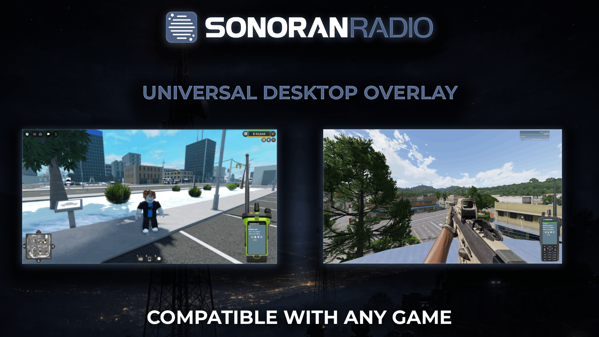

# Desktop Overlay

<figure><figcaption></figcaption></figure>

## Radio Overlay

### Accessing the Radio Overlay

Accessing the Radio Overlay

With the desktop application opened, select the **Open Overlay** button on the dispatch or mobile panel. This will close the main dispatch panel and will open up the radio overlay.

The overlay will be displayed on top of any window it's placed on. Pressing the power button **Off** or selecting **Return to Portal** will close the overlay and re-open the dispatch panel.

<figure><figcaption></figcaption></figure>

<figure><figcaption></figcaption></figure>

### Using the Radio Overlay

#### Hotkeys

Hotkeys

By selecting the **Settings** button on the overlay, users can configure a hotkey to hide/show the overlay. Additionally, a hotkey to focus the radio can be used for games with fullscreen mode.

<figure><figcaption></figcaption></figure> <figure><figcaption></figcaption></figure>

#### Changing Frames

Changing Frames

Communities can configure custom radio frames to be made available to their users.&#x20;

Users can change their selected frame in the settings window.

<figure><figcaption></figcaption></figure> <figure><figcaption></figcaption></figure>

Moving Resizing the Overlay

Click and drag on the radio to move it around the screen. Hold **CTRL** while clicking and dragging up or down on the overlay to increase or decrease the size.

### Customizing Radio Frames


Uploading custom radio frames requires the **Pro** subscription.

For more information, [view our pricing page](../../pricing/pricing-faq/).


Configuring Custom Overlay Frames

In the admin's **Customization** > **Desktop Frames** menu, new frame images can be uploaded. Once uploaded, drag-and-drop the buttons onto the frame and position the screen size.

<figure><figcaption></figcaption></figure>

## Connected Users Overlay

The user list overlay allows you to quickly view what users are online, what channels they're in, and who is currently transmitting.

<figure><figcaption></figcaption></figure>

### Accessing the User List Overlay

Accessing the Connected Users Overlay

To open the connected users overlay, select the **Open User List** button on the dispatch or mobile panel. Or, create a new hotkey in the **Settings** panel to **Open the Connected Users**.

<figure><figcaption></figcaption></figure>

<figure><figcaption></figcaption></figure>

