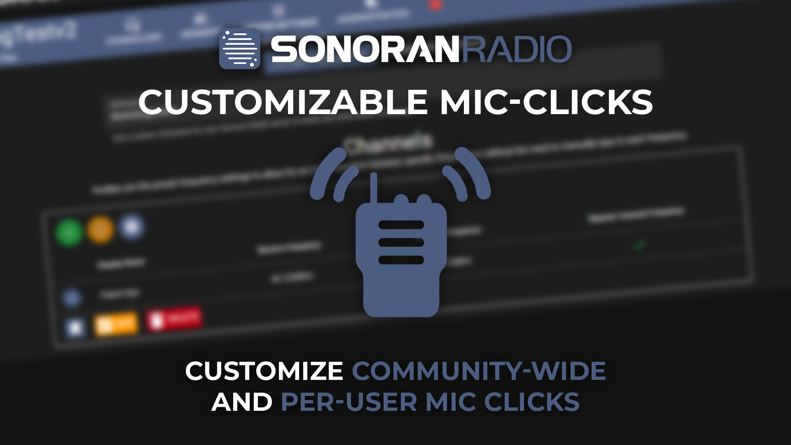

# Custom SFX

## Custom Microphone Clicks

When a user presses down their push-to-talk key, a "key-down" sound effect is played.

When a user releases their push-to-talk key, a "key-up" sound effect is played.

Sonoran Radio allows these sound effects to be customized!

<figure><figcaption></figcaption></figure>


Community SFX customization requires the **Plus** version or higher.

Per-User SFX customization requires the **Pro** version.

For more information, view our [pricing FAQ](../../../pricing/faq/standalone-pricing.md).


### Community-Wide SFX

<figure><figcaption>
Sonoran Radio - SFX Customization
</figcaption></figure>

Customize the default key-up, key-down, and talkover error SFX for the entire community in the `Customization` > `SFX Customization` tab.

This requires the `Admin` permission.

Once configured, all users in your community will broadcast these SFX options, unless they have a per-user SFX specified.

### Per-User SFX

Individual users can customize their key-up and key-down SFX in their user settings dialog in their radio or dispatch portal.

Once configured, the user will override any default or community-wide SFX.

_Note: SFX uploads can not be processed using the in-game radio._

<figure><figcaption></figcaption></figure>
