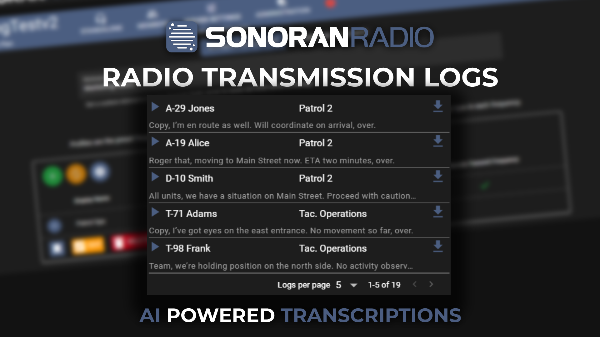

# Transmission Logs

<figure><figcaption>
Sonoran Radio: Transmission Logs
</figcaption></figure>


Community transmission logs are only available on the pro version.

[Learn more about our paid plans](/broken/pages/FjG6luNtOYdxkXxVERZt).


## Accessing Transmission Logs

The transmission log viewer can be accessed on the dispatch panel by clicking the list icon. Users will be able to view all logs within the last 24 hours transmitted on [channels that they have access to](configure-channels.md#restrict-channel-visibility).

Transmission logs have the following properties:

* Play/Pause Recording
* Username of Transmitter
* Channel of the Transmission
* Download the Recording
* AI Transcript

<figure><figcaption>
Sonoran Radio: Transmission Logs
</figcaption></figure>

## AI Audio Transcripts

Audio transcripts can also be automatically generated for each transmission recording.

Communities can optionally enable the `Transmission Log STT` option in the [AI configuration panel](../../integrations/ai.md#ai-options).

## Disable User Transmission Recording

Some users may wish to manually opt-out of submitting their transmissions for recording. This can be toggled in the **Settings** menu under the **Privacy** tab.

<figure><figcaption></figcaption></figure>
