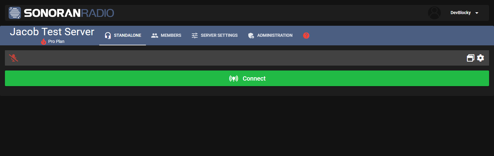
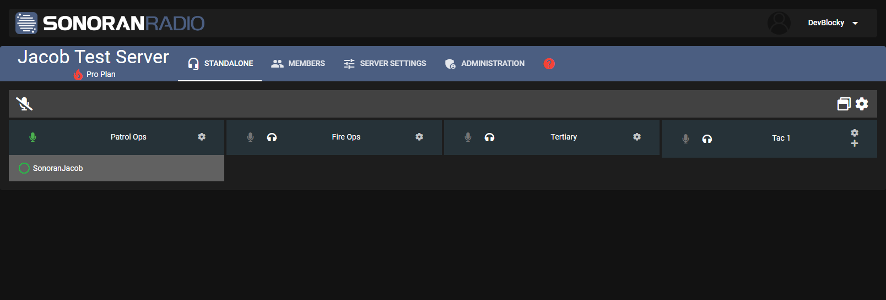
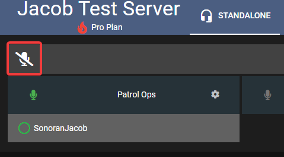
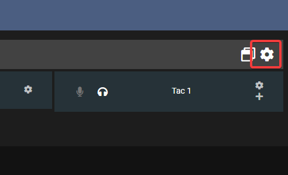
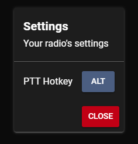
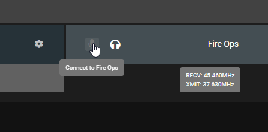
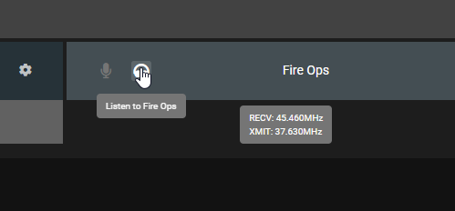

# Using the Dispatch Panel



## Dispatch Portal

When you first open a Sonoran Radio community with standalone enabled, you will see this page:

<figure><figcaption>
Sonoran Radio - Connect to Radio
</figcaption></figure>

To join the radio, press **Connect.** After connecting, you will be greeted with a row of channels, and a list of connected users underneath them

<figure><figcaption>
Sonoran Radio - Radio Hub
</figcaption></figure>

### Transmitting (Push to Talk)

To transmit over Sonoran Radio, you can press the microphone button on the top-left

<figure><figcaption>
Sonoran Radio - Transmit Button
</figcaption></figure>

### PTT Keybind


Push-to-talk key binds are only global in the [desktop application](../../../sonoran-radio/download-the-app.md).

On web, the browser window must be in focus.


In the browser or desktop, you can set a push-to-talk keybind in your radio settings

<figure><figcaption></figcaption></figure>

 

<figure><figcaption></figcaption></figure>

### Switching Channels

To switch to another channel, click the microphone button on the channel card

<figure><figcaption>
Sonoran Radio - Switch Channel
</figcaption></figure>

### Scanning (Listen) To Multiple Channels

Select the headphone icon on each channel to listen in.\
You can listen to multiple channels at once.

<figure><figcaption>
Sonoran Radio - Scan Channel
</figcaption></figure>

### Drag and Drop Users

Change a user's channel ([requires permission](../../getting-started/invite-and-manage-users.md#manage-user-permissions)) by dragging and dropping their name into the channel header.

<figure><figcaption></figcaption></figure>

### User Actions

Right click in the user to:

* Kick the user from the channel ([Requires Permission](../../getting-started/invite-and-manage-users.md#manage-user-permissions))
* Move the user to a different channel ([Requires Permission](../../getting-started/invite-and-manage-users.md#manage-user-permissions))
* Adjust the user's volume ([Requires Permission](../../getting-started/invite-and-manage-users.md#manage-user-permissions))

<figure><figcaption>
Sonoran Radio - Radio User Actions
</figcaption></figure>

### Display Name

Users can customize their display name in their account settings tab.\
This requires the `Change Display Name` permission.

<figure><figcaption>
Sonoran Radio - Display Name
</figcaption></figure>

Users can customize others' display names in the members tab.\
This requires the `Manage Display Names` permission.

<figure><figcaption>
Sonoran Radio - Manage Display Names
</figcaption></figure>
