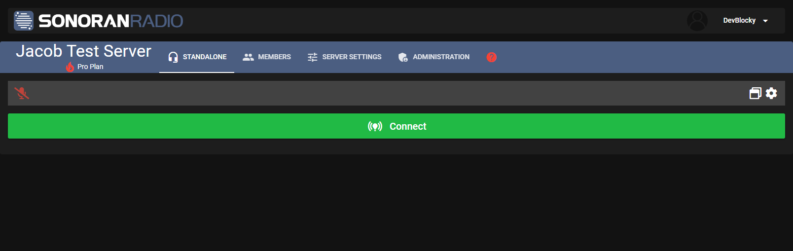
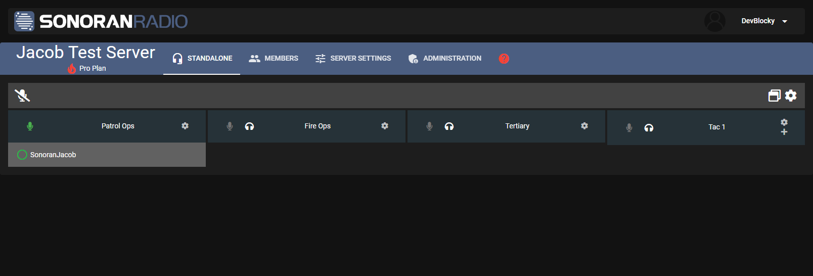
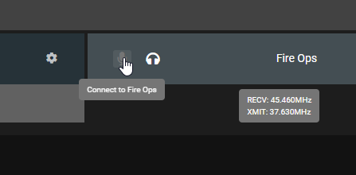
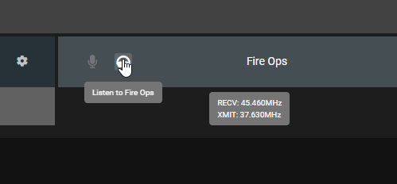

# Using the Dispatch Panel



## Dispatch Portal

When you first open a Sonoran Radio community with standalone enabled, you will see this page:

<figure><figcaption>
Sonoran Radio - Connect to Radio
</figcaption></figure>

To join the radio, press **Connect.** After connecting, you will be greeted with a row of channels, and a list of connected users underneath them

<figure><figcaption>
Sonoran Radio - Radio Hub
</figcaption></figure>

### Hotkeys (Keybinds)


Push-to-talk key binds are only global in the [desktop application](../../../sonoran-radio/download-the-app.md).

On web, the browser window must be in focus.


Dispatch Hotkeys

Hotkeys allow for faster actions at the press of a button. These can be configured by clicking the gear icon to open the settings menu.

 (1) (2).png>)

 (1) (2) (1).png>)

* [Push to Talk](using-the-dispatch-panel.md#transmitting-push-to-talk)
* [Temporary Per-Channel Push to Talk](using-the-dispatch-panel.md#transmitting-push-to-talk)
* [Tone Board](custom-tone-board.md)
* [Change Group Tab](using-the-dispatch-panel.md#switching-transmit-and-scanned-channels-1)
* [Change Channel](using-the-dispatch-panel.md#switching-transmit-and-scanned-channels)
* [Volume Change](using-the-dispatch-panel.md#volume-sliders)

Right click on a hotkey button for the option to clear it.

.png>)

### Transmitting (Push to Talk)

Dispatch Push To Talk

To transmit over Sonoran Radio, you can press the microphone button on the top-left.

Alternatively, use the [PTT hotkey](using-the-dispatch-panel.md#hotkeys-keybinds).

<figure><figcaption>
Dispatch: PTT Button
</figcaption></figure>

To temporarily transmit in a single channel, and move back to your original channel afterwards, select the keyboard icon to set a per-channel XMIT hotkey.

<figure><figcaption>
Dispatch: Per-Channel XMIT Hotkey
</figcaption></figure>

### Switching Transmit and Scanned Channels

Switching Transmit and Scanned Channels

To switch to another channel, click the microphone button on the channel card.

`CTRL` + `Click` on the microphone option to transmit on multiple channels at once.

[You can also change channels via hotkey.](using-the-dispatch-panel.md#hotkeys-keybinds)

### Scanning (Listen) To Multiple Channels

Select the headphone icon on each channel to listen in.\
You can listen to multiple channels at once.

### Drag and Drop Users

User Drag-And-Drop

Change a user's channel ([requires permission](../../getting-started/invite-and-manage-users.md#manage-user-permissions)) by dragging and dropping their name into the channel header.

### User Actions

User Actions (Right Click)

Right click in the user to:

* Kick the user from the channel ([Requires Permission](../../getting-started/invite-and-manage-users.md#manage-user-permissions))
* Clear the [user's panic status](using-the-dispatch-panel.md#unit-panic)
* Move the user to a different channel ([Requires Permission](../../getting-started/invite-and-manage-users.md#manage-user-permissions))
* Adjust the user's volume ([Requires Permission](../../getting-started/invite-and-manage-users.md#manage-user-permissions))
* Change the user's display name ([Requires Permission](../../getting-started/invite-and-manage-users.md#manage-user-permissions))

 (3).png>)

### Unit Panic

Unit Panic Status

When a [unit toggles their panic status in-game](../in-game-radio/using-the-in-game-radio/#panic), the dispatch portal will reflect this with a red banner and a red highlight on the panicked unit.

Dispatchers can [right-click the user to clear the panic](using-the-dispatch-panel.md#user-actions-right-click) for them.

The [customizable panic sound effect](custom-sfx.md) will also alert dispatchers to an active unit panic.

 (1) (2).png>)

### Display Names

Via Dispatch Portal

To change your display name, users will need the `Change Display Name` permission. To manage others, users will need the `Manage Display Names` permission.

#### Via Radio Interface

Right click a user in the radio interface and select `Display Name`

Via Members Tab

#### Via Members Tab

In the admin panel's `Members` tab, select the drop-down and `Set Display Name` button to edit a user's display name.

Via Sonoran CMS

#### Via Sonoran CMS

[Sonoran CMS can also automatically set and manage your Radio display names and sync them with Discord.](../../integrations/sonoran-cms.md)

Via Sonoran CAD Sync

[Learn about automatically setting radio display names to match your unit information in Sonoran CAD.](../../integrations/sonoran-cad-integration.md)

Via Command

Use the in-game command `/radio displayname John Doe` to update your radio display name.

[In-game commands can also be restircted with ACE permission](../in-game-radio/configuring-ace-permissions.md)s.

Via Developer Export or Endpoint

Programmatically [update a user's display name in FiveM](../../integrations/developer-documentation/resource-events.md#set-display-name) or [update a display name via API](../../integrations/developer-documentation/api-endpoints/users/set-user-display-name.md).

### Volume Changes

Volume Sliders

Adjust the overall voice and sound effect volume by [opening the settings menu](using-the-dispatch-panel.md#dispatch-hotkeys) and selecting the `Audio` tab.

In addition to the manual sliders, you can customize how much the [volume hotkeys](using-the-dispatch-panel.md#dispatch-hotkeys) adjust the volume.

You can also [adjust volume for a specific user](using-the-dispatch-panel.md#user-actions-right-click).

 (1) (2).png>)

### Viewing Channel IDs

Channel IDs

Some integrations like ACE perm sync or scanner permissions may require you to enter the internal ID number of a specific channel.

Select the `#` symbol on the last channel in the dispatch panel to toggle ID visibility.

.png>)

