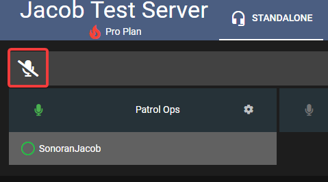

# Using the Dispatch Panel



## Dispatch Portal

When you first open a Sonoran Radio community with standalone enabled, you will see this page:

<figure><figcaption>
Sonoran Radio - Connect to Radio
</figcaption></figure>

To join the radio, press **Connect.** After connecting, you will be greeted with a row of channels, and a list of connected users underneath them

<figure><figcaption>
Sonoran Radio - Radio Hub
</figcaption></figure>

### Hotkeys (Keybinds)


Push-to-talk key binds are only global in the [desktop application](../../../sonoran-radio/download-the-app.md).

On web, the browser window must be in focus.


Dispatch Hotkeys

### Transmitting (Push to Talk)

Dispatch Push To Talk

To transmit over Sonoran Radio, you can press the microphone button on the top-left

### Switching Transmit and Scanned Channels

Switching Transmit and Scanned Channels

To switch to another channel, click the microphone button on the channel card

### Scanning (Listen) To Multiple Channels

Select the headphone icon on each channel to listen in.\
You can listen to multiple channels at once.

### Drag and Drop Users

User Drag-And-Drop

Change a user's channel ([requires permission](../../getting-started/invite-and-manage-users.md#manage-user-permissions)) by dragging and dropping their name into the channel header.

### User Actions

User Actions (Right Click)

Right click in the user to:

* Kick the user from the channel ([Requires Permission](../../getting-started/invite-and-manage-users.md#manage-user-permissions))
* Move the user to a different channel ([Requires Permission](../../getting-started/invite-and-manage-users.md#manage-user-permissions))
* Adjust the user's volume ([Requires Permission](../../getting-started/invite-and-manage-users.md#manage-user-permissions))
* Change the user's display name ([Requires Permission](../../getting-started/invite-and-manage-users.md#manage-user-permissions))

### Unit Panic

Unit Panic Status

When a [unit toggles their panic status in-game](../in-game-radio/using-the-in-game-radio/#panic), the dispatch portal will reflect this with a red banner and a red highlight on the panicked unit.

.png>)

### Display Names

Via Dispatch Portal

To change your display name, users will need the `Change Display Name` permission. To manage others, users will need the `Manage Display Names` permission.

#### Via Radio Interface

Right click a user in the radio interface and select `Display Name`

Via Members Tab

#### Via Members Tab

In the admin panel's `Members` tab, select the drop-down and `Set Display Name` button to edit a user's display name.

Via Sonoran CMS

#### Via Sonoran CMS

[Sonoran CMS can also automatically set and manage your Radio display names and sync them with Discord.](../../integrations/sonoran-cms.md)


[sonoran-cms.md](../../integrations/sonoran-cms.md)

