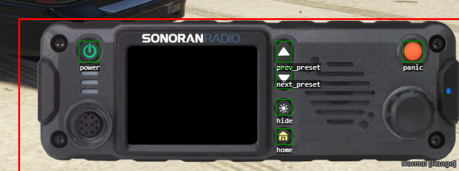

# Customizing Radio Frames

## Video Tutorial:


Sonoran Radio - Customize Radio Frames


## Selecting Custom Frames

Custom radio frames can be selected in the radio settings menu. Custom frames allow your community to create more UI options for each department!

The drop-down menu will appear in your settings menu if you have one or more options available to you.

<figure><figcaption><p>Sonoran Radio - High Visibility Frame</p></figcaption></figure>

## Restricting Custom Frames

Restrict radio frames by department, job, or job grade, and set admin command permissions. Compatible with ESX, QBCore, or as a standalone.

You can use [CMS to automatically manage in-game ACE permissions](../../../other-products/sonoran-cms.md), and even sync them with Discord roles!

Example: `SAHP` department members with police job grades 1-3 can use frames:

* `default`
* `signalpro`
* `voxguard`
* `hi-vis`

<details>

<summary>Config.frames</summary>

<pre class="language-lua"><code class="lang-lua"><strong>Config.frames = {
</strong>	permissionMode = 'ace', -- ace, qbcore, esx or none
	adminPermission = 'sonoranradio.admin', -- ACE permission required to use admin commands
	departments = {
		['sahp'] = {
			label = 'San Andreas Highway Patrol',
			permissions = {
				jobs = { -- Jobs that can use this department
					['police'] = {
						grades = { -- Job grades that can use this department
							1,
							2,
							3
						}
					}
				},
				ace = { -- ACE Permissions that can use this department | ONLY EFFECTIVE IN ACE PERMISSION MODE
					'sonoranradio.sahp'
				}
			},
			-- Radio frames that can be used by this department
			allowedFrames = {
				'default',
				'signalpro',
				'voxguard',
				'hi-vis'
			}
		}
	}
}
</code></pre>

</details>

## Customizing Radio Frames

1. Navigate to the `sonoranradio\skins` directory.
2. Locate a skin folder, which will contain 2-3 images and a `skin.json` file, displaying different frames.
3. Observe the images, which include handheld, mobile, and possibly HUD radio types.
4. Create a new skin folder and add your own frame images in the format you've observed in Step 3.
5. Copy over and modify an existing `skin.json` file to maintain format consistency.
6. In the `skin.json` file, specify the radio name and configure the frame types and body settings.
7. In the `skin.json` file, define the images and button positions for each radio type.

### Debug Mode

You can turn on debug mode in the main config to display button positions on screen for easier position configuration.

To enable debug mode, set `Config.debug` to `true` in your `config.lua` file.

<figure><figcaption><p>Sonoran Radio - Vehicle Radio - Debug Mode Enabled</p></figcaption></figure>

### Frame Types

The following are valid as values for `type`:

* `portable` - Used for handheld radios
* `vehicle` - Used for mobile radios installed in a vehicle
* `hud` - Top-down view of a portable radio

### Body Settings

1. In `body`, specify the image filename for each radio type.\
   For instance, use `radio-portable.png` for a portable radio.
2. Additionally, set the `width` value to define the image's display width in-game.

### Controls

1. Assign actions to buttons at specific positions on the radio image.
   * **Example:** Align a panic button hitbox with the panic button on the image, so clicking it in-game triggers a panic action.
2. Available action types: `power`, `next_preset`, `prev_preset`, `panic`, `home`, `hide`.

### Screen and Mini-Screen

Specify the position and width of the radio frame screen in Sonoran Radio to display information. Modify values under `screen` or `miniScreen` for HUD-type frames.

For `HUD`-type frames, `controls` can be left blank.

## Example File

Below is an example of a `skin.json` file:

<details>

<summary>skin.json</summary>

```json
{
  "name": "Moto AX",
  "frames": [
    {
      "type": "portable",
      "body": { "image": "radio-portable.png", "width": 17 },
      "controls": [
        {
          "action": "power",
          "bottom": 29.6,
          "right": 0.8,
          "width": 2.7,
          "height": 2.7
        },
        {
          "action": "next_preset",
          "bottom": 30,
          "right": 7.25,
          "width": 1.25,
          "height": 4.25
        },
        {
          "action": "prev_preset",
          "bottom": 30,
          "left": 7.125,
          "width": 1.25,
          "height": 4.25
        },
        {
          "action": "panic",
          "bottom": 29.75,
          "left": 4,
          "width": 2,
          "height": 1.25
        },
        {
          "action": "home",
          "bottom": 3.25,
          "left": 6.75,
          "right": 6.75,
          "height": 1.5
        }
      ],
      "screen": {
        "bottom": 5.875,
        "height": 18.125,
        "left": 3.2185,
        "right": 3.2,
        "zIndex": 5
      }
    },
    {
      "type": "vehicle",
      "body": { "image": "radio-mobile.png", "width": 45.125 },
      "controls": [
        {
          "action": "power",
          "top": 2.25,
          "left": 6.15,
          "width": 2,
          "height": 2
        },
        {
          "action": "prev_preset",
          "top": 2.25,
          "right": 17.25,
          "width": 1.5,
          "height": 2
        },
        {
          "action": "next_preset",
          "top": 5,
          "right": 17.25,
          "width": 1.5,
          "height": 2
        },
        {
          "action": "hide",
          "top": 8.25,
          "right": 17.25,
          "width": 1.5,
          "height": 1.5
        },
        {
          "action": "home",
          "top": 11.25,
          "right": 17.25,
          "width": 1.5,
          "height": 1.5
        },
        {
          "action": "panic",
          "top": 2.25,
          "right": 3.75,
          "width": 2,
          "height": 2
        }
      ],
      "screen": {
        "top": 2.65,
        "height": 10.2,
        "left": 11,
        "width": 13.45,
        "zIndex": 5
      }
    },
    {
      "type": "hud",
      "body": { "image": "radio-portable-top.png", "width": 22.25 },
      "controls": [],
      "miniScreen": {
        "bottom": 7.2,
        "height": 3.75,
        "left": 7.75,
        "right": 7.5
      }
    }
  ]
}
```

</details>
