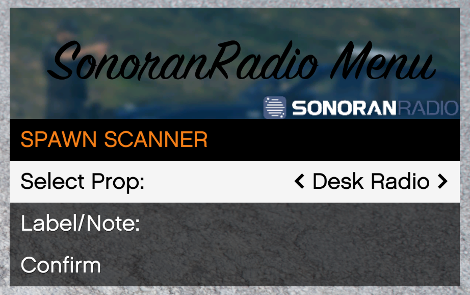
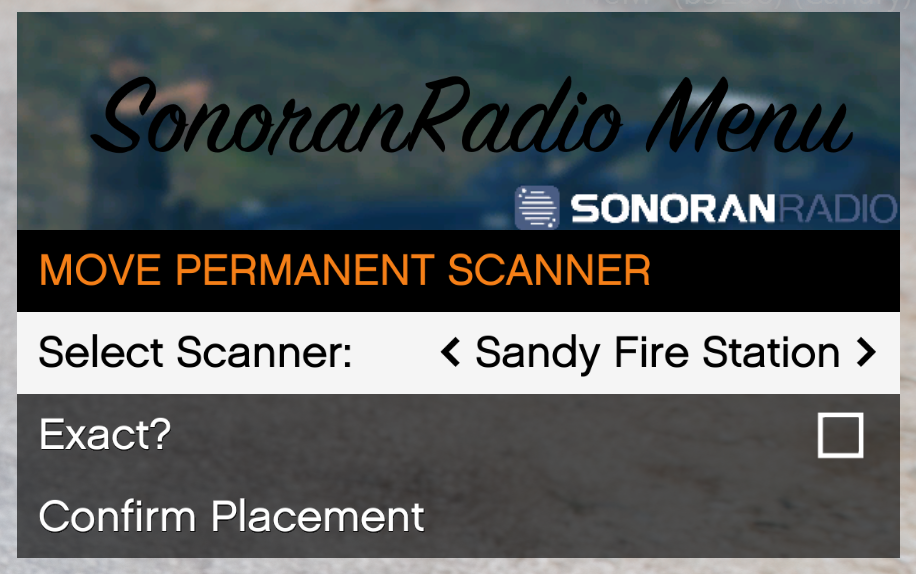
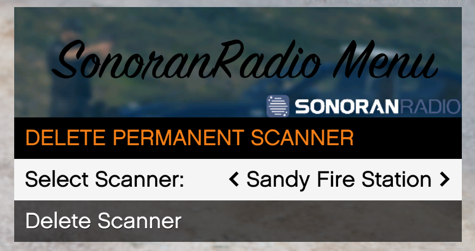

# Radio Scanners

<figure><figcaption><p>Sonoran Radio - In-Game Scanner</p></figcaption></figure>


Due to bandwidth usage, this feature is automatically enabled with the Pro version only!

[Learn more about our paid subscription plans.](../../../pricing/pricing-faq/standalone-pricing.md)


## Video Example

## Using the Radio Scanner

### Enabling the Scanner

1. Enable the `config.chatter`  option in your [config.lua](../../getting-started/installing-the-in-game-resource.md#updates).
2. Add the `sonoranradio.scanner` [ace permission](configuring-ace-permissions.md).

### Opening in Standalone

You can use `/radio scanner` command to open a personal scanner. This requires the `sonoranradio.scanner` [ace permission](configuring-ace-permissions.md).

### Opening in a Framework Server (QBCore, Qbox, etc.)

With the radio scanner item in their inventory, users can double click to open the [scanner menu](radio-scanners.md#using-the-radio-scanner-1).

[View our complete list of supported FiveM frameworks an inventories.](../../integrations/fivem-inventories.md)

<figure><figcaption><p>Sonoran Radio Scanner Item in Inventory</p></figcaption></figure>

#### Item Drop


Dropping scanners is not currently supported in OX inventory.

Support will be added at a later date, pending more information from the OX development team.


If the scanner item is dropped on the floor, you can open its scanner menu by being near it and pressing `E`.

If the scanner is powered, transmissions will be heard by nearby users.

<figure><figcaption><p>Sonoran Radio Scanner Item Drop Use Hint</p></figcaption></figure>

### Radio Scanner Menu

<div><figure><figcaption></figcaption></figure> <figure><figcaption></figcaption></figure></div>

Press the power button and the scanner will auto-connect to the default channel. Use the knob to scroll through all available channels.

By default, only public radio channels will be available. For [private channels](../dispatch-panel/configure-channels.md#restrict-channel-visibility), you can [configure ACE permissions to access them](radio-scanners.md#ace-permissions).

## Permanent Scanners

Permanent Scanners are scanners that are available to everybody at configurable locations across the map. For example, you can add a scanner in the Sandy Shores Sheriff Station that will always listen the `County Patrol Ops` channel.

#### Configuring Permanent Scanners

You can use `/radiomenu` to easily add, move, or delete persistent scanners

<div data-full-width="false"><figure><figcaption></figcaption></figure> <figure><figcaption></figcaption></figure> <figure><figcaption></figcaption></figure> <figure><figcaption></figcaption></figure></div>

When creating a scanner, you have the ability to choose between many different scanner-like models to best fit your needs

<figure><figcaption></figcaption></figure>

You can also modify the `scanners.json` JSON config file for more customization. By default, scanners connect to the default channel, but you can customize the channel ID it uses.

<details>

<summary>Example Scanner JSON</summary>

```json
{
    "Id": "036a2ad1-eeae-4519-be4c-67157b8a035d",
    "Note": "Sandy Sheriff Station",
    "Powered": true,
    "ChannelId": 31226,
    "PropModel": "prop_cs_hand_radio",
    "PropPosition": {
        "x": 1853.98,
        "y": 3688.92,
        "z": 34.38054,
        "heading": 32.76,
        "exact": false
    }
}
```

</details>

#### Finding Channel IDs

The channel IDs can be found in the [dispatcher panel](../dispatch-panel/using-the-dispatch-panel.md#channel-ids) or [in-game radio](using-the-in-game-radio/fivem-keybinds-and-commands.md#copying-channel-and-scan-list-ids).

## Developers

### Ace Permissions

If you have enabled `Config.acePermsForScanners`, you must add permissions in your `server.cfg`for the scanner to work.

The channel IDs can be found in the [dispatcher panel](../dispatch-panel/using-the-dispatch-panel.md#channel-ids) or [in-game radio](using-the-in-game-radio/fivem-keybinds-and-commands.md#copying-channel-and-scan-list-ids).

```bash
# Give the group access to /radio scanner
add_ace group.admin sonoranradio.scanner allow

# Only public (non-private) channels are accessible
# Grant access to a private channel with the ID of 123
add_ace group.admin sonoranradio.channel.123 allow
```

### Giving the Scanner Item (QBCore)

Sonoran Radio does not provide a way to get the scanner item independently. You can give the item with any method, but here's an example chat command:

```
/giveitem <playerId> sonoran_radio_scanner 1
```

Please note that if you changed `Config.ScannerItem.name`, it will not work with `sonoran_radio_scanner`
