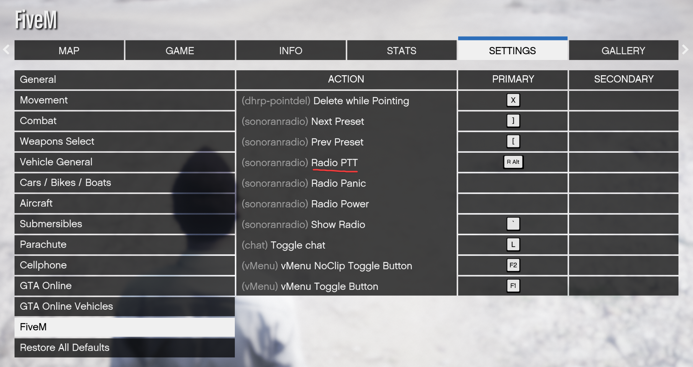
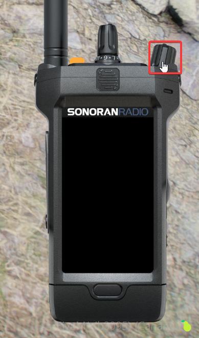
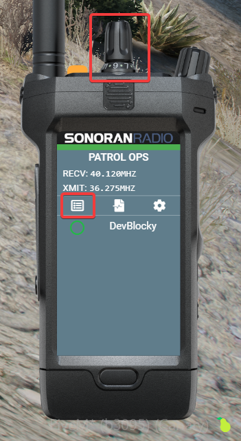

# Using the In-Game Radio



## Initial Setup

### Accessing the In-Game Radio

#### Keybind

The default keybind to open Sonoran Radio is `~` (right above Tab)

You can also [customize this keybind](using-the-in-game-radio.md#setting-your-push-to-talk-ptt-keybind)

#### Command

Use the `/radio` command

#### Permissions

Restrict access to the radio with [ACE permissions](configuring-ace-permissions.md).

### Logging In

When you first use the in-game resource, you'll need to log in.\
A 4-digit code will appear for you to sign in from your browser.

<figure><figcaption>
Sonoran Radio - Login with Link Prompt
</figcaption></figure>

Open [sonoranradio.com/link](https://sonoranradio.com/link) in a web browser, log in if needed, enter your code, and click "Activate" to log in to the game.

<figure><figcaption>
Sonoran Radio - Activate Link
</figcaption></figure>

### Logging Out

You can logout/un-link your in-game radio via the settings menu (gear icon).

<figure><figcaption>
In-Game Radio - Settings
</figcaption></figure>

 

<figure><figcaption>
In-Game Radio - Unlink
</figcaption></figure>

***

## Using the In-Game Radio

### Setting your Push-To-Talk (PTT) Keybind

By default, there is no PTT keybind set. You can set one in your GTA `Settings` -> `Key Bindings` -> `FiveM` -> `Radio PTT`

<figure><figcaption></figcaption></figure>

### Connecting and Switching Channels

The radio will connect when you turn it on with the power button ([unless you need to login first](using-the-in-game-radio.md#logging-in))

<figure><figcaption></figcaption></figure>

You can scroll through the radio channels with the channel select dial on top, or choose a channel using the UI

<figure><figcaption></figcaption></figure>

### Adjust Volume

#### System-Wide Volume

In the settings menu (gear icon) you can adjust the radio's total volume output.

<figure><figcaption>
In-Game Radio - Settings
</figcaption></figure>

 

<figure><figcaption>
In-Game Radio - System Volume
</figcaption></figure>

#### Per-User Volume

You can also right-click on any user to adjust their volume specifically.

<figure><figcaption>
In-Game Radio - Per-User Volume
</figcaption></figure>

### Move and Resize the Radio

On the radio screen, open the `Settings` modal by pressing the gear icon.

Select `Move/Resize`

* Click and drag the radio to change it's position on your screen.
* Hold `ctrl` and drag to resize the radio.
* Press `esc` to save the new size and position.

You can also use `/radioreset ui` to reset the size and position.

<figure><figcaption>
In-Game Radio - Settings
</figcaption></figure>

 

<figure><figcaption>
In-Game Radio - Move/Resize
</figcaption></figure>

<figure><figcaption>
In-Game Radio - Adjustment
</figcaption></figure>

### Change Radio Frames

The settings menu also allows you to customize your radio frame:

<figure><figcaption>
Sonoran Radio - Custom Frames
</figcaption></figure>

Learn more about customizable radio frames:


[customizing-radio-frames.md](customizing-radio-frames.md)


## Custom Animations

Unlock multiple more custom radio animations, FREE with Sonoran Radio pro!

<figure><figcaption>
Sonoran Radio x Big Daddy Scripts
</figcaption></figure>


[big-daddy-radio-animations.md](../../integrations/big-daddy-radio-animations.md)

