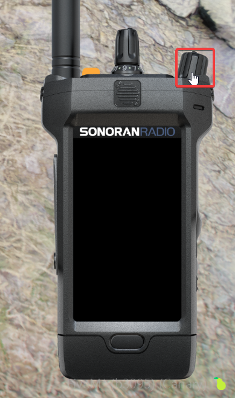
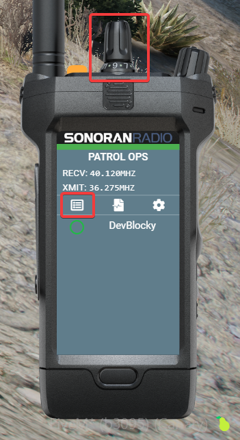

# Using the In-Game Radio



## Initial Setup

### Displaying the In-Game Radio

By default, the radio display remains visible on-screen at all times. Users can toggle focus on the radio, enabling interaction when needed and un-focusing when done.

1. Use the [customizable keybind](./#setting-your-push-to-talk-ptt-keybind) (Default is `~` right above tab)
2. Use the `/radio` command

Access to the radio can be restricted with [ACE permissions](../configuring-ace-permissions.md).

### Hiding the In-Game Radio

#### A. Via Button

Use the purple button or icon on the radio frames:

<figure><figcaption>
Vehicle Radio: Hide Button
</figcaption></figure> <figure><figcaption>
Handheld Radio: Hide Button
</figcaption></figure>

#### B. Via Command

Use the `/radio hide` command in-game to hide the radio.

### Logging In

When you first use the in-game resource, you'll need to log in.\
A 4-digit code will appear for you to sign in from your browser.

<figure><figcaption>
Sonoran Radio - Login with Link Prompt
</figcaption></figure>

Open [sonoranradio.com/link](https://sonoranradio.com/link) in a web browser, log in if needed, enter your code, and click "Activate" to log in to the game.

<figure><figcaption>
Sonoran Radio - Activate Link
</figcaption></figure>

### Logging Out

You can logout/un-link your in-game radio via the settings menu (gear icon).

<figure><figcaption>
In-Game Radio - Settings
</figcaption></figure> <figure><figcaption>
In-Game Radio - Unlink
</figcaption></figure>

***

## Using the In-Game Radio

### Setting your Push-To-Talk (PTT) Keybind

[You can customize your PTT button in your GTA Settings.](fivem-keybinds.md)

### Connecting and Switching Channels

The radio will connect when you turn it on with the power button ([unless you need to login first](./#logging-in))

<figure><figcaption></figcaption></figure>

You can scroll through the radio channels with the channel select dial on top, or choose a channel using the UI

<figure><figcaption></figcaption></figure>

### Adjust Volume

#### System-Wide Volume

In the settings menu (gear icon) you can adjust the radio's total volume output.

<figure><figcaption>
In-Game Radio - Settings
</figcaption></figure> <figure><figcaption>
In-Game Radio - System Volume
</figcaption></figure>

#### Per-User Volume

You can also right-click on any user to adjust their volume specifically.

<figure><figcaption>
In-Game Radio - Per-User Volume
</figcaption></figure>

### Move and Resize the Radio

On the radio screen, open the `Settings` modal by pressing the gear icon.

Select `Move/Resize`

* Click and drag the radio to change it's position on your screen.
* Hold `ctrl` and drag to resize the radio.
* Press `esc` to save the new size and position.


**If you move your radio too far off of your screen:**

Use `/radio reset` to reset the size and position.


<figure><figcaption>
In-Game Radio - Settings
</figcaption></figure> <figure><figcaption>
In-Game Radio - Move/Resize
</figcaption></figure>

<figure><figcaption>
In-Game Radio - Adjustment
</figcaption></figure>

### Radio Types

Sonoran Radio offers three radio platforms: handheld, top-down HUD, and vehicle.\
All three radio platforms can have [customizable frame styles](./#change-radio-frames).

<figure><figcaption></figcaption></figure>

When opening the radio via `/radio` the handheld radio will display on-screen.\
The vehicle UI will display when opening the radio inside of a vehicle.\
The top-down HUD style can be viewed with the `/radiohud` command.

### Change Radio Frames

The settings menu also allows you to customize your radio frame:

<figure><figcaption>
Sonoran Radio - Custom Frames
</figcaption></figure>

Learn more about customizable radio frames:


[customizing-radio-frames.md](../customizing-radio-frames.md)


## Civilian Usage

### Placing an Emergency (911) Call

Civilians can place an emergency call to speak directly with dispatchers:


[emergency-calls.md](../../dispatch-panel/emergency-calls.md)


## Custom Animations

Unlock multiple more custom radio animations, FREE with Sonoran Radio pro!

<figure><figcaption>
Sonoran Radio x Big Daddy Scripts
</figcaption></figure>


[big-daddy-radio-animations.md](../../../integrations/big-daddy-radio-animations.md)

